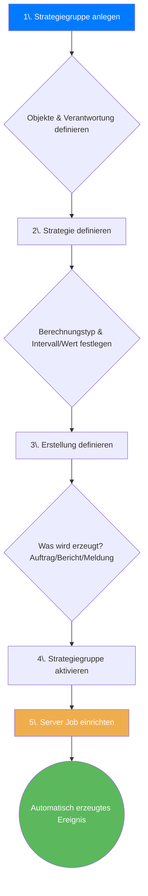

Willkommen zur umfassenden Dokumentation des Paledo Strategiemanagers. Dieses leistungsstarke Modul ist der Schlüssel zur Automatisierung Ihrer präventiven Instandhaltungsprozesse. Es ermöglicht die regelbasierte, automatische Erstellung von Aufträgen, Berichten oder Meldungen basierend auf Zeitintervallen, Verbräuchen oder zustandsbasierten Schwellwerten. Diese Anleitung führt Sie durch alle Aspekte des Moduls, von den grundlegenden Konzepten über die detaillierte Konfiguration bis hin zur Überwachung. 
___
## 1. Einführung: Was ist der Strategiemanager?

### 1.1. Ziel und Nutzen

Der **Strategiemanager** ist ein zentrales Modul in Paledo zur **Planung, Automatisierung und Steuerung von präventiven Instandhaltungsmaßnahmen**. Sein Hauptzweck ist die automatische Erzeugung von Ereignissen – also **Aufträgen, Berichten oder Meldungen** – basierend auf vordefinierten Regeln. Diese Regeln können auf Zeitintervallen, Betriebsstunden, Zählerständen oder Messwert-Schwellwerten basieren.

Das Ziel ist es, von einer reaktiven zu einer proaktiven, vorausschauenden Instandhaltung überzugehen und manuelle Planungs- und Überwachungsaufwände drastisch zu reduzieren.


**Hauptvorteile auf einen Blick:**
*   **Automatisierung:** Reduziert manuellen Planungsaufwand und vermeidet vergessene Wartungen.
*   **Standardisierung:** Stellt sicher, dass wiederkehrende Aufgaben immer nach demselben Schema angelegt werden.
*   **Transparenz:** Bietet eine klare Übersicht über alle anstehenden und überfälligen Wartungsmaßnahmen.
*   **Flexibilität:** Unterstützt verschiedenste Auslöser, von einfachen Zeitintervallen bis zu komplexen, zustandsbasierten Schwellwerten.


### 1.2. Abgrenzung zum Strategieplan

Im Paledo-Kontext gibt es neben der "Strategie" bzw. "Strategiegruppe" auch den **"Strategieplan"**. Während sie ähnlich klingen, dienen sie unterschiedlichen Zwecken:

*   **Strategiegruppe:** Fokussiert auf die Erzeugung von **einzelnen Ereignissen** (z.B. ein großer Wartungsauftrag alle 6 Monate) basierend auf einem Auslöser (Zeit, Verbrauch).
*   **Strategieplan:** Dient der Abbildung von **detaillierten, oft kurzzyklischen Checklisten** (z.B. tägliche Maschinenführer-Wartung im Rahmen von TPM). Erzeugt typischerweise nur einen Bericht mit vielen kleinen Planvorgängen.

## 2. Grundlagen: Die Logik der Wartungsstrategien

### 2.1. Die fünf Strategiearten im Detail

Der Kern des Strategiemanagers ist die Berechnung des nächsten Wartungstermins. Hierfür stehen fünf grundlegende Strategiearten zur Verfügung, die sich in zwei Hauptgruppen (Intervall, Verbrauch) und eine Spezialgruppe (Schwellwert) unterteilen lassen.

| Kategorie | Strategieart | Berechnungsgrundlage | Dynamik | Typischer Anwendungsfall |
| :--- | :--- | :--- | :--- | :--- |
| **Zeitbasiert** | **Intervall SOLL** | Basisdatum + festes Intervall | Statisch | Gesetzlich vorgeschriebene, jährliche Prüfung. Der nächste Termin ist fix, egal wann die letzte Prüfung war. |
| | **Intervall IST** | Letztes Durchführungsdatum + Intervall | Dynamisch | Regelmäßige Schmierung alle 3 Monate. Der Zyklus startet neu, nachdem die Arbeit erledigt wurde. |
| **Verbrauchsbasiert** | **Verbrauch SOLL** | Prognose auf Basis von Durchschnittsverbräuchen | Statisch | Fahrzeugwartung alle 15.000 km, basierend auf der durchschnittlichen Fahrleistung. |
| | **Verbrauch IST** | Reale Messwerte aus Messbelegen | Dynamisch | Maschinenwartung nach 1.000 Betriebsstunden, basierend auf den realen Zählerständen. |
| **Zustandsbasiert**| **Schwellwert** | Messpunkt überschreitet/unterschreitet Grenzwert | Ereignisbasiert | Bremsbelag-Verschleiß. Ein Auftrag wird erstellt, sobald die Dicke unter 3mm fällt. |


**Messpunkte sind entscheidend!**
Strategien, die auf **Verbrauch** oder **Schwellwerten** basieren, benötigen eine saubere Stammdatenpflege. Es müssen entsprechende **Messpunkttypen** angelegt und regelmäßig **Messbelege** erfasst werden, damit die Berechnungsgrundlage korrekt ist.


## 3. Voraussetzungen für den Einsatz

Um den Strategiemanager vollumfänglich, insbesondere zur Erstellung von Berichten, nutzen zu können, müssen folgende Stammdaten in Paledo vorhanden und freigegeben sein:

*   Eine freigegebene **Protokollvorlage**
*   Eine freigegebene **Berichtsvorlage**
*   Eine freigegebene **Tätigkeit**
*   Ein **Equipment** oder ein **Technischer Platz** in der Anlagenstruktur
*   Eine **Auftragsart** (z.B. "Instandhaltungsauftrag")

## 4. Der Weg zur automatisierten Wartung: Ein Überblick

Der Prozess von der Idee bis zum automatisch erstellten Wartungsauftrag folgt einer klaren Logik. Das nachfolgende Diagramm visualisiert die wesentlichen Schritte.

## 5. Strategiegruppen verwalten

Eine **Strategiegruppe** ist der Container, der eine oder mehrere Strategien für eine logische Gruppe von Komponenten bündelt. Hier werden auch übergreifende Verantwortlichkeiten und Standard-Anleitungen definiert.

### 5.1. Die Benutzeroberfläche im Überblick

Wenn Sie das Modul unter `Administration → Berichts- & Auftragswesen → Strategiemanager` öffnen, sehen Sie eine zweigeteilte Ansicht:

*   **Links:** Eine Liste aller existierenden **Strategiegruppen**.
*   **Rechts:** Die Detailansicht der ausgewählten Gruppe. Diese zeigt Kopfdaten, Verantwortlichkeiten und eine Komponentenübersicht.

In der **Komponentenübersicht** sehen Sie für jedes verknüpfte Objekt den aktuellen Status der jeweiligen Strategie, z.B. den aktuellen Verbrauchswert im Vergleich zum Zykluswert.

### 5.2. Eine neue Strategiegruppe anlegen

1.  Klicken Sie in der Ribbon-Leiste auf **Neu**.
2.  **Name der Strategiegruppe:** Vergeben Sie einen aussagekräftigen Namen (z.B. "Wartung Druckbehälter Halle 3").
3.  **Verantwortlichkeit:** Legen Sie eine verantwortliche Person oder einen Arbeitsplatz (z.B. `T-ME01 – Mechatronik Team 1x`) fest. Diese Zuweisung wird an alle erzeugten Ereignisse vererbt, sofern nicht in der Strategie selbst anders definiert.
4.  **Komponenten hinzufügen:** Klicken Sie auf das Hinzufügen-Symbol im Reiter "Komponentenübersicht". Wählen Sie aus der Anlagenstruktur die gewünschten Equipments oder Technischen Plätze aus (Mehrfachauswahl mit `STRG` möglich) und bestätigen Sie mit **OK**.
5.  **Speichern:** Sichern Sie die neue Strategiegruppe.

## 6. Wartungsstrategien im Detail konfigurieren

Nachdem die Gruppe angelegt ist, werden im Reiter **Strategien** die eigentlichen Wartungsregeln definiert.

### 6.1. Reiter „Berechnung“: Das Herz der Strategie

Hier legen Sie fest, *wann* ein Ereignis ausgelöst wird.

1.  Klicken Sie auf **Neu**, um eine neue Strategie anzulegen.
2.  **Name:** Benennen Sie die Strategie (z.B. "Kalibrierung (6 Monate)").
3.  **Berechnungstyp:** Wählen Sie eine der fünf Strategiearten aus (z.B. `IST-Intervall`).
4.  **Parameter:** Füllen Sie die für den Typ relevanten Felder aus:
    *   **Basisdatum:** Das Startdatum für die allererste Berechnung.
    *   **Intervall:** Der Zyklus (z.B. 6 Monate).
    *   **Messpunkttyp/Werte:** Bei verbrauchs- oder schwellwertbasierten Strategien.
5.  **Erweiterte Einstellungen:** Konfigurieren Sie das Verhalten in Sonderfällen:
    *   **Verhalten bei Stornierung:** Was passiert, wenn ein erzeugter Auftrag storniert wird?
    *   **Arbeitsfrei-Modus:** Soll der Termin bei Feiertagen verschoben werden?
    *   **Ersetzungsmodus:** Sollen sich Strategien gegenseitig ersetzen (z.B. eine Jahreswartung ersetzt eine fällige Monatswartung)?

### 6.2. Reiter „Erstellung“: Was soll generiert werden?

Hier definieren Sie, *was* bei Fälligkeit passieren soll.

1.  **Erstellungstyp:** Wählen Sie, ob ein `Auftrag`, ein `Bericht`, eine `Meldung` oder eine Kombination (z.B. `Auftrag mit Bericht`) erstellt werden soll.
2.  **Konfiguration "Auftrag":**
    *   **Auftragsart:** z.B. `Instandhaltungsauftrag`.
    *   **Initialer Auftragsstatus:** z.B. `Entwurf` oder `Freigegeben`.
    *   **Auftragstitel:** Nutzen Sie Platzhalter für dynamische Titel, z.B. `[Strategy.Name] an [Component.Name]`.
    *   **Priorität, Beschreibung, Aufgabenbeschreibung:** Füllen Sie diese Felder für standardisierte Aufträge vor.
    *   **Anhänge/Material:** Aktivieren Sie die Checkboxen, wenn Standard-Anhänge oder -Materialien automatisch hinzugefügt werden sollen.
3.  **Konfiguration "Bericht":**
    *   **Tätigkeit:** Wählen Sie die passende Tätigkeit, die die Berichts- und Protokollvorlage steuert.
    *   **Initialer Berichtsstatus:** z.B. `Vorbereitet`.
    *   **Ereignistitel:** Auch hier sind Platzhalter wie `[Strategy.Name]` möglich.


**Dynamische Platzhalter verwenden**
Felder wie `[Strategy.Name]` oder `[Component.Description]` werden zur Laufzeit automatisch mit den korrekten Werten befüllt. Dies ermöglicht hochgradig standardisierte und dennoch spezifische Ereignisse.


### 6.3. Reiter „Objekte“: Komponenten verknüpfen und überwachen

Dieser Reiter bietet eine detaillierte, komponentenspezifische Übersicht und Steuerungsmöglichkeit für die ausgewählte Strategie.

*   **Linke Spalte:** Zeigt alle Objekte (z.B. Busse), die dieser Strategie zugeordnet sind, inklusive eines farbigen Status (z.B. 🔴 für "Überfällig").
*   **Rechte Detailansicht:** Für das ausgewählte Objekt werden alle relevanten Daten angezeigt:
    *   **Termininformationen:** Letzter/Nächster Termin, Anzahl erstellter Ereignisse.
    *   **Verbrauchsdetails:** Bei Verbrauchsstrategien sehen Sie hier den Startverbrauch, den Stand bei letzter Ausführung und den aktuellen Messwert. Paledo berechnet daraus den verbleibenden Verbrauch bis zur nächsten fälligen Wartung.


**Überfälligkeit kontrollieren**
Ein negativer Wert bei "Nächster Termin in Tagen" oder ein roter Status signalisieren eine massive Terminüberschreitung. Dieser Reiter ist ein zentrales Werkzeug zur Überwachung und Fehleranalyse.


### 6.4. Reiter „Materialreservierungen“ und „Anhänge“

*   **Materialreservierungen:** Hier können Sie Standard-Ersatzteile, die für diese Wartung immer benötigt werden, vordefinieren. Fügen Sie Material aus dem Stamm oder einer Stückliste hinzu und legen Sie die Menge fest.
*   **Anhänge:** Verknüpfen Sie relevante Dokumente wie Schaltpläne, Sicherheitsanweisungen oder Herstellerhandbücher, die dem Techniker bei der Ausführung helfen.

### 6.5. Reiter „Zuständigkeiten“: Ressourcen gezielt zuweisen

Wenn die ausführende Ressource von der in der Strategiegruppe definierten abweicht, können Sie hier eine spezifische Zuweisung vornehmen.

*   **Auswahl:** Weisen Sie eine verantwortliche Person, einen Arbeitsplatz, eine Schicht oder eine Fremdfirma zu.
*   **Round Robin:** Aktivieren Sie die Option "Zuweisbare Personen verwenden" und fügen Sie eine Liste von Personen hinzu. Paledo kann die erstellten Aufgaben dann reihum (im Round-Robin-Verfahren) an die Personen in dieser Liste verteilen, um eine gleichmäßige Auslastung zu gewährleisten.

## 7. Instandhaltungsanleitungen direkt in der Gruppe erstellen

Anstatt auf globale Berichts- und Protokollvorlagen zurückzugreifen, können Sie eine detaillierte Checkliste direkt in der Strategiegruppe definieren. Dies ist besonders nützlich für sehr spezifische Wartungspläne.

1.  Aktivieren Sie in den Kopfdaten der Strategiegruppe die Checkbox **„Eigene Instandhaltungsanleitung verwenden“**.
2.  Wählen Sie eine **Berichtsvorlage** und ein **Protokoll** aus dieser Vorlage. Diese dienen als Basis.
3.  Wechseln Sie in den neuen Reiter **„Instandhaltungsanleitung“**.
4.  Fügen Sie neue Positionen hinzu. Jede Zeile entspricht einem Checklistenpunkt und kann wie in einer Protokollvorlage konfiguriert werden (Titel, Typ, Sollwerte, Toleranzen etc.).
5.  **Strategiezuweisung:** Am rechten Ende der Tabelle erscheinen Spalten für jede in der Gruppe angelegte Strategie. Setzen Sie hier ein Häkchen, um festzulegen, welcher Prüfpunkt zu welcher Strategie gehört (z.B. "Ölstand prüfen" zur wöchentlichen, aber nicht zur jährlichen Wartung).


**Tipp: Kopieren aus Excel**
Sie können Wartungspunkte direkt aus einer Excel-Tabelle mit `Strg+C` und `Strg+V` in die Liste der Instandhaltungspositionen einfügen, um die Erstellung zu beschleunigen.


## 8. KI-gestützte Erstellung von Strategien mit Paledo Intelligence

Neben der manuellen Konfiguration bietet Paledo eine innovative und zeitsparende Möglichkeit, komplette Wartungspläne mithilfe von **Paledo Intelligence (PI)**, einem integrierten KI-Chat-Assistenten, zu erstellen. Anstatt jede Strategie einzeln zu definieren, beschreiben Sie Ihren Bedarf in natürlicher Sprache, und die KI generiert einen vollständigen Vorschlag, den Sie direkt übernehmen können.

  
**Vorteile der KI-gestützten Erstellung:**

- **Geschwindigkeit:** Erstellen Sie komplexe Wartungspläne mit mehreren Intervallen in Sekunden statt Minuten.
    
- **Einfachheit:** Keine Notwendigkeit, sich durch alle Konfigurationsmenüs zu klicken. Eine einfache Beschreibung genügt.
    
- **Inspiration:** Nutzen Sie die KI, um schnell einen ersten Entwurf zu erhalten, den Sie anschließend verfeinern können.  
    
    

### 8.1. Schritt-für-Schritt: Vom Chat zur fertigen Strategie

Die Erstellung eines Wartungsplans mit Paledo Intelligence ist in wenige, intuitive Schritte unterteilt.

**1. KI-Assistenten starten**

Nachdem Sie eine neue Strategiegruppe angelegt haben (siehe Kapitel 5.2), finden Sie in der oberen Ribbon-Leiste das Symbol für **PI (Paledo Intelligence)**. Ein Klick darauf öffnet das Chat-Fenster des Assistenten.

**2. Anforderung formulieren (Prompting)**

Geben Sie Ihre Anforderung als klare Anweisung in das Chatfeld ein. Je präziser Ihre Beschreibung, desto besser wird das Ergebnis.

Ein guter Prompt enthält typischerweise:

- Das **Objekt** (z.B. "4-Achsen CNC Fräsmaschine")
    
- Die gewünschten **Wartungsintervalle** (z.B. "monatlich, 3 Monate und 12 Monate")
    
- Ggf. die **Zielgruppe** oder den **Kontext** (z.B. "Tätigkeiten für Mechatroniker mit Fachkenntnissen")
    

**Beispiel-Prompt:**

> „Erstelle einen Wartungsplan für eine 4-Achsen CNC Fräsmaschine. Die Wartungsintervalle sollen monatlich, 3 Monate und 12 Monate sein. Die Tätigkeiten sind zur Ausführung durch Mechatroniker mit Fachkenntnissen vorgesehen.“

**3. Strategieerstellung anstoßen**

Nachdem die KI geantwortet und einen Vorschlag im Chat formuliert hat, können Sie die Übernahme in Paledo auf zwei Wegen anstoßen:

- Klicken Sie auf den Button **Paledo Strategie anlegen**.
    
- Oder tippen Sie eine Bestätigung in den Chat, wie z.B. "Ergebnis als Paledo Strategie übernehmen".
    

**4. Vorschau prüfen und Strategien anlegen**

Paledo öffnet nun ein Vorschaufenster. Hier sehen Sie eine tabellarische Übersicht aller Strategien, die von der KI generiert wurden, inklusive Titel, Beschreibung und dem jeweiligen Intervall. Überprüfen Sie diesen Vorschlag sorgfältig.

Wenn Sie mit dem Ergebnis zufrieden sind, klicken Sie unten rechts auf den Button **Strategien anlegen**.

**5. Ergebnis und weitere Bearbeitung**

Die Strategien werden nun automatisch erstellt und erscheinen im Reiter **Strategien** Ihrer Strategiegruppe. Von hier aus können Sie diese wie manuell erstellte Strategien weiter bearbeiten, verfeinern und Details wie Materialreservierungen, Anhänge oder spezifische Zuständigkeiten hinzufügen.

  
**Best Practices für die Arbeit mit der KI:**

- **Die KI als Entwurfshelfer:** Sehen Sie die KI als einen Assistenten, der Ihnen die Fleißarbeit abnimmt. Eine finale Prüfung und ggf. Anpassung der generierten Strategien durch einen Fachexperten ist immer empfehlenswert.
    
- **Nachbearbeitung ist entscheidend:** Die KI erstellt die Grundstruktur der Strategien (Titel, Intervall). Spezifische Details wie die Verknüpfung zu einer bestimmten Berichtsvorlage oder die Zuweisung zu einer Fremdfirma müssen Sie im Anschluss wie gewohnt manuell konfigurieren.
    
- **Präzision im Prompt:** Experimentieren Sie mit unterschiedlichen Formulierungen. Je klarer Sie z.B. zwischen "jährlich" und "alle 12 Monate" unterscheiden, desto genauer kann die KI arbeiten.  
    
## 9. Sonderfall: Der Strategieplan für TPM & Co.

Der **Strategieplan** ist ein eigenständiges Objekt, das sich ideal für detaillierte, wiederkehrende Checklisten eignet, wie sie bei der Maschinenführerwartung (TPM) üblich sind.

### 9.1. Gruppendefinition und Objekte

Ähnlich der Strategiegruppe werden hier im Reiter **"Gruppendefinition"** die betroffenen Objekte (z.B. "CF Laminator 1", "CF Laminator 2") und die Verantwortlichkeiten (Person, Arbeitsplatz) festgelegt.

### 9.2. Planvorgänge: Die Checkliste definieren

Der Reiter **"Planvorgänge"** ist das Herzstück des Strategieplans. Hier wird die eigentliche Checkliste als eine Liste von Vorgängen definiert. Jeder Vorgang hat:

*   **Position:** Die Reihenfolge im Ablauf.
*   **Name:** Die konkrete Anweisung (z.B. "Obere Deckplatte reinigen").
*   **Berechnungstyp & Intervall:** Jeder Schritt kann sein eigenes Intervall haben (z.B. einige täglich, andere wöchentlich).
*   **Erstellungsmodus:** Steuert, wie viele offene Ereignisse gleichzeitig existieren dürfen, um eine Überflutung des Systems zu verhindern.

### 9.3. Erstellungsoptionen: Nur Bericht, kein Auftrag

Im Reiter **"Erstellungsoptionen"** wird typischerweise **nur die Erstellung eines Berichts** konfiguriert. Die Checkbox "Auftrag anlegen" bleibt deaktiviert. Dies ist typisch für Aufgaben, die vom Bediener ohne formalen Instandhaltungsauftrag durchgeführt werden. Es wird eine Berichtsvorlage und ein Titel für den automatisch generierten Bericht festgelegt.

### 9.4. Nachverfolgung und Berechtigungen

*   **Erstellte Berichte:** Dieser Reiter zeigt eine Historie aller durch den Plan erzeugten Berichte, inklusive ihres Workflow-Status (z.B. `Vorbereitet`, `Protokolliert`, `Unvollständig`) und einer Bewertung. Dies ermöglicht eine lückenlose Kontrolle der Durchführung.
*   **Berechtigungen:** Wie bei anderen Paledo-Objekten kann hier feingranular festgelegt werden, welcher Benutzer oder welche Rolle Lese-, Schreib- oder Löschrechte auf den Strategieplan hat.

## 10. Ausführung und Überwachung

### 10.1. Manuelle Ausführung und Simulation

Sie können die Funktionsweise einer Strategie jederzeit manuell testen:

1.  Wählen Sie im Strategiemanager die gewünschte Strategiegruppe aus.
2.  Klicken Sie in der Ribbon-Leiste auf **Sofort erzeugen**.
3.  Es öffnet sich ein Dialog "Planungsergebnis". Dieser simuliert, welche Ereignisse (Aufträge, Berichte) jetzt erstellt würden. Er zeigt auch Hinweise an, falls eine Erzeugung fehlschlägt.
4.  Mit Klick auf **Speichern** werden die in der Vorschau angezeigten Ereignisse tatsächlich im System angelegt.

### 10.2. Automatische Ausführung per Server Job

Damit Strategien automatisch im Hintergrund laufen, muss ein Server Job eingerichtet werden.

1.  Stellen Sie sicher, dass die gewünschte Strategiegruppe auf **Aktiv** gesetzt ist.
2.  Navigieren Sie zu `Administration → Server Jobs & Monitoring → Server Jobs`.
3.  Klicken Sie auf **Neu**.
4.  Wählen Sie den Job-Typ **„Strategy Manager“**.
5.  Konfigurieren Sie den Job:
    *   **Intervall (s):** Legen Sie fest, wie oft der Job laufen soll (z.B. alle 3600 Sekunden für stündlich).
    *   **Priorität:** Definieren Sie die Priorität des Jobs.
    *   **Ist Aktiv:** Aktivieren Sie den Job.
    *   **Zyklusart:** Legen Sie fest, ob der Zyklus fest ist oder sich auf die letzte Durchführung bezieht.
6.  Speichern Sie den Job.


**Ohne aktiven Server Job keine Automatisierung!**
Wenn der "Strategy Manager"-Serverjob nicht existiert oder nicht aktiv ist, werden **keine** Ereignisse automatisch erzeugt, selbst wenn die Strategiegruppen aktiv sind.


### 10.3. Die Strategieübersicht: Alles im Blick

Unter `Administration → Berichts- & Auftragswesen → Strategieübersicht` finden Sie eine globale Ansicht aller Komponenten, für die Strategien definiert sind, unabhängig von ihrer Gruppenzugehörigkeit. Diese Liste ist ein mächtiges Werkzeug zur Überwachung und zeigt pro Komponente den Ausführungsstatus, den nächsten Termin und die letzte Durchführung.

## 11. Praxisbeispiele & Best Practices

*   **Beispiel 1: Zeitbasierte Prüfung (SOLL-Intervall)**
    *   **Szenario:** Eine sicherheitsrelevante Prüfung an einem Druckbehälter muss exakt alle 12 Monate stattfinden.
    *   **Konfiguration:** `Strategietyp: Intervall SOLL`, `Intervall: 12 Monate`, `Basisdatum: Datum der Inbetriebnahme`.
    *   **Ergebnis:** Paledo erstellt jedes Jahr pünktlich einen Prüfbericht, unabhängig davon, ob die letzte Prüfung eine Woche früher oder später abgeschlossen wurde.

*   **Beispiel 2: Zustandsbasierte Wartung (Schwellwert)**
    *   **Szenario:** Ein Bremsbelag an einer Maschine soll bei kritischem Verschleiß ausgetauscht werden.
    *   **Konfiguration:** `Strategietyp: Schwellwert`, `Messpunkttyp: Bremsbelagdicke`, `Minimalwert: 10 mm`.
    *   **Ergebnis:** Sobald ein Messbeleg mit einem Wert unter 10 mm erfasst wird, generiert Paledo sofort eine Meldung oder einen hoch priorisierten Auftrag zum Austausch.

*   **Best Practices:**
    *   **Kombinieren Sie Strategien:** Legen Sie für eine Komponente mehrere Strategien an, z.B. eine zeitbasierte Grundwartung (alle 6 Monate) und eine schwellwertbasierte Sicherheitsüberwachung (z.B. Temperatur).
    *   **Nutzen Sie den Ersetzungsmodus:** Konfigurieren Sie, dass eine "Jahreswartung" die gleichzeitig fällige "Monatswartung" ersetzt, um doppelte Arbeit zu vermeiden.
    *   **Starten Sie einfach:** Beginnen Sie mit einfachen Intervall-Strategien und führen Sie verbrauchs- und schwellwertbasierte Strategien schrittweise ein, wenn die Datenqualität (Messbelege) sichergestellt ist.

## 12. Technischer Hintergrund (Für Administratoren)

*   **Systemarchitektur:** Der Strategiemanager ist als eigenständiges Modul (`SynX.Xaf.Paledo.Strategy`) in die Paledo-Architektur integriert. Er nutzt die .NET 6-Basis und interagiert über das XPO ORM mit der Microsoft SQL Server-Datenbank.
*   **Zentrale Businessobjekte:**
    *   `BOPreventiveStrategy`: Definiert die eigentliche Strategie (Typ, Intervall, etc.).
    *   `BOPreventiveEvent`: Repräsentiert ein geplantes, aber noch nicht erzeugtes Ereignis.
    *   `BOPreventiveExecution`: Protokolliert die tatsächliche Durchführung.
*   **Server Job:** Der `StrategyJob` ist die serverseitige Komponente, die in festgelegten Intervallen die Strategien prüft und die Erstellung von Aufträgen, Berichten oder Meldungen anstößt.
*   **Integration:** Das Modul ist eng mit anderen Paledo-Bereichen verknüpft, insbesondere mit der **Anlagenstruktur** (für die Objekte), dem **Berichtswesen** (für die Vorlagen) und den **Messpunkten/Messbelegen** (als Datengrundlage). Über die Standardschnittstellen können so auch Daten aus externen Systemen (z.B. SAP PM, OPC-Maschinendaten) als Trigger für Strategien dienen.