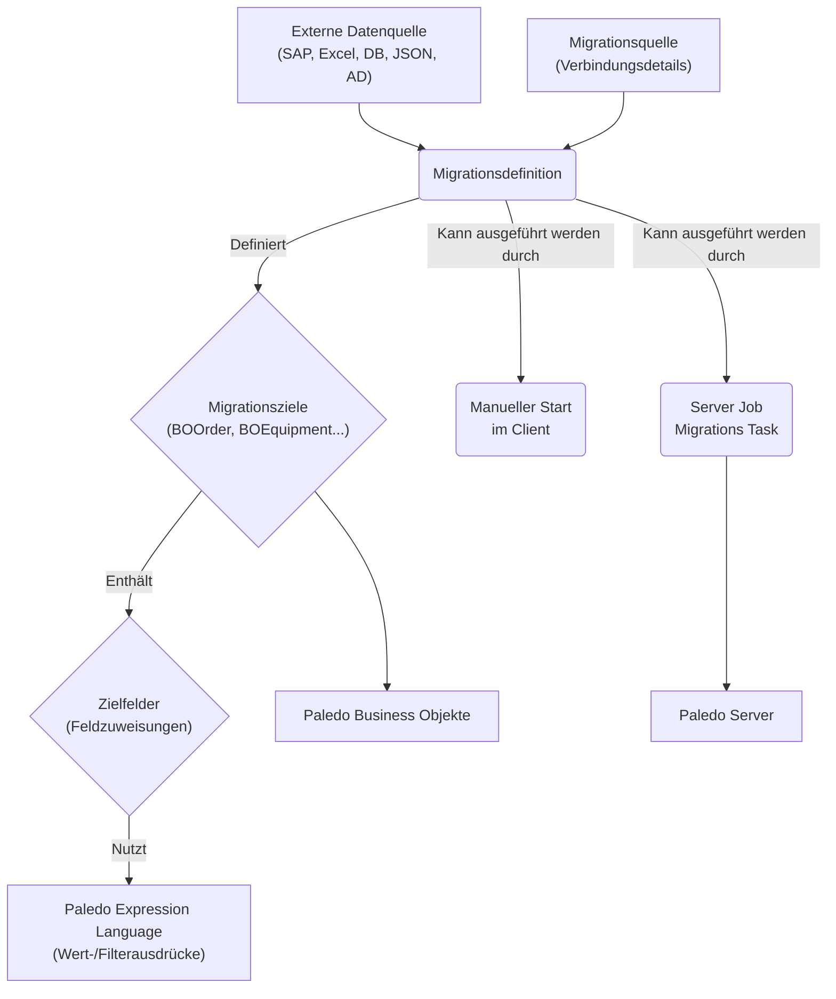
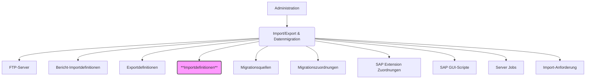
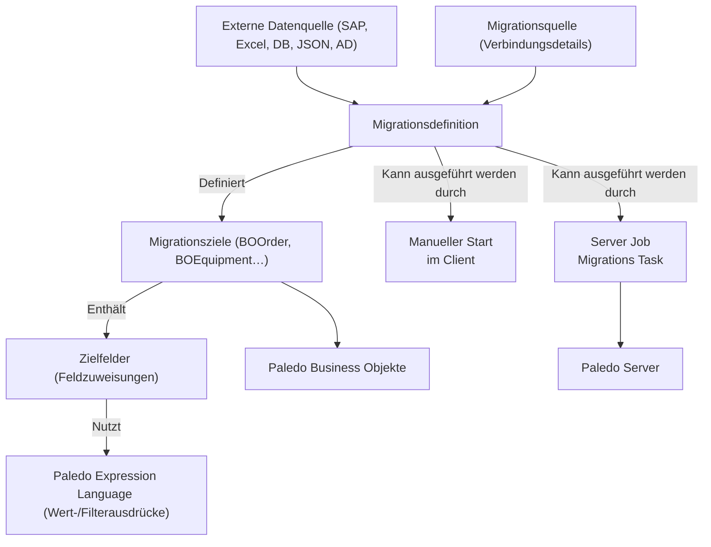
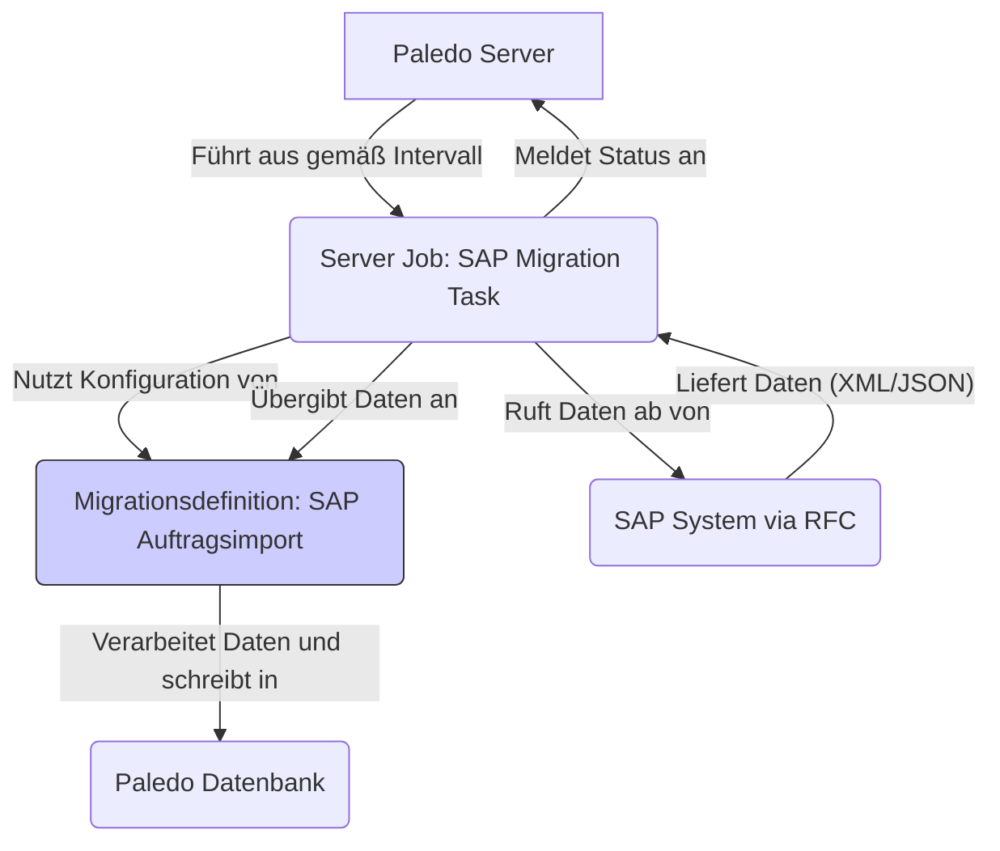

# Migrationsdefinition

## Inhaltsverzeichnis

1. [Einführung](./#1-einfuhrung)
   * [Zweck und Einsatzgebiete](./#11-zweck-und-einsatzgebiete)
   * [Zielgruppe](./#12-zielgruppe)
   * [Einordnung in das Paledo Interface Toolkit (PIT)](./#13-einordnung-in-das-paledo-interface-toolkit-pit)
2. [Grundlegende Konzepte](./#2-grundlegende-konzepte)
   * [Migrationsdefinition](./#21-migrationsdefinition)
   * [Datenquellen (Provider)](./#22-datenquellen-provider)
   * [Migrationsziele](./#23-migrationsziele)
   * [Zielfelder](./#24-zielfelder)
   * [Wert- und Filterausdrücke](./#25-wert--und-filterausdrucke)
   * [Importverhalten](./#26-importverhalten)
   * [Datenstruktur auflösen](./#27-datenstruktur-auflosen)
3. [Navigation und Benutzeroberfläche](./#3-navigation-und-benutzeroberflache)
   * [Zugriff auf Migrationsdefinitionen](./#31-zugriff-auf-migrationsdefinitionen)
   * [Listenansicht der Migrationsdefinitionen](./#32-listenansicht-der-migrationsdefinitionen)
   * [Detailmaske einer Migrationsdefinition](./#33-detailmaske-einer-migrationsdefinition)
   * [Migrationsquellen verwalten](./#34-migrationsquellen-verwalten)
4. [Eine Migrationsdefinition erstellen und konfigurieren](./#4-eine-migrationsdefinition-erstellen-und-konfigurieren)
   * [Schritt 1: Neue Definition anlegen](./#41-schritt-1-neue-definition-anlegen)
   * [Schritt 2: Datenquelle konfigurieren und Struktur auflösen](./#42-schritt-2-datenquelle-konfigurieren-und-struktur-auflosen)
     * [Auswahl des Quelltyps](./#421-auswahl-des-quelltyps)
     * [Spezifizierung der Quelle (Datei, Datenbank, AD)](./#422-spezifizierung-der-quelle-datei-datenbank-ad)
     * [Anzeigen der Struktur im Reiter "Datenquelle"](./#423-anzeigen-der-struktur-im-reiter-datenquelle)
     * [Sonderfall: Hierarchische JSON-Daten (Schema-Reiter)](./#424-sonderfall-hierarchische-json-daten-schema-reiter)
   * [Schritt 3: Migrationsziele definieren](./#43-schritt-3-migrationsziele-definieren)
     * [Reihenfolge und Position](./#431-reihenfolge-und-position)
     * [Zielobjekt und Importverhalten](./#432-zielobjekt-und-importverhalten)
     * [Benennung und Referenzierung](./#433-benennung-und-referenzierung)
   * [Schritt 4: Zielfelder konfigurieren](./#44-schritt-4-zielfelder-konfigurieren)
     * [Zieleigenschaft auswählen](./#441-zieleigenschaft-auswahlen)
     * [Wertausdruck definieren](./#442-wertausdruck-definieren)
     * [Filterausdruck für Identifikation (Insert/Update)](./#443-filterausdruck-fur-identifikation-insertupdate)
     * [Mehrteilige Initialisierung](./#444-mehrteilige-initialisierung)
     * [Priorität der Zielfelder](./#445-prioritat-der-zielfelder)
   * [Schritt 5: Globale Optionen konfigurieren (Reiter "Optionen")](./#45-schritt-5-globale-optionen-konfigurieren-reiter-optionen)
     * [Allgemeine Steuerung](./#451-allgemeine-steuerung)
     * [Inplace Migration Options](./#452-inplace-migration-options)
     * [Vor- und Nachverarbeitung](./#453-vor--und-nachverarbeitung)
     * [Item Deletion (Löschfunktionalität)](./#454-item-deletion-loschfunktionalitat)
     * [Kommentarfeld zur Dokumentation](./#455-kommentarfeld-zur-dokumentation)
5. [Der Ausdruckseditor](./#5-der-ausdruckseditor)
   * [Aufruf und Aufbau](./#51-aufruf-und-aufbau)
   * [Verwendung von Quellspalten](./#52-verwendung-von-quellspalten)
   * [Funktionsbibliothek](./#53-funktionsbibliothek)
     * [Standardfunktionen (String, Datum/Zeit, Logik, Mathe, Aggregat)](./#531-standardfunktionen-string-datumzeit-logik-mathe-aggregat)
     * [Paledo-spezifische Funktionen](./#532-paledo-spezifische-funktionen)
6. [Erweiterte Funktionen und Techniken](./#6-erweiterte-funktionen-und-techniken)
   * [Ausführungsbedingungen (Conditionals)](./#61-ausfuhrungsbedingungen-conditionals)
     * [Konfiguration](./#611-konfiguration)
     * [Visuelle Kennzeichnung (Unterstreichung)](./#612-visuelle-kennzeichnung-unterstreichung)
   * [Flow Control (Steuerung des Ablaufs)](./#62-flow-control-steuerung-des-ablaufs)
   * [Komplexe Ausdrücke (XPO Free Joins, Aggregationen)](./#63-komplexe-ausdrucke-xpo-free-joins-aggregationen)
   * [Verwendung von Custom Actions (z.B. CHANGEWORKFLOWSTATE)](./#64-verwendung-von-custom-actions-zb-changeworkflowstate)
   * [Inplace-Migration (Kontextbezogener Import)](./#65-inplace-migration-kontextbezogener-import)
   * [Katalog- und Referenzdatenmapping](./#66-katalog--und-referenzdatenmapping)
7. [Migration ausführen](./#7-migration-ausfuhren)
   * [Manuelle Ausführung](./#71-manuelle-ausfuhrung)
   * [Automatisierte Ausführung über Server Jobs](./#72-automatisierte-ausfuhrung-uber-server-jobs)
     * [Einrichtung eines Migrations-Service-Tasks](./#721-einrichtung-eines-migrations-service-tasks)
     * [Beispiel: SAP Migration Task](./#722-beispiel-sap-migration-task)
8. [Debugging und Fehlerbehandlung](./#8-debugging-und-fehlerbehandlung)
   * [Verwendung von Haltepunkten](./#81-verwendung-von-haltepunkten)
   * [Fehlersuche und Protokolle](./#82-fehlersuche-und-protokolle)
   * ["Dry-Run"-Option](./#83-dry-run-option)
9. [Best Practices und Tipps](./#9-best-practices-und-tipps)
   * [Testen und Inkrementelles Vorgehen](./#91-testen-und-inkrementelles-vorgehen)
   * [Namenskonventionen und Dokumentation](./#92-namenskonventionen-und-dokumentation)
   * [Umgang mit Eindeutigkeit (Importverhalten)](./#93-umgang-mit-eindeutigkeit-importverhalten)
   * [Performance-Optimierung](./#94-performance-optimierung)
   * [Export/Import von Definitionen](./#95-exportimport-von-definitionen)
10. [Häufige Probleme und Lösungen](./#10-haufige-probleme-und-losungen)
11. [Fazit](./#11-fazit)

***

## 1. Einführung

### 1.1 Zweck und Einsatzgebiete

Das Submodul **„Migrationsdefinitionen“** ist ein zentraler Bestandteil des **Paledo Interface Toolkits (PIT)**. Es ermöglicht die **strukturierte, konfigurierbare und wiederholbare Übertragung von Daten** aus diversen externen Quellen in die Paledo-Anwendung. Hauptziel ist es, Datenimporte und Schnittstellenanbindungen mittels eines **Low-Code-Ansatzes durch Konfiguration statt Programmierung** umzusetzen.

Typische Einsatzgebiete sind:

* **Integration von Drittsystemen**: Insbesondere die Anbindung von SAP-Systemen (Import von Material, Equipment, Technischen Plätzen, Aufträgen, Meldungen, Stücklisten etc.).
* **Datenmigration**: Übernahme von Daten aus Altsystemen oder temporären Datenquellen (z.B. Excel, Access-Datenbanken) im Rahmen von Projekteinführungen.
* **Regelmäßige Synchronisation**: Zyklischer Abgleich von Datenbeständen zwischen Paledo und anderen Systemen.
* **Verarbeitung von Dateninseln**: Import von dezentral gepflegten Listen (z.B. Benutzerlisten, Materialkataloge).

Das System unterstützt dabei Konzepte wie Eindeutigkeitsprüfung (Entscheidung zwischen Neuanlage (Insert) und Aktualisierung (Update) vorhandener Datensätze).

### 1.2 Zielgruppe

Diese Anleitung richtet sich an **erfahrene Paledo-Anwender und Entwickler** mit guten Kenntnissen des Paledo-Datenmodells (Business Objekte, BOs) und der Paledo-Umgebung. Das Modul ist aufgrund seiner Komplexität und der potenziellen Auswirkungen auf die Datenintegrität **nicht für Endanwender ohne spezielle Schulung** gedacht.


**Wichtiger Sicherheitshinweis:** Das Modul "Migrationsdefinitionen" führt Importe ohne die üblichen Paledo-Berechtigungsprüfungen durch. Falsche Konfigurationen können zu erheblichem Datenmüll oder zur unbeabsichtigten Zerstörung von Daten führen. Der Zugriff sollte über das Berechtigungssystem auf geschulte Administratoren oder Entwickler beschränkt sein.


### 1.3 Einordnung in das Paledo Interface Toolkit (PIT)

Migrationsdefinitionen sind Teil des PIT, einem Framework zur Anbindung externer Systeme und Datenquellen an Paledo. Sie arbeiten eng mit anderen PIT-Komponenten zusammen, insbesondere mit:

* **Migrationsquellen**: Zentral verwaltete Definitionen für Verbindungen zu Datenquellen (Datenbanken, FTP, etc.).
* **Server Jobs**: Ermöglichen die automatisierte, zeitgesteuerte Ausführung von Migrationen.
* **Paledo Expression Language**: Wird intensiv für Transformationsregeln (Wertausdrücke) und Filterbedingungen genutzt.

Technisch können Migrationen manuell vom Paledo Desktop Client oder automatisiert als Serverdienst (z.B. zyklisch oder durch Verzeichnisüberwachung) ausgeführt werden.

## 2. Grundlegende Konzepte

Das Datenmigrationssystem basiert auf den folgenden Kernkomponenten:

### 2.1 Migrationsdefinition

Die **Migrationsdefinition** ist die zentrale Konfigurationseinheit. Sie bündelt alle Einstellungen für einen bestimmten Importprozess: die verwendete Datenquelle, die Zielobjekte in Paledo, die Transformationsregeln und die Ausführungsoptionen. Jede Definition erhält einen eindeutigen Namen.

### 2.2 Datenquellen (Provider)

Ein **Datenprovider** definiert den Typ der externen Datenquelle. Paledo unterstützt verschiedene Provider, darunter:

* **CSV-File**: Komma- oder semikolonseparierte Textdateien.
* **Excel / Spreadsheet**: Microsoft Excel-Dateien (`.xls`, `.xlsx`).
* **JSON-File**: JavaScript Object Notation-Dateien, oft von APIs genutzt.
* **Xml-File**: Extensible Markup Language-Dateien, häufig bei SAP-Schnittstellen.
* **Database Data Provider**: Verbindung zu relationalen Datenbanken (SQL Server, Oracle, Access via ODBC) über definierte Migrationsquellen.
* **Active Directory Data Provider**: Anbindung an LDAP-Verzeichnisse.

### 2.3 Migrationsziele

Innerhalb einer Migrationsdefinition können **mehrere Migrationsziele** definiert werden. Jedes Ziel repräsentiert einen Paledo **Business Objekt (BO) Typ**, in den Daten importiert werden sollen (z.B. `BOOrder`, `BOEquipment`, `BOPerson`). Die Ziele werden in einer bestimmten **Reihenfolge (Position)** verarbeitet, was wichtig ist, um Abhängigkeiten zwischen Objekten korrekt abzubilden (z.B. erst den Auftragstyp anlegen, dann den Auftrag). Jedes Ziel erhält einen Namen, um es später referenzieren zu können.

### 2.4 Zielfelder

Für jedes Migrationsziel werden **Zielfelder** konfiguriert. Ein Zielfeld definiert die Zuordnung eines Wertes aus der Datenquelle zu einer spezifischen **Eigenschaft (Feld) des Ziel-Business-Objekts** (z.B. Quellspalte `[KTEXT]` auf Zielfeld `Subject` des `BOOrder`). Die **Priorität** steuert die Reihenfolge der Feldzuweisungen innerhalb eines Ziels.

### 2.5 Wert- und Filterausdrücke

* **Wertausdruck**: Definiert, _wie_ der Wert für ein Zielfeld berechnet wird. Dies kann eine einfache Übernahme einer Quellspalte (`[QuellSpaltenName]`), eine Verrechnung mehrerer Spalten, die Nutzung von Funktionen oder komplexe bedingte Logik sein. Hier kommt die Paledo Expression Language zum Einsatz.
* **Filterausdruck**: Definiert Kriterien, um ein **bereits vorhandenes Objekt** im Paledo-System zu finden. Dies ist entscheidend für die **Insert/Update-Logik**:
  * Wird ein Objekt anhand des Filterausdrucks gefunden, wird es aktualisiert.
  * Wird kein Objekt gefunden, wird ein neues Objekt angelegt (sofern das Importverhalten dies zulässt).
  * Für eine eindeutige Identifikation muss der Filterausdruck oft identisch mit dem Wertausdruck des Schlüsselfeldes sein (z.B. `[SAPOrderNumber]`).

### 2.6 Importverhalten

Das **Importverhalten** wird pro Migrationsziel festgelegt und steuert, wie mit gefundenen oder nicht gefundenen Objekten umgegangen wird:

* **Standard**: Wenn ein Objekt (basierend auf Filterausdrücken) gefunden wird, wird es aktualisiert. Wenn nicht, wird ein neues Objekt angelegt.
* **Voreinstellung nicht leer / Nicht-Leer**: Ähnlich wie Standard, aber es wird _kein neues Objekt angelegt_, wenn die zur Identifikation verwendeten Quellfelder leer sind. Dies verhindert die Erzeugung von "Geisterdatensätzen" bei fehlerhaften oder unvollständigen Quelldaten.
* **Aktualisierung / Nur-Update**: Aktualisiert nur vorhandene Objekte. Wenn kein passendes Objekt gefunden wird, wird _kein neues angelegt_.
* Andere spezifische Verhalten können verfügbar sein.


**Empfehlung:** Das Importverhalten **"Voreinstellung nicht leer"** sollte bevorzugt verwendet werden, um die ungewollte Anlage von Objekten durch leere oder inkonsistente Schlüsselwerte in der Datenquelle zu verhindern.


### 2.7 Datenstruktur auflösen

Dies ist ein initialer Schritt bei der Konfiguration einer Migrationsdefinition. Paledo analysiert die ausgewählte Datenquelle (z.B. eine Excel-Datei, eine XML-Struktur, eine Datenbanktabelle) und erstellt ein internes **Schema (Dictionary)** der verfügbaren Spalten/Felder. Diese Schema-Information ist die Grundlage für die spätere Konfiguration der Zielfelder und die Verwendung von Quellspalten in Ausdrücken.


Wenn sich die Struktur der externen Datenquelle ändert (z.B. neue Spalten in einer Excel-Datei), muss die Datenstruktur in der Migrationsdefinition **erneut aufgelöst** werden, damit die Änderungen erkannt und verwendet werden können. Ansonsten kann es zu Importfehlern kommen, selbst wenn die neuen Spalten nicht aktiv genutzt werden.


## 3. Navigation und Benutzeroberfläche

### 3.1 Zugriff auf Migrationsdefinitionen

Das Modul "Migrationsdefinitionen" befindet sich im Navigationsbereich des Paledo Desktop Clients üblicherweise unter:

**Administration -> Import/Export & Datenmigration -> Importdefinitionen**

Die folgende Abbildung zeigt den relevanten Ausschnitt des Navigationsmenüs:

<figure><figcaption>Paledo Navigationsmenü Importdefinitionen</figcaption></figure>

(Der Begriff "Importdefinitionen" wird hier synonym zu "Migrationsdefinitionen" verwendet).

### 3.2 Listenansicht der Migrationsdefinitionen

Nach Auswahl von "Importdefinitionen" öffnet sich eine Listenansicht, die alle vorhandenen Migrationsdefinitionen anzeigt.

<figure><figcaption>Paledo Liste der Importdefinitionen</figcaption></figure>

* **Funktionen:**
  * Anzeigen, Suchen und Filtern von Definitionen.
  * Erstellen neuer Definitionen (`Neu`).
  * Öffnen vorhandener Definitionen zur Bearbeitung (Doppelklick oder Enter).
  * Kopieren (`Kopieren`) bestehender Definitionen als Vorlage.
  * Löschen (`Löschen`) nicht mehr benötigter Definitionen.
  * Direktes Starten einer manuellen Migration (`Migration durchführen`).
* **Wichtige Spalten:**
  * `Name`: Der eindeutige Name der Definition.
  * `Datenbankfeld`: Kann einen Hinweis auf die primäre Datenquelle geben (z.B. Tabellenname).
  * `Inplace Target Object` / `Inplace View Type`: Konfiguration für die kontextbezogene Einbettung der Migration in anderen Modulen (siehe Abschnitt [6.5 Inplace-Migration](./#65-inplace-migration-kontextbezogener-import)).

### 3.3 Detailmaske einer Migrationsdefinition

Die Detailmaske ist der zentrale Ort zur Konfiguration einer einzelnen Migrationsdefinition. Sie öffnet sich beim Erstellen einer neuen oder Öffnen einer bestehenden Definition.

Die folgende Abbildung zeigt die Detailansicht einer Importdefinition:

<figure><figcaption>Paledo Detailansicht Importdefinition</figcaption></figure>

Die Ansicht ist typischerweise in mehrere Bereiche und Reiter untergliedert:

* **Kopfdaten:** Enthält den Namen der Definition und ggf. einen Bezug zur primären Datenquelle (`Datenbankfeld`).
* **Ribbon-Menü (Oben):** Bietet Aktionen wie Speichern, Datenstruktur auflösen, Migration durchführen, Haltepunkte verwalten.
* **Reiter:**
  * **Migrationsdetails:** Hauptbereich zur Definition der Migrationsziele (obere Liste) und der zugehörigen Zielfelder (untere Liste).
  * **Optionen:** Globale Einstellungen, Vor-/Nachverarbeitung, Löschlogik, Inplace-Konfiguration und das wichtige Kommentarfeld.
  * **Datenquelle:** Zeigt die analysierte Struktur der Datenquelle (Tabellen/Segmente und deren Felder) nach dem "Datenstruktur auflösen".
  * **Schema:** Spezieller Reiter zur Definition der Struktur bei hierarchischen JSON-Datenquellen mittels YAML.

### 3.4 Migrationsquellen verwalten

Eng verbunden mit den Migrationsdefinitionen ist das Modul **Migrationsquellen**, erreichbar unter:

**Administration -> Import/Export & Datenmigration -> Migrationsquellen**

Hier werden **zentral die technischen Verbindungsinformationen** zu externen Datenquellen verwaltet, insbesondere für Datenbanken und Active Directory.

* **Zweck:** Definition von wiederverwendbaren Verbindungen (z.B. SQL Connection Strings, ODBC-Namen, LDAP-Pfade und Credentials).
* **Verwendung:** Wenn in einer Migrationsdefinition der "Database Data Provider" oder "Active Directory Data Provider" genutzt wird, muss hier eine entsprechende Migrationsquelle ausgewählt werden.


Es ist Best Practice, Datenbankverbindungen zentral als Migrationsquelle anzulegen und diese dann in den Migrationsdefinitionen zu referenzieren, anstatt Verbindungsdetails direkt in jeder Definition zu hinterlegen.


## 4. Eine Migrationsdefinition erstellen und konfigurieren

Die Erstellung und Konfiguration einer Migrationsdefinition folgt typischerweise diesen Schritten:

### 4.1 Schritt 1: Neue Definition anlegen

1. Navigiere zu **Administration -> Import/Export & Datenmigration -> Importdefinitionen**.
2. Klicke im Ribbon auf **"Neu"**.
3. Vergib einen **aussagekräftigen Namen** für die Migrationsdefinition.


Verwende eine konsistente Namenskonvention, z.B. `<System>_<BO>_<Zweck>` (Beispiel: `SAP_Equipment_InitialLoad`, `Excel_User_Sync_Daily`). Dies ist besonders wichtig, da in komplexen Umgebungen (z.B. mit SAP) oft Dutzende Definitionen existieren.


4. Wähle den **Standard-Datenprovider** (z.B. `CSV-File`, `Xml-File`, `Database Data Provider`).
5. Speichere die Definition initial ab.

<figure><figcaption>Paledo Importdefinition anlegen</figcaption></figure>

### 4.2 Schritt 2: Datenquelle konfigurieren und Struktur auflösen

Bevor Feldzuweisungen erfolgen können, muss Paledo die Struktur der Datenquelle kennen.

1. Klicke im Ribbon der Detailmaske auf **"Datenstruktur auflösen"**.
2. Es öffnet sich der Dialog **"Quelle"**.

<figure><figcaption>Datenstruktur auflösen</figcaption></figure>

#### 4.2.1 Auswahl des Quelltyps

Wähle den Typ der Datenquelle aus der Liste aus (z.B. `CSV-File`, `Excel`, `JSON-File`, `Xml-File`, `Database Data Provider`, `Active Directory Data Provider`).

<figure><figcaption>Quelltyp auswählen</figcaption></figure>

#### 4.2.2 Spezifizierung der Quelle (Datei, Datenbank, AD)

Je nach gewähltem Quelltyp erscheint ein Folgedialog:

* **Datei-basierte Quellen (CSV, Excel, JSON, XML):** Es öffnet sich ein Standard-Datei-Öffnen-Dialog. Wähle die Beispieldatei aus, deren Struktur analysiert werden soll. Bei Excel muss zusätzlich das relevante Tabellenblatt ausgewählt werden.
* **Database Data Provider:** Es öffnet sich ein Auswahlfeld, in dem eine zuvor unter "Migrationsquellen" definierte Datenbankverbindung ausgewählt werden muss. Ggf. muss auch die spezifische Tabelle oder View angegeben werden.
* **Active Directory Data Provider:** Es muss eine zuvor definierte Migrationsquelle mit den LDAP-Verbindungsparametern ausgewählt werden.

Nach Bestätigung analysiert Paledo die Quelle und speichert das Schema intern.

#### 4.2.3 Anzeigen der Struktur im Reiter "Datenquelle"

Wechsle zum Reiter **"Datenquelle"**. Hier siehst du nun die von Paledo erkannte Struktur:

* **Links:** Liste der erkannten Tabellen oder Segmente (bei flachen Quellen wie CSV oft nur eine Tabelle).
* **Rechts:** Liste der Felder (Spalten) der links ausgewählten Tabelle.

Diese Feldnamen (z.B. `[ORDERID]`, `[KTEXT]`) können nun in den Wert- und Filterausdrücken der Zielfelder verwendet werden.


Bei hierarchischen Quellen (XML, JSON) werden verschachtelte Strukturen standardmäßig "flachgeklopft". Das bedeutet, dass verknüpfte Unterelemente durch das kartesische Produkt (Cross Join) dargestellt werden. Eine Struktur mit 1 Auftrag, 3 Vorgängen und 3 Materialien pro Vorgang resultiert dann in 1 ⋅ 3 ⋅ 3 = 9 Importzeilen. Dies kann zu unerwartet großen Datenmengen und Performance-Problemen führen und muss bei der Konzeption berücksichtigt werden.


#### 4.2.4 Sonderfall: Hierarchische JSON-Daten (Schema-Reiter)

Für komplex verschachtelte **JSON-Datenquellen** reicht die automatische Auflösung oft nicht aus. Hier kommt der Reiter **"Schema"** ins Spiel:

1. **Schema generieren:** Klicke im Ribbon auf **"Schema generieren"**. Es öffnet sich der **"YAML Schema Generator"**.
2. **Quelle angeben:** Wähle im Generator `JSON` als Quelltyp und gib eine Beispiel-JSON-Datei oder einen Endpunkt an.
3. **Generieren:** Der Generator versucht, ein passendes YAML-Schema abzuleiten.


Setze in den `schemaSettings` im Generator `useChildTablePrefixes: true`, um eindeutige Tabellennamen für Unterelemente zu erhalten.


4. **Anpassen:** Das generierte YAML-Schema erscheint im Reiter "Schema" und kann/muss oft manuell angepasst werden (Datentypen korrigieren, Verschachtelung verfeinern).
5. **Verwenden:** Nach erfolgreicher Schema-Definition erscheinen die daraus resultierenden Tabellen und Felder im Reiter "Datenquelle" und können wie bei anderen Quellen verwendet werden.

### 4.3 Schritt 3: Migrationsziele definieren

Wechsle zurück zum Reiter **"Migrationsdetails"**. Definiere nun die Objekte, die in Paledo angelegt oder aktualisiert werden sollen.

1. Klicke im oberen Bereich ("Migrationsziele") auf **"Neu"**.
2. Konfiguriere das Migrationsziel:
   * **Position:** Eine Zahl, die die Verarbeitungsreihenfolge festlegt (kleinere Zahlen zuerst). Dies ist kritisch für Abhängigkeiten (z.B. muss ein `BOWorkCenter` existieren, bevor es einem `BOOrder` zugewiesen wird).
   * **Zielobjekt:** Wähle den Paledo Business Objekt Typ aus (z.B. `BOOrder`, `BOEquipment`, `BOSAPOrderType`).
   * **Importverhalten:** Wähle das gewünschte Verhalten (z.B. `Standard`, `Voreinstellung nicht leer`). Siehe Abschnitt [2.6 Importverhalten](./#26-importverhalten).
   * **Name:** Vergib einen eindeutigen logischen Namen für dieses Ziel (z.B. `Auftragskopf`, `EquipmentRef`, `VerantwortlicherUser`). Dieser Name wird verwendet, um das in diesem Schritt erzeugte/geladene Objekt in späteren Schritten zu referenzieren (Syntax: `[<ZielName>]`).
   * **Nicht importieren wenn leer:** Zusätzliche Option, um Datensätze zu überspringen, wenn bestimmte Schlüsselfelder leer sind.
   * **Bemerkungen:** Optionales Feld zur Dokumentation des Zwecks dieses Migrationsziels.

<figure><figcaption>Migrationsziel anlegen</figcaption></figure>

Wiederhole diesen Schritt für alle benötigten Business Objekte und beachte die korrekte Reihenfolge über die **Position**.

### 4.4 Schritt 4: Zielfelder konfigurieren

Für jedes im oberen Bereich ausgewählte Migrationsziel müssen nun im unteren Bereich die **Zielfelder** (Feldzuweisungen) definiert werden.

1. Wähle oben das Migrationsziel aus, für das du Felder konfigurieren möchtest.
2. Klicke im unteren Bereich ("Zielfelder") auf **"Neu"**.
3. Konfiguriere das Zielfeld:
   * **Priorität:** Legt die Reihenfolge der Feldzuweisungen innerhalb des aktuellen Migrationsziels fest.
   * **Als Lösch-Kriterium:** Markiert dieses Feld als Kriterium für die optionale Löschfunktionalität (siehe [4.5.4 Item Deletion](./#454-item-deletion-loschfunktionalitat)).
   * **Zielfeld:** Wähle aus der Dropdown-Liste die Eigenschaft des Paledo Business Objekts aus, die befüllt werden soll (z.B. `Subject`, `SAPOrderID`, `WorkCenter`).
   * **Wertausdruck:** Definiere hier die Logik zur Wertberechnung mittels Paledo Expression Language (siehe Kapitel [5. Der Ausdruckseditor](./#5-der-ausdruckseditor)). Beispiele: `[KTEXT]`, `COMBINEDATETIME([DATUM],[ZEIT])`, `[<Auftragsart>]` (Referenz auf ein vorheriges Migrationsziel).
   * **Filterausdruck:** **Nur für Felder, die zur Identifikation dienen!** Gib hier den Ausdruck an, mit dem Paledo nach einem vorhandenen Objekt suchen soll. Oft ist dieser identisch mit dem Wertausdruck des Schlüsselfeldes (z.B. `[SAPOrderID]`). Wenn kein Filterausdruck angegeben wird, wird das Feld nur zugewiesen, aber nicht zur Identifikation verwendet.
   * **Ausführungsbedingung (Condition):** Optional. Ein Ausdruck, der `true` oder `false` zurückgeben muss. Das Zielfeld wird nur verarbeitet, wenn die Bedingung `true` ergibt (siehe Abschnitt [6.1 Ausführungsbedingungen](./#61-ausfuhrungsbedingungen-conditionals)).
   * **Bemerkungen:** Optionales Feld zur Dokumentation der Feldzuweisung.

<figure><figcaption>Zielfeld anlegen</figcaption></figure>

Wiederhole diesen Schritt für alle Felder, die aus der Quelle übernommen oder berechnet werden sollen.

#### 4.4.4 Mehrteilige Initialisierung

Wenn ein Objekt nur durch eine **Kombination mehrerer Felder** eindeutig identifiziert werden kann (z.B. ein SAP-Vorgang durch Auftragsnummer + Vorgangsnummer), müssen **alle diese Felder** sowohl einen **Wertausdruck** als auch den **identischen Filterausdruck** erhalten. Nur wenn alle Filterkriterien gemeinsam zutreffen, wird das Objekt als "gefunden" betrachtet.

**Beispiel (SAP Vorgang):**

| Zielfeld (BOSAPOperation) | Wertausdruck       | Filterausdruck     |
| ------------------------- | ------------------ | ------------------ |
| `Number`                  | `[ACTIVITY]`       | `[ACTIVITY]`       |
| `Order`                   | `[<Auftragskopf>]` | `[<Auftragskopf>]` |

#### 4.4.5 Priorität der Zielfelder

Die `Priorität` ist wichtig, wenn Feldzuweisungen voneinander abhängen oder in einer bestimmten Reihenfolge erfolgen müssen (z.B. erst den Status setzen, dann abhängige Felder).

### 4.5 Schritt 5: Globale Optionen konfigurieren (Reiter "Optionen")

Der Reiter **"Optionen"** bietet globale Einstellungen für die gesamte Migrationsdefinition.

<figure><figcaption> Reiter "Optionen" von Importdefinitionen</figcaption></figure>

#### 4.5.1 Allgemeine Steuerung

* **Fehlende Spalten ignorieren:** Verhindert Fehler, wenn eine in der Definition verwendete Spalte in der aktuellen Quelldatei fehlt.
* **Abbruch bei Fehler:** Stoppt die gesamte Migration, sobald der erste Fehler auftritt. Empfohlen für kritische Importe.
* Weitere Optionen zur Steuerung der Strukturauflösung, Behandlung stornierter Einträge etc.

#### 4.5.2 Inplace Migration Options

* **Inplace View Type / Inplace Target Object:** Konfiguration für die Einbettung der Migration in anderen Paledo-Masken (siehe Abschnitt [6.5 Inplace-Migration](./#65-inplace-migration-kontextbezogener-import)).

#### 4.5.3 Vor- und Nachverarbeitung

Hier können Aktionen definiert werden, die **vor** oder **nach** dem eigentlichen Datenimport ausgeführt werden.

* **Konfiguration:** Festlegung von Objekttyp, Filterkriterien und auszuführendem Ausdruck (Aktion). Optional können auch Objekte gelöscht werden.
* **Anwendungsfälle:** Bereinigen von Zwischentabellen, Setzen von Statusflags, Erstellen von Protokolleinträgen, Starten von Folgeprozessen.

#### 4.5.4 Item Deletion (Löschfunktionalität)

* **Checkbox "Löscht nicht importierte Daten":** Wenn aktiviert, löscht Paledo nach dem Import alle Objekte des Zieltyps, die während dieses Migrationslaufs **nicht** angelegt oder aktualisiert wurden (aber den optionalen Löschkriterien entsprechen).


**Vorsicht bei der Verwendung der Löschfunktionalität!** Diese Option sollte nur genutzt werden, wenn die Datenquelle garantiert **vollständig** ist. Bei Teilimporten oder fehlerhaften Quellen können unbeabsichtigt Daten im Zielsystem gelöscht werden. Zusätzliche Löschkriterien und Sicherheitslimits (minimale/maximale Anzahl) sollten konfiguriert werden.


#### 4.5.5 Kommentarfeld zur Dokumentation

Ein Freitextfeld zur Beschreibung der Funktionsweise, des Zwecks und der Besonderheiten der Migrationsdefinition.


**Nutze das Kommentarfeld intensiv!** Dokumentiere hier den Zweck, Annahmen, komplexe Logiken, Abhängigkeiten und potenzielle Risiken. Dies ist entscheidend für die Wartbarkeit und das Verständnis der Definition durch andere oder dich selbst zu einem späteren Zeitpunkt.


Nach Abschluss aller Konfigurationsschritte muss die Migrationsdefinition **gespeichert** werden.

## 5. Der Ausdruckseditor

Der Ausdruckseditor ist das zentrale Werkzeug zur Definition der Logik in **Wertausdrücken**, **Filterausdrücken** und **Ausführungsbedingungen**.

### 5.1 Aufruf und Aufbau

* **Aufruf:** Klicke auf das `[...]`-Symbol in einer Zelle für einen Ausdruck (z.B. in der Spalte "Wertausdruck").
* **Aufbau:**
  * **Linker Bereich:** Baumansicht mit verfügbaren Elementen:
    * **Spalten:** Alle Felder, die durch "Datenstruktur auflösen" aus der Quelle erkannt wurden. Syntax: `[Feldname]` oder bei Referenzen `<ZielName>.Feldname`.
    * **Funktionen:** Umfangreiche Bibliothek von Standard- und Paledo-spezifischen Funktionen, kategorisiert (String, Datum/Zeit, Logik, Math, Aggregat, Custom).
    * **Konstanten/Operatoren:** Vordefinierte Werte und Vergleichs-/Rechenoperatoren.
  * **Mittlerer Bereich:** Textfeld zur Eingabe und Bearbeitung des Ausdrucks. Unterstützt IntelliSense (Vorschläge nach Eingabe von `[`, `<`, `.`).
  * **Rechter Bereich:** Kontexthilfe mit Beschreibung des links ausgewählten Elements.

### 5.2 Verwendung von Quellspalten

Felder aus der Datenquelle werden per Doppelklick, Drag & Drop oder Direkteingabe (mit `[` beginnen) in den Ausdruck eingefügt. Bei hierarchischen Quellen oder Referenzen auf vorherige Migrationsziele wird die Punkt- oder Klammernotation verwendet (z.B. `<SAP Auftrag>.Subject`, `[values_keyValue.timestamp]`).

### 5.3 Funktionsbibliothek

#### 5.3.1 Standardfunktionen (String, Datum/Zeit, Logik, Mathe, Aggregat)

Der Editor bietet eine Vielzahl von Standardfunktionen zur Datenmanipulation:

* **String:** `Concat()`, `Contains()`, `Left()`, `Replace()`, `Upper()`, `Lower()`, `Trim()`, `Substring()`, etc.
* **Datum/Zeit:** `Now()`, `Today()`, `DateAdd()`, `DateDiff()`, `GetDate()`, `GetMonth()`, `GetYear()`, `COMBINEDATETIME()`, etc.
* **Logisch:** `iif(bedingung, wert_wenn_wahr, wert_wenn_falsch)`, `IsNullOrEmpty()`, `IsTrue()`, `IsFalse()`, `And`, `Or`, `Not`, etc.
* **Math:** `Round()`, `Abs()`, `Max()`, `Min()`, `ToInt()`, `ToDecimal()`, etc.
* **Aggregat:** `Sum()`, `Count()`, `Avg()`, `Min()`, `Max()` - oft in Verbindung mit XPO-Joins auf Objektlisten (z.B. `<SAP Auftrag>.Operations[].Sum(SAPActualWork)`).

#### 5.3.2 Paledo-spezifische Funktionen

Zusätzlich stehen spezielle Funktionen für Paledo-Kontexte bereit:

* `SAPNumber(string sapNumber)`: Entfernt führende Nullen aus SAP-Nummernkreisen.
* `ChangeWorkflowState(<BO>, 'StatusName')`: Ändert den Workflow-Status eines Business Objekts.
* `CreateDocumentationRecord(...)`: Erzeugt einen Paledo-Bericht (BORecord) mit spezifischen Parametern.
* `AddComponent(<ParentBO>, <ChildBO>)`: Fügt einem Objekt ein Kind-Objekt hinzu (z.B. Equipment zu Auftrag).
* `SetClassificationValue(...)`: Setzt Werte in Paledo-Klassifizierungen.
* `TriggerMaterialSAPUpload(...)`: Kann spezifische Aktionen wie einen direkten SAP-Upload anstoßen.
* `Lookup(string catalogName, object key)`: Sucht Werte in Paledo-Katalogen.
* `HasRole(string roleName)`: Prüft, ob der aktuelle Benutzer eine bestimmte Rolle hat.
* Viele weitere, je nach Paledo-Version und Konfiguration.


Die verfügbaren Funktionen bieten mächtige Werkzeuge zur Transformation und Anreicherung von Daten direkt während des Imports. Komplexe Logik sollte jedoch gut getestet und im Kommentarfeld des Zielfeldes dokumentiert werden.


## 6. Erweiterte Funktionen und Techniken

### 6.1 Ausführungsbedingungen (Conditionals)

#### 6.1.1 Konfiguration

Für jedes Zielfeld kann im Feld **"Ausführungsbedingung"** ein Ausdruck hinterlegt werden, der `true` oder `false` zurückgibt. Die Zuweisung des Wertausdrucks für dieses Zielfeld erfolgt **nur dann, wenn die Bedingung `true` ergibt**.

* **Anwendungsfälle:**
  * Felder nur unter bestimmten Umständen setzen (z.B. Statusabhängig).
  * Überschreiben vorhandener Werte verhindern (`IsNullOrEmpty(<ZielObjekt>.FeldName)`).
  * Zuweisungen temporär deaktivieren (Bedingung `1 = 2`).
  * Importverhalten dynamisch steuern.

#### 6.1.2 Visuelle Kennzeichnung (Unterstreichung)


Wenn für ein Zielfeld eine **Ausführungsbedingung** hinterlegt ist, wird der Text in den Spalten **"Zielfeld"** und **"Wertausdruck"** in der Liste der Zielfelder **unterstrichen** dargestellt. Dies ist ein nützlicher visueller Hinweis, besonders wenn die Spalte "Ausführungsbedingung" ausgeblendet ist.


### 6.2 Flow Control (Steuerung des Ablaufs)

Durch Verwendung des speziellen Zielfeldes `<Flow Control>` kann der Abarbeitungsfluss zwischen den **Migrationszielen** (den Zeilen im oberen Bereich der Migrationsdetails) gesteuert werden.

* **Wertausdruck:** Enthält einen Ausdruck, der den **Namen eines anderen Migrationsziels** zurückgibt.
* **Funktion:** Wenn der Ausdruck einen gültigen Zielnamen liefert, springt die Verarbeitung direkt zu diesem Ziel und überspringt alle dazwischenliegenden Ziele. Liefert der Ausdruck einen leeren String oder `null`, wird normal mit dem nächsten Ziel fortgefahren.
* **Anwendungsfall:** Überspringen von Verarbeitungsschritten basierend auf Datenwerten (z.B. "wenn Auftrag abgeschlossen, überspringe Vorgangsbearbeitung").

**Beispiel:**\
Wertausdruck für `<Flow Control>` in Ziel "Auftragskopf":`iif(Contains([S_STATUS], 'TABG'), 'NächstesHauptobjekt', '')`\
Wenn der Status 'TABG' enthält, wird zum Ziel "NächstesHauptobjekt" gesprungen, andernfalls normal weitergemacht.

### 6.3 Komplexe Ausdrücke (XPO Free Joins, Aggregationen)

Die Paledo Expression Language basiert auf DevExpress XPO und unterstützt dessen Syntax für den Zugriff auf verknüpfte Objekte und Aggregationen:

* **Zugriff auf verknüpfte Objekte:** `[<ZielName>].PropertyName` (z.B. `<Auftragskopf>.WorkCenter.Code`).
* **Zugriff auf Auflistungen (Collections):** `[<ZielName>].CollectionName[]` (z.B. `<SAP Auftrag>.Operations[]`).
* **Filterung in Collections:** `[<ZielName>].CollectionName[Status == 1]`
* **Aggregationen über Collections:**
  * `[<ZielName>].CollectionName[].Sum(PropertyName)` (z.B. `<SAP Auftrag>.Operations[].Sum(SAPActualWork)`).
  * `[<ZielName>].CollectionName[].Count()`
  * `[<ZielName>].CollectionName[].Min(PropertyName)`
  * `[<ZielName>].CollectionName[].Max(PropertyName)`

Diese ermöglichen mächtige Berechnungen und Datenzusammenfassungen über verknüpfte Paledo-Objekte direkt im Wertausdruck.

### 6.4 Verwendung von Custom Actions (z.B. CHANGEWORKFLOWSTATE)

Neben Standard-Datenzuweisungen können über den Wertausdruck auch spezielle Paledo-Aktionen ausgelöst werden, die oft als Funktionen im Ausdruckseditor verfügbar sind.

* **Beispiel `CHANGEWORKFLOWSTATE(<BO>, 'StatusName')`:** Diese Funktion ändert den Workflow-Status des übergebenen Business Objekts.
* **Konfiguration:** Die Funktion wird im **Wertausdruck** eines Zielfeldes aufgerufen. Das Zielfeld selbst muss nicht unbedingt einer BO-Eigenschaft entsprechen (kann z.B. ein Dummy-Feld sein oder das Feld bleibt leer, wenn die Funktion keinen relevanten Rückgabewert hat).
* **Bedingte Ausführung:** Solche Aktionen werden oft mit einer **Ausführungsbedingung** kombiniert, um sicherzustellen, dass sie nur im gewünschten Kontext ausgeführt werden.

### 6.5 Inplace-Migration (Kontextbezogener Import)

Migrationsdefinitionen können so konfiguriert werden, dass sie direkt aus der Detailmaske eines anderen Business Objekts heraus aufgerufen werden können.

* **Konfiguration:** Erfolgt im Reiter **"Optionen"** der Migrationsdefinition:
  * **Inplace Target Object:** Der Typ des BOs, in dessen Maske die Migration verfügbar sein soll (z.B. `BOLocation` für einen TPL).
  * **Inplace View Type:** Art der Einbindung, z.B. `Dialog` (öffnet die Migration in einem separaten Fenster über einen Button) oder `Embedded` (direkt eingebettet, selten).
* **Anwendungsfall:** Ermöglicht Anwendern, Daten direkt im Arbeitskontext zu importieren, ohne in das Migrationsmodul wechseln zu müssen (z.B. Equipments zu einem spezifischen Technischen Platz aus einer Excel-Datei importieren).
* **Zusatz:** Die Sichtbarkeit der Migrationsaktion in der Zielmaske muss ggf. zusätzlich über das Paledo UI-Modell oder spezifische Anpassungen konfiguriert werden.

### 6.6 Katalog- und Referenzdatenmapping

Für die Zuordnung von Werten aus externen Systemen zu Paledo-spezifischen Werten (z.B. SAP-Auftragsart 'PM01' zu Paledo-Auftragsart 'Instandhaltung') können Paledo-Kataloge oder spezielle Migrationszuordnungen verwendet werden.

* **Ansatz 1: Paledo-Kataloge:** Werte im Wertausdruck über die `Lookup()`-Funktion nachschlagen.
* **Ansatz 2: Migrationszuordnungen:** Im Modul **"Migrationszuordnungen"** können Mapping-Tabellen definiert werden, die dann in Ausdrücken verwendet werden können (ggf. über spezifische Funktionen).

## 7. Migration ausführen

### 7.1 Manuelle Ausführung

Eine konfigurierte Migration kann jederzeit manuell aus der Paledo-Anwendung gestartet werden:

1. Öffne die Listenansicht **"Importdefinitionen"** oder die **Detailmaske** der gewünschten Definition.
2. Klicke im Ribbon auf **"Migration durchführen"**.
3. Es erscheint ein Dialog, in dem ggf. der Datenprovider ausgewählt und spezifische Parameter für diesen Lauf konfiguriert werden müssen (z.B. Auswahl der konkreten Excel-Datei).
4. Klicke auf **"OK"**, um die Migration zu starten.
5. Ein Fortschrittsdialog zeigt den Status und eventuelle Fehler an. Nach Abschluss erscheint eine Erfolgs- oder Fehlermeldung.

### 7.2 Automatisierte Ausführung über Server Jobs

Für regelmäßige Importe (z.B. stündlicher SAP-Abgleich) werden Migrationsdefinitionen über Paledo Server Jobs automatisiert.

#### 7.2.1 Einrichtung eines Migrations-Service-Tasks

1. Navigiere zu **Administration -> Import/Export & Datenmigration -> Server Jobs**.
2. Erstelle einen neuen Server Job.
3. Wähle als **Typ** einen passenden Migrationstask, z.B.:
   * **Migrations-Service-Task**: Allgemeiner Typ für datei- oder datenbankbasierte Migrationen.
   * **SAP Migration Task**: Spezieller Typ für Migrationen mit SAP-RFC-Anbindung.
4. Konfiguriere den Job:
   * **Intervall (s):** Ausführungsfrequenz.
   * **Ist Aktiv:** Aktiviert den Job.
   * **Parameter:**
     * **Migration Definition:** Wähle die zuvor erstellte Migrationsdefinition aus.
     * Weitere Parameter je nach Jobtyp und Definition (z.B. zu überwachender Ordner, SAP-Verbindung, spezifische Filter für den Abruf).
5. Speichere und aktiviere den Job.

<figure><figcaption>Server-Jobs anlegen</figcaption></figure>

#### 7.2.2 Beispiel: SAP Migration Task

Ein typischer `SAP Migration Task` für den Import von Aufträgen würde folgende Konfigurationen enthalten:

* **Typ:** `SAP Migration Task`
* **Intervall:** z.B. `3600` (stündlich)
* **Parameter:**
  * `Migration Definition`: Name der SAP-Auftragsimport-Definition.
  * `Migration Type`: Fachliche Bezeichnung (z.B. `Order`).
  * `SAP Verbindungstyp`: z.B. `RFC`.
  * Spezifische Abrufparameter für den SAP-Baustein (z.B. `IncludeCompleted = False`, `Plant = '1000'`).

Der Server führt den Job dann gemäß Intervall aus, ruft die Daten ab (z.B. via SAP RFC), übergibt sie an die Migrationsdefinition, welche die Daten verarbeitet und in die Paledo-Datenbank schreibt. Der Job-Status (letzte Ausführung, Dauer, Erfolg/Fehler) kann im Server Job Modul überwacht werden.

## 8. Debugging und Fehlerbehandlung

Die Fehlersuche bei komplexen Migrationen kann herausfordernd sein. Paledo bietet dafür Werkzeuge:

### 8.1 Verwendung von Haltepunkten

Haltepunkte ermöglichen es, die Migration an bestimmten Stellen anzuhalten und die Datenwerte zu inspizieren.

1. Öffne die Detailmaske der Migrationsdefinition.
2. **Haltepunkte laden/verwalten:** Nutze die Aktionen im Ribbon (`Haltepunkte laden`, `Haltepunkte deaktivieren`, `Haltepunkte entfernen`).
3. **Haltepunkt setzen:** Wähle in der Liste der Zielfelder das Feld aus, bei dem die Migration anhalten soll. Setze im Eigenschaftsfenster (oder über Rechtsklick) einen Haltepunkt. Optional kann eine Bedingung für den Haltepunkt angegeben werden (z.B. nur anhalten, wenn `[SAPOrderID] == '12345'`).
4. **Migration ausführen:** Starte die Migration manuell.
5. **Debug-Dialog:** Wenn ein Haltepunkt erreicht wird, öffnet sich ein Dialog, der anzeigt:
   * Die aktuellen Werte der Quelldaten für den betroffenen Datensatz.
   * Die berechneten Werte für die Zielfelder bis zu diesem Punkt.
   * Die Möglichkeit, den Migrationsprozess fortzusetzen (`Weiter`), schrittweise vorzugehen (falls implementiert) oder abzubrechen (`Abbrechen`).


Haltepunkte sind essenziell, um komplexe Wertausdrücke, Filterlogiken und bedingte Ausführungen zu überprüfen und Fehler in der Transformationslogik zu finden.


### 8.2 Fehlersuche und Protokolle

Bei Problemen während einer Migration:

1. **Fehlermeldungen prüfen:** Nach einer fehlgeschlagenen manuellen Migration oder in den Logs eines Server Jobs werden oft spezifische Fehlermeldungen angezeigt (z.B. Typkonflikte, Datenbankfehler, nicht gefundene Objekte).
2. **Haltepunkte setzen:** Gezielt an kritischen Stellen (z.B. vor einer komplexen Berechnung oder einer Objektreferenzierung) Haltepunkte setzen und Werte prüfen.
3. **Ausdrücke isoliert testen:** Komplexe Wert- oder Filterausdrücke ggf. im Ausdruckseditor oder einem separaten Tool mit Beispieldaten testen.
4. **Datenquelle validieren:** Sicherstellen, dass die Quelldaten das erwartete Format und die erwarteten Werte enthalten. Ggf. Schema neu auflösen.
5. **Reihenfolge prüfen:** Sicherstellen, dass Migrationsziele und Zielfelder in der korrekten Reihenfolge (Position, Priorität) verarbeitet werden, insbesondere bei Abhängigkeiten.

## 9. Best Practices und Tipps

### 9.1 Testen und Inkrementelles Vorgehen

* **Immer in Testumgebungen testen:** Führe neue oder geänderte Migrationen niemals direkt im Produktivsystem aus. Nutze dedizierte Test- oder Qualitätssicherungsumgebungen.
* **Klein anfangen:** Beginne mit einer einfachen Definition (wenige Ziele, wenige Felder) und erweitere diese schrittweise. Teste jeden Schritt.
* **Mit kleinen Datenmengen testen:** Verwende zu Beginn überschaubare Testdatensätze, um die Logik zu verifizieren, bevor große Datenmengen importiert werden.

### 9.2 Namenskonventionen und Dokumentation

* **Sprechende Namen:** Verwende klare und konsistente Namen für Migrationsdefinitionen, Migrationsziele und ggf. für komplexe Zielfelder.
* **Kommentare nutzen:** Dokumentiere den Zweck, die Logik und Besonderheiten im Kommentarfeld der Definition und ggf. bei den Zielen und Feldern. Dies ist entscheidend für die Wartbarkeit.

### 9.3 Umgang mit Eindeutigkeit (Importverhalten)

* **"Voreinstellung nicht leer" bevorzugen:** Nutze dieses Importverhalten, um die Anlage von Objekten durch leere Schlüsselwerte zu verhindern.
* **Filterausdrücke sorgfältig definieren:** Stelle sicher, dass die Filterausdrücke für die Schlüsselfelder korrekt gesetzt sind, um Duplikate zu vermeiden und Updates korrekt durchzuführen.

### 9.4 Performance-Optimierung

* **Filterausdrücke optimieren:** Verwende indizierte Felder für Filterausdrücke, wenn möglich.
* **Datenmenge begrenzen:** Rufe nur die benötigten Daten aus der Quelle ab (z.B. durch Filter im SAP-Baustein oder in der Datenbankabfrage).
* **Hierarchien beachten:** Sei dir der potenziellen Datenmultiplikation bei hierarchischen Quellen (XML/JSON) bewusst.
* **Verarbeitung aufteilen:** Bei sehr großen Datenmengen kann es sinnvoll sein, die Migration in mehrere kleinere, spezialisierte Definitionen aufzuteilen.
* \*\* unnötige Initialisierungen vermeiden:\*\* Prüfe, ob Objekte unnötigerweise mehrfach pro Quelldatensatz initialisiert werden. Nutze Referenzen `[<ZielName>]` effizient.

### 9.5 Export/Import von Definitionen

Migrationsdefinitionen können exportiert (z.B. aus einem Testsystem) und in ein anderes System (z.B. Produktivsystem) importiert werden.

* **Funktion:** Standard XAF-Export/Import-Funktionalität für Objekte.
* **Einschränkung:** Es gibt keine eingebaute Funktion für einen Delta-Abgleich oder ein Merging von Definitionen. Beim Import muss die vorhandene Definition im Zielsystem in der Regel zuerst gelöscht werden. Bei komplexen Änderungen ist oft ein manueller Abgleich und Nachbau der Änderungen einfacher als Export/Import.

## 10. Häufige Probleme und Lösungen

| Problem                                           | Mögliche Ursachen & Lösungen                                                                                                                                                                                                                                                                          |
| ------------------------------------------------- | ----------------------------------------------------------------------------------------------------------------------------------------------------------------------------------------------------------------------------------------------------------------------------------------------------- |
| **Keine Daten werden importiert**                 | 
- Datenquelle falsch konfiguriert (Pfad, Verbindung, Tabellenblatt). - Datenstruktur nicht (neu) aufgelöst. - Filterausdrücke zu restriktiv oder falsch. - Quelldaten entsprechen nicht dem erwarteten Format. - Importverhalten verhindert Anlage (z.B. "Nur-Update").
            |
| **Falsche Daten werden importiert / Felder leer** | 
- Wertausdrücke fehlerhaft. - Falsche Quellspalten verwendet. - Datentypkonflikte (z.B. String statt Zahl). - Reihenfolge der Zielfelder/Ziele falsch (Abhängigkeiten). - Haltepunkte zur Überprüfung der Zwischenwerte nutzen. - Funktion <code>IsNullOrEmpty()</code> prüfen.
 |
| **Duplikate werden angelegt**                     | 
- Filterausdrücke für Schlüsselfelder nicht oder falsch gesetzt. - Importverhalten "Standard" bei inkonsistenten Schlüsseln (leere Werte). -> "Voreinstellung nicht leer" verwenden. - Mehrteilige Initialisierung unvollständig konfiguriert.
                                           |
| **Performance-Probleme bei großen Datenmengen**   | 
- Nicht-optimierte Filterausdrücke. - Zu viele Daten aus der Quelle abgerufen. - "Flachklopfen" hierarchischer Daten erzeugt riesige Datenmengen. - Unnötige Schleifen oder wiederholte Objektinitialisierungen. - Migration ggf. aufteilen oder serverseitig optimieren.
          |
| **Fehler bei hierarchischem JSON/XML**            | 
- Schema (YAML) nicht oder falsch definiert. - Schema passt nicht zur tatsächlichen Datenstruktur. - <code>useChildTablePrefixes</code> nicht gesetzt, führt zu Namenskonflikten. - Datenstruktur nach Schema-Änderung nicht neu aufgelöst.
                                           |
| **Objekte werden ungewollt gelöscht**             | 
- Option "Löscht nicht importierte Daten" aktiv und Quelldaten unvollständig. - Löschkriterien zu weit gefasst. - Sicherheitslimits (Min/Max) nicht gesetzt oder zu hoch.
                                                                                                                |

## 11. Fazit

Das Modul **"Migrationsdefinitionen"** ist ein mächtiges und flexibles Werkzeug innerhalb des Paledo Interface Toolkits. Es ermöglicht erfahrenen Anwendern und Entwicklern, komplexe Datenintegrations- und Migrationsszenarien effizient und wartbar per Konfiguration umzusetzen. Durch die Unterstützung verschiedener Datenquellen, umfangreicher Transformationsmöglichkeiten mittels Ausdrücken und Funktionen sowie integrierter Debugging-Werkzeuge können selbst anspruchsvolle Anforderungen, insbesondere im SAP-Umfeld, realisiert werden.

Ein sorgfältiges Design, gründliches Testen und eine gute Dokumentation sind jedoch unerlässlich, um die Stabilität und Datenintegrität im Paledo-System sicherzustellen und das volle Potenzial dieses Moduls auszuschöpfen.
