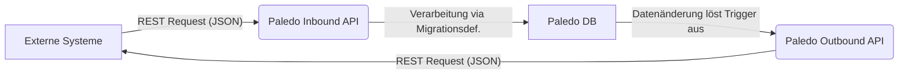
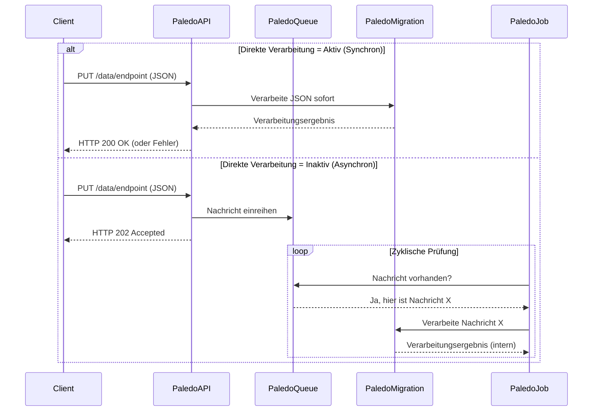
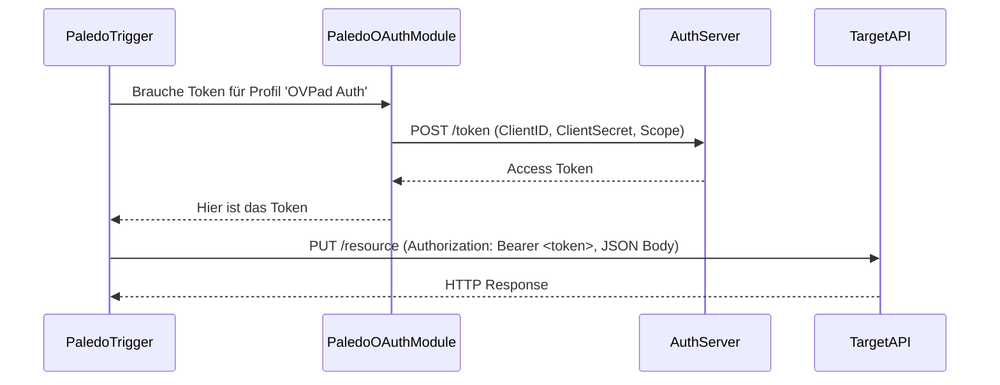
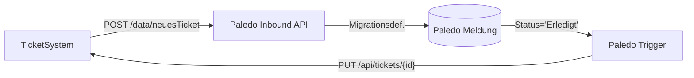
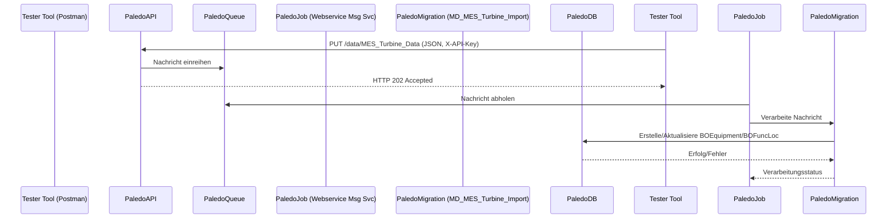

# REST API

**Zielgruppe:** Erfahrene Paledo-Anwender und Entwickler

**Modul:** Generische REST API (Teil des Paledo Interface Toolkits)

**Stand:** Basierend auf Informationen bis April 2025

***

## Einleitung und Einsatzkontext

### Zweck des Moduls

Die **generische REST API** ist ein Sub-Modul des Paledo Interface Toolkits (PIT). Sie dient der flexiblen Anbindung von Drittsystemen an Paledo und umgekehrt. Das Modul ermöglicht es, sowohl **eingehende REST-Nachrichten** (typischerweise mit JSON-Body) zu empfangen und zu verarbeiten, als auch **ausgehende REST-Aufrufe** an externe Endpunkte zu senden, die durch Ereignisse innerhalb von Paledo ausgelöst werden (Trigger).


Ein wesentlicher Vorteil dieses Moduls ist, dass die Konfiguration von Schnittstellen vollständig innerhalb der Paledo Benutzeroberfläche erfolgen kann. Es ist **nicht notwendig**, für die Einführung einer neuen Schnittstelle zusätzliche Software zu programmieren oder Updates beim Kunden auszurollen.


### Typische Anwendungsfälle

* **Integration von Ticketsystemen:** Empfang von Tickets (z.B. Instandhaltungstickets) aus einem unternehmensweiten System und Rückmeldung des Bearbeitungsstatus aus Paledo.
* **Anbindung von Betriebsleittechnik oder externen Erfassungssystemen:** Übermittlung von Zustandsdaten, Messwerten oder Schadensmeldungen an Paledo.
* **Synchronisation mit Drittsystemen:** Automatisierter Datenaustausch bei Statusänderungen oder relevanten Ereignissen in Paledo (z.B. Abschluss eines Auftrags).

### Grundprinzip und Technologie

Die generische REST API basiert auf dem **OpenAPI-Standard (Version 3.x)**. Eingehende Endpunkte werden über eine YAML-Spezifikation definiert. Paledo stellt für konfigurierte Endpunkte automatisch eine **Swagger UI** bereit, die es Entwicklern von Drittsystemen ermöglicht, die Schnittstellen zu erkunden, zu testen und die Definitionen einzusehen.

***

## Systemvoraussetzungen & Erforderliches Know-how

### Technische Voraussetzungen

* Paledo-Serverkomponente mit lizenziertem und aktivem PIT-Modul.
* Netzwerkkonnektivität zwischen dem Paledo-Server und den anzubindenden Drittsystemen (ggf. über VPN, Firewall-Freischaltungen).
* Erreichbarkeit der Paledo-REST-Endpunkte von außen (für eingehende Nachrichten) bzw. der externen Endpunkte von Paledo aus (für ausgehende Nachrichten).

### Erforderliches Wissen

Die Konfiguration und Nutzung der generischen REST API erfordert tiefgreifendes Wissen in verschiedenen Bereichen:

* **Paledo Migrationsdefinitionen (Synonym: Importdefinitionen):** Diese sind fundamental für die Verarbeitung der Daten aus eingehenden JSON-Nachrichten sowie für die Rückverarbeitung von Antworten auf ausgehende Calls. Ein hohes Verständnis der Schemata und Mapping-Möglichkeiten ist unabdingbar.
* **Paledo Datenmodell:** Sehr gute Kenntnisse des Paledo-Datenmodells sind notwendig, um Daten korrekt zu mappen und Inkonsistenzen zu vermeiden.
* **Paledo Skriptsprache (Expressions):** Wird benötigt für die dynamische Erstellung von JSON-Payloads bei ausgehenden Trigger-Aufrufen und für die Definition von Filterbedingungen.
* **Webtechnologien:** Gutes Verständnis von REST-Prinzipien, HTTP-Methoden (PUT, POST, GET etc.), JSON-Datenstruktur, HTTP-Headern.
* **Authentifizierungsmethoden:** Kenntnisse über API-Keys (typischerweise im Header) und OAuth2 (insbesondere Client Credentials Flow).
* **YAML-Syntax:** Notwendig für die Erstellung und das Verständnis der OpenAPI-Spezifikationen für eingehende Endpunkte.


**Wichtiger Hinweis:** Aufgrund der Komplexität und der potenziellen Auswirkungen auf die Datenkonsistenz sollte die Konfiguration nur von sehr erfahrenen Paledo-Anwendern, Entwicklern oder Consultants durchgeführt werden. Fehlkonfigurationen können die Datenintegrität ernsthaft gefährden.


***

## Grundlagen und Architektur

### Duale Funktionalität (Inbound/Outbound)

Die generische REST API deckt zwei Hauptrichtungen der Kommunikation ab:

1. **Inbound (Eingehend):** Paledo agiert als REST-Server. Es können Endpunkte konfiguriert werden, die JSON-Nachrichten von externen Systemen empfangen.
2. **Outbound (Ausgehend):** Paledo agiert als REST-Client. Basierend auf Triggern (Datenänderungen in Paledo) können proaktiv REST-Nachrichten an externe Endpunkte gesendet werden.



### Konfigurationsbasierter Ansatz

Alle Aspekte der Schnittstelle – Endpunkte, Trigger, Authentifizierung, Datenmapping – werden **direkt in der Paledo Benutzeroberfläche konfiguriert**. Es ist keine zusätzliche Programmierung oder ein Deployment erforderlich.

### Verarbeitung über Migrationsdefinitionen


Das Kernstück der Datenverarbeitung (sowohl für eingehende Nachrichten als auch für die Verarbeitung von Antworten auf ausgehende Calls) sind die **Paledo Migrationsdefinitionen**. Diese definieren, wie die Felder aus dem JSON-Body auf die Objekte und Attribute im Paledo-Datenmodell gemappt werden.


***

## Navigation im Paledo Client

### Zugriff auf die Module

Alle relevanten Konfigurations- und Monitoring-Module für die generische REST API finden sich im Paledo Client unter dem Navigationspfad:

`Administration → Webschnittstelle`

<figure><figcaption>Paledo Navigationsmenü Webschnittstelle</figcaption></figure>

Dort stehen folgende Unterpunkte zur Verfügung:

* **REST-Schnittstelle Konfiguration:** Verwaltung eingehender REST-Endpunkte.
* **Getriggerte REST-Aufrufe:** Verwaltung ausgehender, ereignisgesteuerter REST-Calls.
* **Getriggerte REST-Aufrufe Authentifizierung:** Verwaltung von OAuth2-Profilen für ausgehende Calls.
* **Webservice-Nachrichten:** Monitoring und Logbuch aller ein- und ausgehenden REST-Nachrichten.
* **(OCI Schnittstelle):** (Nicht Teil der generischen REST API).

***

## Konfiguration eingehender REST-Endpunkte

Diese Funktionalität erlaubt es Paledo, als Server zu agieren und Daten von externen Systemen via REST entgegenzunehmen.

### Maskenübersicht: REST-Schnittstelle Konfiguration

Diese Maske (erreichbar über `Administration → Webschnittstelle → REST-Schnittstelle Konfiguration`) bietet eine Übersicht aller konfigurierten eingehenden REST-Endpunkte.

<figure><figcaption>Paledo Liste der konfigurierten Endpunkte</figcaption></figure>

* **Ribbon-Menü:** Standardfunktionen wie `Neu`, `Speichern`, `Löschen`, `Aktualisieren`, `Suche`.
* **Übersichtstabelle:** Zeigt die konfigurierten Endpunkte mit Parametern wie `Endpunkt-Name`, `Ist aktiv`, `Direkte Verarbeitung`, `API Key`, `Migrationsdefinition`.


**Tipp:** Checkboxen (`Ist aktiv`, `Direkte Verarbeitung`) können oft direkt in der Liste geändert werden, ohne die Detailmaske zu öffnen. Spalten sind sortierbar.


* **Interaktion:** Doppelklick öffnet die Detailmaske.

### Detailmaske: REST-Endpunkt

Diese Maske wird durch Doppelklick auf einen Eintrag oder über `Neu` geöffnet.

<figure><figcaption>Paledo Detailansicht REST-Endpunkt</figcaption></figure>

* **Basisdaten (Formularfelder):**
  * `Endpunkt-Name`: Eindeutiger technischer Name (wird Teil der URL).
  * `API Key`: Zeichenkette für Header-Authentifizierung (`X-API-Key`).
  * `Migrationsdefinition`: Auswahl der Paledo-Migrationsdefinition zur Verarbeitung.
  * `Ist aktiv`: Checkbox zur Aktivierung/Deaktivierung.
  * `Direkte Verarbeitung`: Checkbox zur Wahl des Verarbeitungsmodus (synchron/asynchron).
* **Tab: Spezifikation:** Enthält das Textfeld zur Eingabe der **YAML-basierten OpenAPI-Spezifikation**.
* **Tab: Rückgabe:** (Funktion nicht detailliert beschrieben).
* **Ribbon-Menü:** Navigation (`Letztes/Nächstes Objekt`), Speicherfunktionen, `Schließen`.

### YAML-Spezifikation (OpenAPI)

#### Zweck und Aufbau

Die YAML-Spezifikation (OpenAPI 3.x) beschreibt den Vertrag für einen eingehenden Endpunkt:

* **Schema:** Definiert die Struktur des erwarteten JSON-Requests.
* **Operationen:** Definiert erlaubte HTTP-Methoden (`put`, `post`, etc.).
* **Sicherheit:** Definiert Authentifizierungsmechanismen (z.B. `ApiKeyAuth`).
* **Validierung:** Paledo validiert eingehende Anfragen anhand dieser Spezifikation.
* **Swagger UI:** Dient als Basis für die automatisch generierte Swagger UI Dokumentation.

#### Beispiel einer YAML-Konfiguration

```yaml
openapi: 3.1.0
info:
  title: Paledo-ÖVPad API - ÖVPad->Paledo
  version: '1.0'
  description: API zur Übermittlung von Schadensmeldungen von ÖVPad an Paledo
servers:
  - url: 'http://localhost:3000' # Beispiel-URL
components:
  securitySchemes:
    # Definition der API Key Authentifizierung
    ApiKeyAuth:
      type: apiKey
      in: header
      name: X-API-Key # Der Header-Name, der den Key enthalten muss
paths:
  /ovpadschaden: # Relativer Pfad zum Basis-Pfad /data/{Endpunkt-Name}
    put:
      summary: Schaden erzeugen oder aktualisieren
      operationId: put-schaden
      security:
        # Verweis auf das definierte Security Scheme
        - ApiKeyAuth: []
      requestBody:
        description: Schadensmeldung anlegen/aktualisieren.
        required: true
        content:
          application/json:
            schema:
              type: object
              required:
                - PAD_MELDUNGSID
                - GESCHAEFTSBEREICH
                # ... weitere Pflichtfelder
              properties:
                PAD_MELDUNGSID:
                  type: integer
                  # ... weitere Felddefinitionen
                SCHADENSFOTOS:
                  type: array
                  items:
                    type: object
                    properties:
                      SCHADENSFOTO:
                        type: string
                        format: byte # Wichtig für Base64 kodierte Daten
      responses:
        '200':
          description: Schadensmeldung wurde erfolgreich verarbeitet (Synchron)
        '202':
           description: Anfrage akzeptiert, Verarbeitung erfolgt asynchron
        '401':
          description: Authentifizierung fehlgeschlagen (API Key ungültig/fehlend)
        # ... weitere Response-Definitionen
```


Die `securitySchemes` und `security` Abschnitte in der YAML definieren, dass der Aufrufer einen HTTP-Header `X-API-Key` mit dem in Paledo konfigurierten Schlüssel senden muss.


### Verarbeitungsmodi (Synchron/Asynchron)

Die Checkbox **"Direkte Verarbeitung"** steuert das Verhalten bei Nachrichteneingang:

* **Aktiv (Synchron):**
  * Nachricht wird sofort verarbeitet (Migrationsdefinition).
  * Aufrufer wartet auf Ergebnis der Verarbeitung.
  * Antwort (z.B. HTTP 200) erst nach Abschluss.
* **Inaktiv (Asynchron):**
  * Nachricht wird in Queue eingereiht.
  * Paledo antwortet sofort (z.B. HTTP 202 Accepted).
  * Verarbeitung später durch Server Job `Webservice Message Service`.




Bei **asynchroner Verarbeitung** ist es zwingend erforderlich, dass der Server Job `Webservice Message Service` konfiguriert und aktiv ist, da sonst keine Verarbeitung stattfindet!


***

## Konfiguration ausgehender REST-Aufrufe (Trigger)

Ermöglicht Paledo, als Client zu agieren und bei Datenänderungen REST-Nachrichten an externe Systeme zu senden.

### Maskenübersicht: Getriggerte REST-Aufrufe

Übersicht (`Administration → Webschnittstelle → Getriggerte REST-Aufrufe`) aller konfigurierten Trigger.

<figure><figcaption>Paledo Liste konfigurierter Trigger</figcaption></figure>

* **Ribbon-Menü:** Standardfunktionen (`Neu`, `Speichern`, etc.).
* **Übersichtstabelle:** Zeigt Trigger mit `Name`, `Description`, `Aktiv?`, `REST API Call Action` (HTTP-Methode), `Authentifizierung` (verwendetes OAuth2-Profil).

### Detailmaske: Getriggerter REST-Aufruf

Konfiguration eines einzelnen Triggers.

<figure><figcaption>Paledo Detailansicht Trigger</figcaption></figure>

#### Allgemeine Einstellungen

* `Name`: Eindeutiger Name.
* `Aktiv?`: Aktiviert/Deaktiviert den Trigger.
* `Description`: Freitextbeschreibung.
* `Zieltyp`: Paledo-Tabelle (Business Object Typ), die überwacht wird.
* `Zieltyp-Filter`: Paledo-Expression, die definiert, wann ein Objekt den Trigger auslöst (siehe Abschnitt [Zieltyp-Filter](./#zieltyp-filter-expression-filter)).


```
**Tipp:** Der `[...]`-Button neben dem Filterfeld öffnet einen grafischen Expression Editor zur komfortablen Erstellung der Filterlogik.
```


#### Trigger-Einstellungen

* `Mehrfaches Triggern... erlauben?`: Löst ggf. erneut für dasselbe Objekt aus.
* `Trigger zurücksetzen nach`: Entprellzeit (HH:MM:SS) - Mindestwartezeit für erneutes Auslösen desselben Objekts. `00:00:00` = potenziell sofortige Neutriggerung.
* `Bei Wertänderung – Wertberechnung`: Expression, die eine zu überwachende Eigenschaft zurückgibt (z.B. `[WorkflowState]`). Trigger löst nur aus, wenn sich dieser Wert _ändert_ (und der Filter passt). Wichtig für sinnvolles mehrfaches Triggern.

#### Webrequest-Konfiguration (Tab: Webrequest)

* `REST API URL`: Ziel-URL des externen Endpunkts.
* `REST API Call Action`: HTTP-Methode (`PUT`, `POST`, `PATCH`, etc.).
* `Authentifizierung`: Auswahl eines vorkonfigurierten OAuth2-Profils (siehe [OAuth2-Authentifizierung](./#oauth2-authentifizierung)). Bleibt leer bei API-Key-Authentifizierung.
* `Zusätzliche Header`: JSON-Objekt mit benutzerdefinierten HTTP-Headern (z.B. `{"X-API-Key": "meinSecretKey", "Content-Type": "application/json"}`).
* `Exportdefinition`: (Optional) Auswahl einer Exportdefinition.
* `Body Ausdruck`: Paledo-Expression, die den JSON-Body dynamisch generiert (siehe [Body-Ausdruck](./#body-ausdruck-im-expression-editor)).


```
**Tipp:** Der `[...]`-Button neben dem Body-Ausdruck öffnet den Expression Editor.
```


#### Logs

Zeigt vergangene Ausführungen dieses Triggers für einzelne Objekte an (nützlich für Debugging).

### Body-Ausdruck im Expression Editor

Der JSON-Body für ausgehende Nachrichten wird dynamisch über eine Paledo-Expression erstellt.

* **Funktion:** Erzeugt JSON basierend auf Daten des auslösenden Objekts.
* **Typische Funktion:** `CREATEJSONSTRING(key1, value1, key2, value2, ...)`
* **Dynamische Werte:** Objektfelder wie `[OVPadID]`, `[WorkflowState].[Name]`.
* **Logik:** Paledo-Funktionen (`IIF`, `TOINT`, `TOSTRING`, etc.).

**Beispiel-Ausdruck:**

```paledo-expression
CREATEJSONSTRING(
  'PAD_MELDUNGSID', TOINT([OVPadID]),
  'STATUS',
    IIF([WorkflowState].[Name] = 'In Arbeit', 'in Bearbeitung',
    IIF([WorkflowState].[Name] = 'Aufgenommen', 'offen',
    IIF([WorkflowState].[Name] = 'Erledigt', 'erledigt', 'unbekannt')))
)
```

Erzeugt JSON wie: `{"PAD_MELDUNGSID": 123, "STATUS": "in Bearbeitung"}`

### Zieltyp-Filter (Expression-Filter)

Definiert, wann ein Objekt des Zieltyps den Trigger auslösen soll. Wird im grafischen Expression Editor bearbeitet.

* **Funktion:** Verhindert ungewollte Trigger-Auslösungen.
* **Editor:** Ermöglicht UND/ODER-Verknüpfungen von Bedingungen auf Objektfelder.
* **Operatoren:** Standardvergleiche (`=`, `<>`, `Is Null`, etc.).

**Beispiel-Filter (logisch):**

`( [Storniert am] ist Null UND [OVPad ID] ist nicht leer ) UND ( [Prozessstatus.Name] = 'Aufgenommen' ODER [Prozessstatus.Name] = 'In Arbeit' ODER [Prozessstatus.Name] = 'Erledigt' )`

### Authentifizierung für getriggerte REST-Aufrufe

#### API Key (in Header-Konfiguration)

* Der API-Schlüssel wird als statischer Wert in `Zusätzliche Header` eingetragen (z.B. `{"X-API-Key": "secret"}`).

#### OAuth2-Authentifizierung

Für dynamische Token-basierte Authentifizierung (Client Credentials Flow).

**Maskenübersicht: Getriggerte REST-Aufrufe Authentifizierung**

* Liste (`Administration → Webschnittstelle → Getriggerte REST-Aufrufe Authentifizierung`) aller OAuth2-Profile.
* Felder: `Name`.

**Detailmaske: Authentifizierungsprofil (OAuth2)**

Konfiguration eines OAuth2-Profils:

* `Name`: Interner Name (z.B. "OVPad Auth").
* `Client ID`: Vom Zielsystem bereitgestellt.
* `Client Secret`: Zugehöriges Secret.
* `Scope`: (Optional) Benötigte Berechtigungsbereiche.
* `Audience`: (Optional) Zielgruppe des Tokens.
* `Endpunkt`: URL des Token-Endpunkts des Auth-Servers.
* `CSRF-Token Endpunkt`: (Optional) Für Systeme mit CSRF-Schutz.

**Verwendung in Triggern**

* Im Trigger wird das Profil im Feld `Authentifizierung` ausgewählt.
* Paledo holt zur Laufzeit automatisch ein Token und fügt es als `Authorization: Bearer <token>` Header hinzu.



### Rückverarbeitung von Responses

Paledo kann die Antwort (Response) eines externen Endpunkts verarbeiten.


Dies erfordert die Zuweisung einer **Migrationsdefinition** zum Trigger (Feld nicht explizit benannt im vorliegenden Material, aber das Prinzip existiert), die den JSON-Body der Response parst und Daten im auslösenden Paledo-Objekt aktualisiert (z.B. Speichern einer externen ID).


***

## Webservice Nachrichten (Monitoring & Fehlerbehandlung)

Zentrales Logbuch (`Administration → Webschnittstelle → Webservice-Nachrichten`) für alle REST-Kommunikationen.

### Maskenübersicht: Webservice-Nachrichten

Zeigt chronologische Liste aller ein- und ausgehenden Nachrichten.

<figure><figcaption>Paledo Liste der ein- und ausgehenden Nachrichten</figcaption></figure>

#### Filteroptionen

* **Zeitraum:** Vordefiniert oder benutzerdefiniert (`Von`/`Bis`).
* **Textsuche:** Volltextsuche in Nachrichteninhalten.

#### Tabellenfelder

* `Erstellungsdatum`: Zeitstempel.
* `Kennung`: Name des Endpunkts oder Triggers.
* `Webservice Action`: HTTP-Methode.
* `Letzte Verarbeitung`: Zeitstempel (relevant bei Asynchron).
* `Zeitpunkt erfolgreiche Verarbeitung`: Zeitstempel (relevant bei Asynchron).
* `Wiederholungen`: Anzahl Verarbeitungsversuche.
* `Status`: `Successfully processed`, `Failed`, `Skipped`.

#### Hinweise zur Ansicht


**Fehlerhafte Nachrichten:** Zeilen mit Status `Failed` werden **rot hervorgehoben**.**Anzeigelimit:** Die Ansicht ist standardmäßig auf **2000 Datensätze begrenzt**. Bei Überschreitung erscheint eine Warnung. Filterung ist notwendig, um ältere Nachrichten zu sehen.


### Detailmaske: Webservice-Nachricht

Zeigt Details zu einer einzelnen Nachricht (öffnen per Doppelklick).

<figure><figcaption>Paledo Webservice-Nachricht Detailansicht</figcaption></figure>
#### Kopfzeilenfelder

Zeigt Werte der Übersichtstabelle plus:

* `Fehlermeldung`: Detaillierte Fehlermeldung bei Status `Failed`.

#### Inhaltsbereich (JSON-Body)

Zeigt den vollständigen **JSON-Body** der Nachricht. Essentiell für die Fehleranalyse.

```json
// Beispiel: Hier würde der JSON-Inhalt der Nachricht angezeigt
{
  "PAD_MELDUNGSID": 123,
  "STATUS": "in Bearbeitung"
  // ...
}
```

### Manuelle Wiederverarbeitung (Retry processing)


**Tipp:** Über den Button **"Retry processing"** (in Übersicht und Detail) können Nachrichten mit Status `Failed` manuell zur erneuten Verarbeitung angestoßen werden. Nützlich nach Behebung des zugrundeliegenden Problems (z.B. Korrektur der Migrationsdefinition).


### Automatische Bereinigung


Ein automatisierter Job löscht alte Webservice-Nachrichten nach einer konfigurierbaren Zeit (z.B. 30 Tage) aus der Datenbank, um Speicherplatz zu sparen.


***

## Hintergrundverarbeitung: Server Jobs

Zwei zentrale Server Jobs (`Administration → Server Jobs & Monitoring → Server Jobs`) sind für den Betrieb notwendig.

### Server Job: Webservice Message Service

<figure><figcaption>Paledo "Webservice Message Service"</figcaption></figure>

* **Funktion:** Verarbeitet Nachrichten aus der internen Queue (asynchron empfangene oder manuell erneut angestoßene).
* **Konfiguration:**
  * **Typ:** `Webservice Message Service`
  * **Intervall (s):** Prüfintervall (z.B. `30`).
  * **Ist Aktiv:** Muss aktiviert sein.


Ohne diesen aktiven Job findet **keine asynchrone Verarbeitung** eingehender Nachrichten statt!


### Server Job: Getriggerter REST API Service

<figure><figcaption>Paledo "Getriggerter REST API Service"</figcaption></figure>

* **Funktion:** Überwacht aktive REST-Trigger, prüft Filterbedingungen und Wertänderungen, löst ausgehende Nachrichten aus.
* **Konfiguration:**
  * **Typ:** `Getriggerter Rest Api Service`
  * **Intervall (s):** Prüfintervall (z.B. `30`).
  * **Ist Aktiv:** Muss aktiviert sein.


Ohne diesen aktiven Job werden **keine ausgehenden Trigger-Nachrichten** versendet!


***

## Best Practices & Hinweise zur Datenkonsistenz

### Risiken bei Fehlkonfiguration


**Gefahr:** Unsachgemäße Konfiguration birgt erhebliche Risiken:

* **Dateninkonsistenzen:** Durch fehlerhafte Migrationsdefinitionen.
* **Unerwünschte Nebeneffekte:** Flut von API-Calls durch falsche Trigger-Filter.
* **Referenzfehler:** Durch falsche Verarbeitungsreihenfolge.
* **Sicherheitslücken:** Durch unsichere API-Keys oder OAuth2-Konfiguration.


### Empfehlungen

* **Nur durch Experten:** Konfiguration erfordert tiefes Paledo- und Schnittstellen-Know-how.
* **Testen:** Immer zuerst in Testumgebung einrichten und ausführlich testen.
* **YAML Validierung:** Externe Tools (z.B. Swagger Editor) nutzen.
* **Logging nutzen:** Webservice-Nachrichten regelmäßig überwachen.
* **Inkrementelle Einführung:** Komplexe Schnittstellen schrittweise aufbauen.
* **Dokumentation:** Konfigurationen und Mappings sorgfältig dokumentieren.

***

## Anwendungsbeispiele aus der Praxis

### Beispiel 1: Anbindung eines Ticketsystems



1. **Inbound:** Ticketsystem sendet neue Störung per `POST` an Paledo. Migrationsdefinition erstellt Paledo-Meldung.
2. **Outbound:** Trigger bei Statusänderung auf "Erledigt" sendet `PUT`-Request an Ticketsystem, um Ticket zu schließen.

### Beispiel 2: Schadenmeldung aus Fahrzeug-App

1. **Inbound:** Mobile App sendet Schadensmeldung (JSON mit Details + Base64-Fotos) per `PUT` an Paledo (`/data/ovpadschaden`).
2. **Verarbeitung:** Migrationsdefinition legt Störmeldung an, verknüpft mit Fahrzeug, hängt Kommentare und dekodierte Bilder an.

### Beispiel 3: Paledo meldet Statusänderungen

1. **Outbound:** Trigger überwacht Paledo-Aufträge (`BOOrder`). Filter prüft auf `[WorkflowState].[Name] = 'Erledigt'`.
2. **Aktion:** Sendet `POST`-Request mit Auftragsdaten an externes System (z.B. Abrechnung).

***

## Tutorial: Anbindung eines MES-Systems (Inbound)

Dieses Tutorial zeigt Schritt für Schritt, wie ein eingehender REST-Endpunkt konfiguriert wird, um Daten von einem externen MES (Manufacturing Execution System) zu empfangen.

### Zielsetzung & Szenario

Ein externes MES soll Stammdaten zu Turbinen an Paledo senden. Paledo empfängt JSON-Daten per `PUT` und aktualisiert/erstellt Turbinen-Objekte (`BOEquipment`, `BOFuncLoc`) mittels einer Migrationsdefinition. Authentifizierung via API-Key.

### Voraussetzungen


**Wichtig:** Stellen Sie sicher, dass alle Punkte aus Abschnitt [Systemvoraussetzungen & Erforderliches Know-how](./#systemvoraussetzungen--erforderliches-know-how) erfüllt sind. Insbesondere benötigen Sie tiefgreifendes Wissen über Paledo Migrationsdefinitionen und das Paledo Datenmodell für Turbinen.


Zusätzlich spezifisch für dieses Tutorial:

* Eine **fertige Paledo-Migrationsdefinition** muss existieren, die den JSON-Body des MES verarbeiten kann. Nennen wir sie `MD_MES_Turbine_Import`. **Die Erstellung dieser Definition ist nicht Teil dieses Tutorials!**

### Schritt 1: Migrationsdefinition vorbereiten

Stellen Sie sicher, dass die Migrationsdefinition `MD_MES_Turbine_Import` im Paledo-System vorhanden und funktionsfähig ist.

### Schritt 2: Navigieren zur REST-Schnittstellenkonfiguration

1. Öffnen Sie den Paledo Client.
2. Navigieren Sie zu: `Administration → Webschnittstelle → REST-Schnittstelle Konfiguration`.

### Schritt 3: Neuen REST-Endpunkt anlegen

1. Klicken Sie im Ribbon auf **"Neu"**.
2. Die Detailmaske für einen neuen Endpunkt öffnet sich.

### Schritt 4: Basisdaten des Endpunkts konfigurieren

Füllen Sie die Felder aus:

1. **Endpunkt-Name:** `MES_Turbine_Data` (Dies wird Teil der URL: `/data/MES_Turbine_Data`)
2. **API Key:** Generieren Sie einen sicheren Schlüssel (z.B. `a3b8e4f1-z9d7-4c6a-b1e0-d9f2a1b3c4d5` - verwenden Sie Ihren eigenen!) und fügen Sie ihn ein.
3. **Ist aktiv:** Lassen Sie den Haken **vorerst weg**.
4. **Direkte Verarbeitung:** Lassen Sie den Haken **weg** (wir wählen Asynchron für dieses Tutorial).

### Schritt 5: YAML-Spezifikation definieren

1. Wechseln Sie zum Tab **"Spezifikation"**.
2.  Fügen Sie die OpenAPI 3.x YAML-Definition ein.

    ```yaml
    openapi: 3.1.0
    info:
      title: Paledo MES Turbine API
      version: '1.0'
      description: API zur Übermittlung von Turbinen-Stammdaten vom MES an Paledo.
    components:
      securitySchemes:
        ApiKeyAuth:
          type: apiKey
          in: header
          name: X-API-Key # Erwarteter Header für Authentifizierung
    paths:
      /: # Relativer Pfad zu /data/MES_Turbine_Data
        put:
          summary: Turbinendaten anlegen oder aktualisieren
          operationId: put-turbine-data
          security:
            - ApiKeyAuth: [] # Erzwingt API Key Authentifizierung
          requestBody:
            description: JSON-Objekt mit Turbinen-Stammdaten.
            required: true
            content:
              application/json:
                schema:
                  type: object
                  required:
                    - turbine_id_mes # Eindeutige ID aus dem MES
                    - serial_number
                    - location_code
                  properties:
                    turbine_id_mes:
                      type: string
                      example: "TURBINE-007"
                    serial_number:
                      type: string
                      example: "SN-987654321"
                    location_code:
                      type: string
                      example: "SITE-A/HALL-3/POS-12"
                    manufacturer:
                      type: string
                    model:
                      type: string
                    commissioning_date:
                      type: string
                      format: date
                    operating_hours:
                      type: number
                      format: float
          responses:
            '202': # Asynchron -> Accepted
              description: Anfrage erfolgreich angenommen, Verarbeitung erfolgt asynchron.
            '400':
              description: Ungültige Anfrage.
            '401':
              description: Authentifizierung fehlgeschlagen.
            '500':
              description: Interner Serverfehler.
    ```

### Schritt 6: Migrationsdefinition zuweisen

1. Gehen Sie zurück zu den Basisdaten.
2. Wählen Sie im Feld **"Migrationsdefinition"** Ihre vorbereitete `MD_MES_Turbine_Import` aus.

### Schritt 7: Verarbeitungsmodus wählen

Wir haben bereits in Schritt 4 entschieden: **"Direkte Verarbeitung"** bleibt **deaktiviert** (asynchron).

### Schritt 8: Endpunkt speichern

1. Überprüfen Sie alle Eingaben.
2. Klicken Sie auf **"Speichern"** oder **"Speichern und Schließen"**.

### Schritt 9: Server Job für asynchrone Verarbeitung prüfen


**Wichtig:** Da wir asynchron gewählt haben, **muss** der `Webservice Message Service` Job laufen!

1. Navigieren Sie zu `Administration → Server Jobs & Monitoring → Server Jobs`.
2. Suchen Sie den Job vom Typ `Webservice Message Service`.
3. Stellen Sie sicher, dass **"Ist Aktiv"** angehakt ist und ein Intervall gesetzt ist. Aktivieren Sie ihn ggf.


### Schritt 10: Endpunkt aktivieren

1. Gehen Sie zurück zu `Administration → Webschnittstelle → REST-Schnittstelle Konfiguration`.
2. Setzen Sie den Haken bei **"Ist aktiv"** für Ihren `MES_Turbine_Data` Endpunkt.
3. Speichern Sie die Änderung (falls direkt in der Liste geändert).

### Schritt 11: Testen des Endpunkts


**Tipp:** Verwenden Sie Tools wie `Postman` oder `curl` für den Test.


1. Senden Sie einen `PUT`-Request an Ihre Paledo-Instanz: `https://<IhrPaledoHost>:<Port>/data/MES_Turbine_Data`.
2.  **Request Details:**

    * Methode: `PUT`
    * Header: `Content-Type: application/json`
    * Header: `X-API-Key: <IhrKonfigurierterApiKey>` (aus Schritt 4)
    * Body: Ein JSON-Objekt, das dem Schema aus Schritt 5 entspricht.

    ```json
    {
      "turbine_id_mes": "TURBINE-008",
      "serial_number": "SN-112233445",
      "location_code": "SITE-B/HALL-1/POS-01",
      "manufacturer": "ACME Turbines Inc.",
      "model": "WindMaster 5000",
      "commissioning_date": "2024-01-15",
      "operating_hours": 250.0
    }
    ```
3. Erwartete Antwort: `HTTP 202 Accepted`.



### Schritt 12: Überwachung und Fehlerbehebung

1. Navigieren Sie zu `Administration → Webschnittstelle → Webservice-Nachrichten`.
2. Suchen Sie Ihren Testaufruf.
3. **Prüfen Sie den Status:**
   * Sollte von `Pending` (oder ähnlich) zu `Successfully processed` wechseln, nachdem der Server Job gelaufen ist.
   * Bei `Failed` (rot markiert):
     * Doppelklick öffnet Details.
     * Lesen Sie die `Fehlermeldung`.
     * Prüfen Sie den JSON-`Inhalt`.
     * Korrigieren Sie das Problem (oft in der `MD_MES_Turbine_Import` oder im gesendeten JSON).
     * Nutzen Sie **"Retry processing"** nach der Korrektur.
4. **Daten prüfen:** Verifizieren Sie, ob die Daten korrekt in den Paledo-Objekten (`BOEquipment`, `BOFuncLoc`) angekommen sind.

### Wichtige Hinweise zum Tutorial


* **Testumgebung:** Führen Sie dies immer zuerst in einer dedizierten Paledo-Testumgebung durch.
* **Datenkonsistenz:** Die Logik in `MD_MES_Turbine_Import` ist entscheidend zur Vermeidung von Dubletten.
* **Sicherheit:** Behandeln Sie den API Key vertraulich.


Sie haben nun erfolgreich einen eingehenden REST-Endpunkt für MES-Daten konfiguriert.
