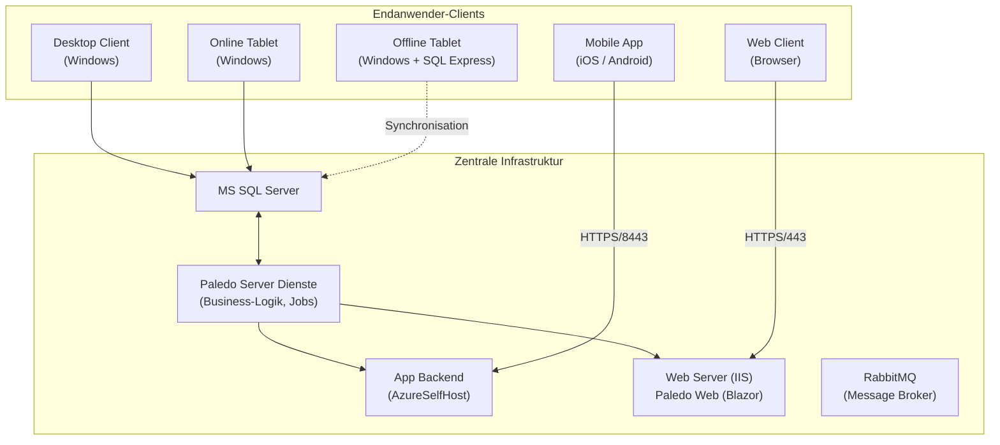
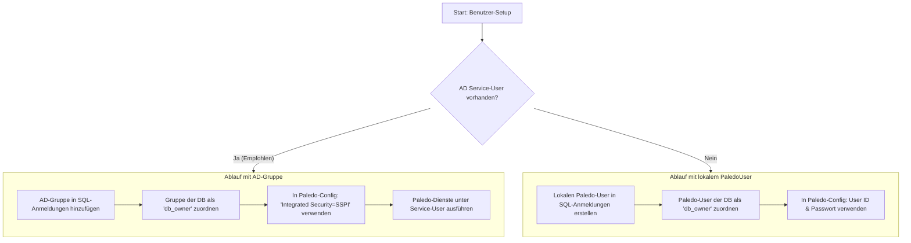

Willkommen zum umfassenden Installationshandbuch für Paledo. Diese Dokumentation führt Sie schrittweise durch den gesamten Prozess, von der Vorbereitung der Infrastruktur bis zur Konfiguration der einzelnen Paledo-Komponenten. Sie richtet sich an erfahrene Anwender und Systemadministratoren, die eine Paledo-Umgebung aufsetzen und warten.

___
## **1. Einleitung und Planung**

Eine sorgfältige Planung ist die Grundlage für eine stabile und wartbare Paledo-Umgebung. Dieser Abschnitt behandelt die grundlegenden Entscheidungen und Vorbereitungen.

### **1.1 Systemumgebungen: Prod, Test & Dev**

Für einen professionellen Betrieb werden mindestens zwei, idealerweise drei, getrennte Umgebungen empfohlen:

*   **Produktiv (PROD):** Das Live-System für den täglichen Betrieb.
*   **Test (TEST):** Eine exakte Kopie des Produktivsystems zur Validierung von Updates, Konfigurationsänderungen und neuen Prozessen.
*   **Entwicklung (DEV):** Eine separate Umgebung für grundlegende Entwicklungs- und Testarbeiten, insbesondere bei größeren Versionssprüngen (z.B. von V20 auf V23).


**Best Practice: Getrennte VMs**
Installieren Sie jede Umgebung auf einer dedizierten virtuellen Maschine (VM), um Interferenzen zu vermeiden und eine saubere Trennung von Ressourcen und Konfigurationen zu gewährleisten. Falls alle Umgebungen auf einem Server laufen müssen, ist eine sorgfältige Port-Verwaltung zwingend erforderlich.


### **1.2 Architekturüberblick**

Die Architektur von Paledo ist auf maximale Flexibilität und Integrationsfähigkeit ausgelegt. Sie besteht aus einem zentralen Kern, der die Geschäftslogik und Datenhaltung übernimmt, und einer Vielzahl von Clients und Schnittstellen, die auf spezifische Anwendungsfälle zugeschnitten sind.

Die folgenden Diagramme beleuchten die Architektur aus zwei unterschiedlichen Perspektiven.

#### **Konzeptionelle Architektur**

Dieses Schaubild zeigt einen allgemeinen Überblick über das Paledo-Ökosystem und seine wichtigsten Integrationspunkte. Es verdeutlicht, wie Paledo als zentrale Datendrehscheibe zwischen verschiedenen Systemen wie SAP und OPC sowie unterschiedlichen Endgeräten fungiert.

<figure><figcaption>Architektur Paledo</figcaption></figure>

#### **Technische Komponenten-Architektur**

Dieses detailliertere Diagramm zeigt die spezifischen Komponenten und ihre Kommunikationswege inklusive der verwendeten Standard-Ports. Es wird deutlich, dass "Fat Clients" wie der Desktop- und Tablet-Client direkt auf die SQL-Datenbank zugreifen, während Web- und Mobil-Clients über gesicherte Backend-Dienste angebunden werden.


### **1.3 Netzwerk- und Portkonfiguration**

Um die Erreichbarkeit und Trennung der Umgebungen zu gewährleisten, sollten DNS-Aliase und feste Ports verwendet werden.

| Umgebung | DNS-Alias (Beispiel) | App Backend (SSL) | Web (Blazor, SSL) |
| :--- | :--- | :--- | :--- |
| **Produktiv** | `paledo.firma.de` | `8443` | `443` |
| **Test** | `paledo-test.firma.de` | `8444` | `444` (oder `81` auf Prod-Server) |


Wenn Test- und Produktivumgebung auf demselben Server laufen, müssen zwingend unterschiedliche Ports für die Testumgebung konfiguriert werden (z.B. App: 8444, Web: 81 oder 444 mit anderer IP-Bindung).


### **1.4 Ordnerstruktur**

Eine konsistente Ordnerstruktur vereinfacht die Wartung und Installation. Der empfohlene Standardpfad ist `%programfiles%\Syntactix\`.

**Standardstruktur:**

```
C:\Program Files\Syntactix\
├── _Export\
├── DBCopyTool\
└── Paledo\
    ├── _Deployment\
    ├── _Install\
    ├── _Licenses\
    ├── _Scripts\
    ├── _Updates\
    ├── PaledoLauncher\
    ├── ServerMonitor\
    ├── PROD\
    │   ├── _Backup\
    │   ├── Blazor\
    │   ├── Client\
    │   ├── PaledoAzureSelfHosting\
    │   ├── Server\
    │   └── Tablet\
    └── TEST\
        └── ... (gleiche Struktur wie PROD)
```

Sie können das folgende Skript verwenden, um diese Struktur automatisch anzulegen. Führen Sie es in einer administrativen Kommandozeile (CMD) aus:

```batch
@echo off
if not exist "%programfiles%\Syntactix\Paledo\" mkdir "%programfiles%\Syntactix\Paledo\"
if not exist "%programfiles%\Syntactix\_Export" mkdir "%programfiles%\Syntactix\_Export"
if not exist "%programfiles%\Syntactix\DBCopyTool" mkdir "%programfiles%\Syntactix\DBCopyTool"
if not exist "%programfiles%\Syntactix\Paledo\_Install\" mkdir "%programfiles%\Syntactix\Paledo\_Install\"
if not exist "%programfiles%\Syntactix\Paledo\_Licenses\" mkdir "%programfiles%\Syntactix\Paledo\_Licenses\"
if not exist "%programfiles%\Syntactix\Paledo\_Scripts\" mkdir "%programfiles%\Syntactix\Paledo\_Scripts\"
if not exist "%programfiles%\Syntactix\Paledo\ServerMonitor\" mkdir "%programfiles%\Syntactix\Paledo\ServerMonitor\"
if not exist "%programfiles%\Syntactix\Paledo\PaledoLauncher\" mkdir "%programfiles%\Syntactix\Paledo\PaledoLauncher\"
if not exist "%programfiles%\Syntactix\Paledo\_Updates\" mkdir "%programfiles%\Syntactix\Paledo\_Updates\"
if not exist "%programfiles%\Syntactix\Paledo\PROD\_Backup\" mkdir "%programfiles%\Syntactix\Paledo\PROD\_Backup\"
if not exist "%programfiles%\Syntactix\Paledo\PROD\Blazor\" mkdir "%programfiles%\Syntactix\Paledo\PROD\Blazor\"
if not exist "%programfiles%\Syntactix\Paledo\PROD\Client\" mkdir "%programfiles%\Syntactix\Paledo\PROD\Client\"
if not exist "%programfiles%\Syntactix\Paledo\PROD\PaledoAzureSelfHosting\" mkdir "%programfiles%\Syntactix\Paledo\PROD\PaledoAzureSelfHosting\"
if not exist "%programfiles%\Syntactix\Paledo\PROD\Server\" mkdir "%programfiles%\Syntactix\Paledo\PROD\Server\"
if not exist "%programfiles%\Syntactix\Paledo\PROD\Tablet\" mkdir "%programfiles%\Syntactix\Paledo\PROD\Tablet\"
icacls "%programfiles%\Syntactix" /grant VORDEFINIERT\Benutzer:(CI)(OI)(F)
echo Ordnerstruktur wurde erstellt.
pause
```

---

## **2. Installation der Basisinfrastruktur**

Bevor Paledo installiert werden kann, muss die zugrunde liegende Server-Infrastruktur korrekt aufgesetzt werden.

### **2.1 IIS (Webserver) Installation**

Der IIS (Internet Information Services) ist für den Betrieb von Paledo Web (Blazor) und dem App Backend erforderlich.


**Wichtige Reihenfolge:** Installieren Sie den IIS **vor** den .NET Runtimes. Andernfalls müssen die .NET Runtimes erneut im "Reparieren"-Modus ausgeführt werden, um sie korrekt im IIS zu registrieren, was oft einen Serverneustart erfordert.


1.  Öffnen Sie den **Server-Manager**.
2.  Gehen Sie zu **Verwalten → Rollen und Features hinzufügen**.
3.  Klicken Sie sich durch den Assistenten bis zur Auswahl der **Serverrollen**.
4.  Aktivieren Sie **Webserver (IIS)**.
5.  Wählen Sie im Schritt **Rollendienste** die folgenden Features zusätzlich zu den Standards aus:

    *   **Allgemeine HTTP-Features:**
        *   HTTP-Umleitung
    *   **Sicherheit:**
        *   Standardauthentifizierung
        *   Windows-Authentifizierung
    *   **Systemzustand und Diagnose:**
        *   Alle Unterpunkte aktivieren (Protokollierung, Anforderungsüberwachung etc.)
    *   **Anwendungsentwicklung:**
        *   **WebSocket-Protokoll** (Zwingend für Blazor erforderlich!)
    *   **Verwaltungsprogramme:**
        *   IIS-Verwaltungskonsole
        *   Kompatibilität mit der IIS 6-Verwaltung (alle Unterpunkte)

6.  Klicken Sie auf **Installieren**, um den Vorgang abzuschließen.

### **2.2 .NET Runtimes installieren**

Paledo V23 basiert auf .NET. Die Installation beider Versionen (.NET 6 und .NET 8) wird empfohlen, da neuere Komponenten wie der Paledo Launcher .NET 8 benötigen.

Installieren Sie folgende Pakete (in dieser Reihenfolge):

1.  **ASP.NET Core Runtime Hosting Bundle**
2.  .NET Desktop Runtime (x64)
3.  .NET Runtime (x64)

### **2.3 SQL Server Installation**

Paledo benötigt eine Microsoft SQL Server Datenbank. Für Testumgebungen ist die **Developer Edition** ausreichend, für Produktivsysteme wird die **Standard Edition** empfohlen.

**Installationsschritte:**

1.  Starten Sie das SQL Server-Setup und wählen Sie **"Neue eigenständige SQL Server-Installation..."**.
2.  **Edition:** Wählen Sie "Developer" oder geben Sie Ihren Produktschlüssel für "Standard" ein.
3.  **Funktionsauswahl:**
    *   **Datenbank-Engine-Dienste** 
    *   **SQL Server-Replikation** 
    *   **SQL Client Connectivity SDK** (bis SQL2019)
4.  **Instanzkonfiguration:**
    *   Verwenden Sie eine **Benannte Instanz** (z.B. `SQL2022`), um Flexibilität zu gewährleisten.
5.  **Serverkonfiguration:**
    *   Setzen Sie den Starttyp für den **SQL Server-Browser** auf **Automatisch**.
6.  **Datenbank-Engine-Konfiguration:**
    *   **Authentifizierungsmodus:** Wählen Sie **Gemischter Modus**. Dies erlaubt sowohl die Windows-Authentifizierung als auch die SQL Server-Authentifizierung.
    *   Vergeben Sie ein sicheres Passwort für den `sa`-Benutzer.
    *   Fügen Sie den **aktuellen Benutzer** und relevante AD-Gruppen (z.B. `Paledo-Admins`) als SQL Server-Administratoren hinzu.
    *   **Datenverzeichnisse:** Es wird empfohlen, ein separates Verzeichnis für Backups anzulegen (z.B. `C:\_DBDumps`).
    *   **FILESTREAM:** Aktivieren Sie **FILESTREAM für Transact-SQL-Zugriff**.

### **2.4 SQL Server Management Studio (SSMS)**

SSMS ist das unverzichtbare Werkzeug zur Verwaltung Ihrer SQL Server-Instanzen.

1.  Wählen Sie im SQL Server-Installationscenter **"SQL Server-Verwaltungstools installieren"**.
2.  Laden Sie SSMS von der Microsoft-Website herunter und führen Sie den Installer aus.
3.  Die Installation ist unkompliziert und erfordert in der Regel einen Neustart des Systems.

### **2.5 SQL Server Konfiguration**

Damit der SQL Server im Netzwerk erreichbar ist, sind zwei finale Schritte notwendig.

1.  **Firewall-Regeln (nur auf Servern):**
    *   **Windows Defender Firewall** öffnen
    * **Eine App oder ein Feature durch die Windows Defender Firewall zulassen** wählen
    * **Andere App zulassen** klicken
	    * **Durchsuchen...** öffnen
	    * `<XX>:\Program Files\Microsoft SQL Server\MSSQL<XX>.<XX>\MSSQL\Binn\sqlservr.exe`
	    * **Hinzufügen**
	* **Andere App zulassen** klicken
	    * **Durchsuchen...** öffnen
	    * `<XX>:\Program Files (x86)\Microsoft SQL Server\90\Shared\sqlbrowser.exe`
	    * **Hinzufügen**
	* Jetzt müssen die erlaubten Applikationen für die jeweiligen Umgebungen freigegeben werden
		* Domäne, Privat oder Öffentlich
2.  **Netzwerkprotokolle aktivieren:**
    *   Öffnen Sie den **SQL Server Configuration Manager**.
    *   Navigieren Sie zu **SQL Server-Netzwerkkonfiguration → Protokolle für [Ihre Instanz]**.
    *   Aktivieren Sie die Protokolle **Named Pipes** und **TCP/IP**.
    *   Starten Sie den SQL Server-Dienst neu, damit die Änderungen wirksam werden.

---

## **3. Paledo Datenbank-Setup**

Nachdem die Infrastruktur steht, wird die Paledo-Datenbank eingerichtet.

### **3.1 Datenbank-Dump einspielen**

Die schnellste Methode zur Einrichtung ist das Einspielen eines vorbereiteten Datenbank-Backups (.bak).

1.  Kopieren Sie das DB-Dump (z.B. von einer CI-Umgebung) in Ihr Backup-Verzeichnis (z.B. `C:\_DBDumps`).
2.  Öffnen Sie **SSMS** und verbinden Sie sich mit Ihrer lokalen SQL-Instanz.
3.  Klicken Sie mit der rechten Maustaste auf **Datenbanken** und wählen Sie **Datenbank wiederherstellen...**.
4.  Wählen Sie als Quelle **Medium** und fügen Sie Ihre `.bak`-Datei hinzu.
5.  Vergeben Sie unter **Ziel → Datenbank** einen aussagekräftigen Namen (z.B. `Paledo_PROD_Main`).
6.  Klicken Sie auf **OK**, um die Wiederherstellung zu starten.


**Nachbereitung:** Benennen Sie nach dem Einspielen die logischen Dateinamen der Datenbank um, damit sie zum Datenbanknamen passen (Rechtsklick auf DB → Eigenschaften → Dateien).
Beispiel: `Paledo_PROD_Main`, `Paledo_PROD_Main_log`.


### **3.2 Benutzer und Berechtigungen**

Paledo benötigt einen dedizierten Benutzer, um auf die Datenbank zuzugreifen. Die Konfiguration hängt davon ab, ob Sie einen AD-Service-User oder einen lokalen SQL-User verwenden.



**Methode mit AD-Gruppe

Die Verwendung einer Active Directory-Gruppe in Verbindung mit einem Service-User ist die empfohlene Methode für Produktivumgebungen. Sie erhöht die Sicherheit, da keine Passwörter in Konfigurationsdateien gespeichert werden, und ermöglicht eine zentrale Verwaltung der Berechtigungen über das AD.

1. Navigieren Sie in SSMS zu **Sicherheit → Anmeldungen**.
2. Klicken Sie mit der rechten Maustaste auf den Ordner **Anmeldungen** und wählen Sie **Neue Anmeldung...**.
3. Klicken Sie neben dem Feld "Anmeldename" auf **Suchen...**.
4. Im neuen Dialogfenster:
    - Klicken Sie auf **Objekttypen** und stellen Sie sicher, dass die Option **Gruppen** aktiviert ist.
    - Geben Sie den Namen Ihrer AD-Gruppe ein (z.B. svc_paledo_users) und klicken Sie auf **Namen überprüfen**.
    - Bestätigen Sie mit **OK**.
5. Stellen Sie sicher, dass die Option **Windows-Authentifizierung** ausgewählt ist.
6. Wechseln Sie in den Bereich **Benutzerzuordnung**.
7. Setzen Sie einen Haken bei Ihrer Paledo-Datenbank (z.B. Paledo_PROD_Main).
8. Wählen Sie im unteren Fenster für diese Datenbank die Mitgliedschaft in der Datenbankrolle **db_owner** aus.
9. Klicken Sie auf **OK**, um die Anmeldung zu erstellen.

  
Wenn Sie die AD-Authentifizierung verwenden, müssen Sie den ConnectionString in **allen Paledo-Konfigurationsdateien** (.config oder .json) anpassen. Fügen Sie Integrated Security=SSPI; hinzu und entfernen Sie jegliche User ID oder Password Angaben.

**Beispiel:**  
connectionString="Pooling=false;Data Source=MEIN-SERVER\SQL2022;Initial Catalog=Paledo_PROD_Main;Integrated Security=SSPI;"  


  
Die Paledo Windows-Dienste (Server, App Backend etc.) müssen unter einem Benutzerkonto ausgeführt werden, das **Mitglied der hier konfigurierten AD-Gruppe** ist. Tragen Sie dieses Dienstkonto in der Windows-Diensteverwaltung (services.msc) für jeden Paledo-Dienst unter "Eigenschaften → Anmelden" ein.  


**Standardmethode: Lokaler `PaledoUser`**

1.  Navigieren Sie in SSMS zu **Sicherheit → Anmeldungen**.
2.  Klicken Sie mit der rechten Maustaste und wählen Sie **Neue Anmeldung...**.
3.  **Anmeldename:** Name des Paledo-User
4.  Wählen Sie **SQL Server-Authentifizierung**.
5.  **Kennwort:** Sicheres Kennwort vergeben
6.  Deaktivieren Sie alle Kennwortrichtlinien-Optionen.
7.  Gehen Sie zu **Benutzerzuordnung**, wählen Sie Ihre Paledo-Datenbank aus und weisen Sie die Rolle **db_owner** zu.
8.  Klicken Sie auf **OK**.


**Fehler "Benutzer ist bereits vorhanden":** Wenn Sie einen Dump von einem anderen System einspielen, existiert der Paledo-User bereits in der Datenbank, ist aber nicht mit der neuen SQL-Instanz verknüpft. Löschen Sie in diesem Fall zuerst den verwaisten User unter `[Ihre DB] → Sicherheit → Benutzer` und führen Sie dann die obigen Schritte erneut aus.


### **3.3 Datenbank-Wartung (Optional, empfohlen)**

Für eine optimale Performance, insbesondere nach dem Einspielen eines Dumps, sollten folgende Wartungsschritte durchgeführt werden:

*   **Index neu erstellen:** Fragmentierte Indizes verlangsamen Abfragen. Führen Sie ein Skript zum Rebuild Index aus. Dies sollte bei Produktivsystemen regelmäßig (z.B. nächtlich) erfolgen.

*   **Datenbank verkleinern (Shrink):** Um ungenutzten Speicherplatz freizugeben, insbesondere in den Log-Dateien.

---

## **4. Installation der Paledo-Komponenten**

### **4.1 Vorbereitung der Anwendungsdateien**

1.  Kopieren Sie die neuesten Paledo-Anwendungsdateien (Client, Server, Blazor etc.) von der Quelle (z.B. CI-Server) in Ihr vorbereitetes Update-Verzeichnis (z.B. `C:\Program Files\Syntactix\Paledo\_Updates\`).
2.  Verschieben Sie die Dateien anschließend in die jeweiligen Zielordner unter `PROD\` oder `TEST\`.


Wenn Dateien aus dem Netzwerk kopiert werden, blockiert Windows diese oft aus Sicherheitsgründen. Dies verhindert den Start der `.exe`-Dateien. Führen Sie folgenden PowerShell-Befehl als Administrator aus, um alle Dateien im Paledo-Verzeichnis freizugeben:

```powershell
# In das übergeordnete Verzeichnis wechseln
cd "C:\Program Files\Syntactix"
# Alle Dateien rekursiv freigeben
Get-ChildItem -Path . -Recurse | Unblock-File
```


### **4.2 Paledo Client (Desktop)**

Der Desktop-Client ist das Hauptwerkzeug für Administration, Planung und Auswertung.

1.  **Konfiguration (`PaledoClient.dll.config`):**
    *   Passen Sie den `ConnectionString` an Ihre SQL-Server-Instanz und Datenbank an.
    *   Stellen Sie sicher, dass das Logging (`eXpressAppFrameworkTraceLevel`) für den Produktivbetrieb auf `1` (Errors) steht.

    ```xml
    <connectionStrings>
        <add name="ConnectionString" connectionString="Pooling=false;Data Source=MEIN-SERVER\SQL2022;Initial Catalog=Paledo_PROD_Main"/>
    </connectionStrings>
    <appSettings>
        <add key="eXpressAppFrameworkTraceLevel" value="1"/>
    </appSettings>
    ```

2.  **Start:** Führen Sie die `PaledoClient.exe` aus. Der erste Start dauert länger, da lokale Caches (`Model.Cache.xafml`) erstellt werden.

### **4.3 Paledo Server Dienste (P1, P2, ...)**

Die Server-Dienste führen Hintergrundaufgaben aus (z.B. SAP-Importe, Strategieberechnungen, Benachrichtigungen).

1.  **Konfiguration (`PaledoServerP1.appsettings.json`, etc.):**
    *   Erstellen Sie für jeden Dienst (P1, P2) eine eigene Konfigurationsdatei. Der Name muss dem Schema `[Exe-Name].appsettings.json` folgen (z.B. `PaledoServerP1.appsettings.json`).
    *   Passen Sie den `ServerConnectionString` an.
    *   Definieren Sie unter `TargetPriorities`, welche Job-Prioritäten dieser Dienst abarbeiten soll (z.B. `P1` für kritische, schnelle Jobs; `P2;P3` für längere, tägliche Jobs).

    ```json
    {
      "ServerSettings": {
        "TargetPriorities": "P1"
      },
      "ConnectionStrings": {
        "ServerConnectionString": "Pooling=false;Data Source=MEIN-SERVER\\SQL2022;Initial Catalog=Paledo_PROD_Main"
      }
    }
    ```
    
    In `.json`-Dateien müssen Backslashes (`\`) im Connection String doppelt geschrieben werden (`\\`).
    
2.  **Dienste installieren:** Erstellen Sie die Windows-Dienste über die Kommandozeile (als Administrator):

    ```batch
    sc create "Paledo PROD Server P1" binPath= "%programfiles%\Syntactix\Paledo\PROD\Server\PaledoServerP1.exe" DisplayName= "Paledo PROD Server P1" start= delayed-auto
    sc create "Paledo PROD Server P2" binPath= "%programfiles%\Syntactix\Paledo\PROD\Server\PaledoServerP2.exe" DisplayName= "Paledo PROD Server P2" start= delayed-auto
    ```

3.  **Dienste starten:** Starten Sie die Dienste nacheinander in der Windows-Diensteverwaltung (services.msc). Warten Sie, bis der erste Dienst im Paledo Client unter **Administration → Server Status** als "Laufend" angezeigt wird, bevor Sie den nächsten starten, um Konflikte bei der Datenbankaktualisierung zu vermeiden.

### **4.4 Paledo App Backend (AzureSelfHost)**

Das App Backend ist die Schnittstelle für die mobile Paledo App.

1.  **Konfiguration (`appsettings.json`):**
    *   Passen Sie den `ServerConnectionString` an.
    *   Konfigurieren Sie die `BaseAddress` unter `AppBackend` mit dem korrekten HTTPS-Port (z.B. `https://+:8443/`).
    *   Konfigurieren Sie den Abschnitt `Kestrel.Certificates` für SSL:
        *   **Subject:** Der "Ausgestellt für"-Name Ihres SSL-Zertifikats (z.B. `*.firma.de`).
        *   **Store:** `my` (für "Eigene Zertifikate").
        *   **Location:** `LocalMachine`.
        *   **AllowInvalid:** `true` (empfohlen, damit der Dienst auch bei abgelaufenem Zertifikat startet).
2.  **Firewall:** Geben Sie den konfigurierten Port (z.B. 8443) in der Windows Firewall für eingehende TCP-Verbindungen frei.
3.  **Dienst installieren:**

    ```batch
    sc create "Paledo PROD App Backend" binPath= "%programfiles%\Syntactix\Paledo\PROD\PaledoAzureSelfHosting\PaledoAzureSelfHosting.exe" DisplayName= "Paledo PROD App Backend" start= auto
    ```

4.  **Dienst starten:** Starten Sie den Dienst und prüfen Sie die Erreichbarkeit über den Browser (`https://hostname:8443`). Es sollte "Paledo Mobile Webservice is running" angezeigt werden.

### **4.5 Paledo Web (Blazor)**

Paledo Web bietet eine moderne, browserbasierte Oberfläche.

1.  **IIS Konfiguration:**
    *   **Anwendungspool erstellen:**
        *   Name: z.B. `PaledoBlazor_PROD`
        *   .NET CLR-Version: **Kein verwalteter Code**
        *   Erweiterte Einstellungen:
            *   **Startmodus:** `AlwaysRunning`
            *   **Leerlauftimeout (Minuten):** `240`
            *   **Regelmäßiges Zeitintervall (Minuten):** `0` (deaktiviert das Recycling nach Zeit)
    *   **Website erstellen:**
        *   Sitename: z.B. `PaledoBlazor_PROD`
        *   Anwendungspool: Den zuvor erstellten Pool auswählen.
        *   Physischer Pfad: Der Ordner mit den Blazor-Dateien.
        *   Bindung: Typ `https` mit Port `443` und dem korrekten SSL-Zertifikat.
2.  **Konfiguration (`appsettings.json`):**
    *   Passen Sie den `ConnectionString` an.


Wenn Sie **keinen** dedizierten AD-Service-User für den IIS-Anwendungspool verwenden, schlägt die Datenbankverbindung fehl. In diesem Fall müssen Sie die Anmeldedaten des lokalen `PaledoUser` direkt in den ConnectionString eintragen. Dies ist eine Notlösung und sollte in Produktivumgebungen vermieden werden.

**Lösung mit Service-User (empfohlen):**
`...;Integrated Security=SSPI;"`

**Notlösung ohne Service-User:**
`"User ID=USERNAME;Password=PASSWORT;...;Data Source=..."`


3.  **Start:** Rufen Sie die konfigurierte Website im Browser auf.

---

## **5. Installation von RabbitMQ (Message Broker)**

RabbitMQ wird für die Echtzeit-Kommunikation zwischen den Paledo-Komponenten (z.B. sofortige Aktualisierungen in der UI) verwendet.

*   Folgen Sie der detaillierten Anleitung : [RabbitMQ: Installation und Konfiguration für Paledo](paledo-installation/rabbitmq.md)
*   **Wichtige Schritte:**
    1.  Installer ausführen.
    2.  User `paledouser` in der RabbitMQ Management UI anlegen und Berechtigungen vergeben.
    3.  Den `guest`-User löschen.
    4.  Die Message-Broker-Einstellungen im Paledo Client aktivieren (**Administration → Einstellungen → Anwendungseinstellungen**).

---

## **6. Spezialfall: Offline-Tablet einrichten**

Für den Einsatz ohne ständige Netzwerkverbindung (z.B. bei Streckenwartungen) werden Offline-Tablets mit einer lokalen Datenbank verwendet.

### **6.1 SQL Server Express Installation für Tablets**

*   Die Installation von SQL Server Express ist identisch zur Installation der Developer-Edition, mit dem Unterschied, dass Sie "Express" als Edition auswählen.
*   Der Standardinstanzname ist `SQLEXPRESS`.
*   Der **SQL Server-Browser** muss hier **nicht** auf "Automatisch" gestellt werden, da der Zugriff nur lokal erfolgt.

### **6.2 Tablet-Datenbank erstellen (DBCopyTool)**

Das `DBCopyTool` ist ein Werkzeug von Syntactix, um eine bereinigte Kopie der Hauptdatenbank für den Tablet-Einsatz zu erstellen.

1.  Starten Sie das `DBCopyTool.exe`.
2.  **Source:** Konfigurieren Sie die Verbindung zur Hauptdatenbank (Server-Instanz).
3.  **Destination:** Geben Sie die lokale Tablet-Instanz (`.\SQLEXPRESS`) und einen neuen Datenbanknamen an (z.B. `Paledo_Tablet_01`).
4.  **Settings:** Wählen Sie das Szenario **"Main-DB -> Tablet-DB"**.
5.  **Start:** Das Tool kopiert die Daten und bereinigt sie für den Offline-Einsatz.


Bevor Sie das DBCopyTool ausführen, sollten Sie auf der Hauptdatenbank die Tabelle `SynchronizationChangeHistory` leeren, um Probleme zu vermeiden.


### **6.3 Tablet-Client Konfiguration & Synchronisation**

1.  **Konfiguration (`PaledoTablet.dll.config`):**
    *   Der `ConnectionString` muss auf die lokale SQL Express-Datenbank zeigen (z.B. `Data Source=.\SQLEXPRESS;Initial Catalog=Paledo_Tablet_01`).
2.  **Erste Synchronisation:**
    *   Starten Sie den Tablet-Client. Er verbindet sich mit der lokalen DB.
    *   Die Verbindung zur Hauptdatenbank für die Synchronisation ist in den Paledo-Einstellungen hinterlegt (**Einstellungen → Synchronization → ServerConnectionString**).
    *   Klicken Sie auf den **Sync-Button**, um das Tablet erstmals mit dem Server abzugleichen. Dieser Vorgang kann einige Zeit dauern.

---

## **8. Troubleshooting**

| Problem                                                         | Ursache                                                                                                                       | Lösung                                                                                                                                                                                                          |
| :-------------------------------------------------------------- | :---------------------------------------------------------------------------------------------------------------------------- | :-------------------------------------------------------------------------------------------------------------------------------------------------------------------------------------------------------------- |
| **Anwendung startet nicht, Windows-Schutz**                     | Dateien wurden aus dem Netzwerk kopiert und von Windows blockiert.                                                            | Führen Sie den `Unblock-File` PowerShell-Befehl aus (siehe Abschnitt 4.1).                                                                                                                                      |
| **Blazor zeigt `HTTP Error 500.30 - ANCM...`**                  | Der IIS-Anwendungspool kann sich nicht mit der Datenbank verbinden.                                                           | Entweder einen AD-Service-User für den App-Pool verwenden oder (als Notlösung) User/Passwort im ConnectionString der `appsettings.json` eintragen.                                                              |
| **Blazor: Leerzeichen im Theme-Namen**                          | Ein `Caption`-Eintrag für ein Theme in der `appsettings.json` enthält ein Leerzeichen, was der Parser nicht verarbeiten kann. | Entfernen Sie Leerzeichen aus den `Caption`-Namen in der Theme-Konfiguration.                                                                                                                                   |
| **Tablet-DB-Erstellung (DBCopyTool) schlägt bei SQL 2022 fehl** | Eine Einstellung bezüglich "Always On-Verfügbarkeitsgruppen" ist bei SQL 2022 standardmäßig anders.                           | Öffnen Sie den SQL Server Configuration Manager, gehen Sie zu den Eigenschaften des SQL-Server-Dienstes und aktivieren Sie im Reiter "Always On-Verfügbarkeitsgruppen" das Feature. Starten Sie den Dienst neu. |
| **Dienste starten nicht beim ersten Versuch**                   | Auf ausgelasteten Systemen kann es zu Timeouts kommen.                                                                        | Versuchen Sie, den Dienst manuell 2-3 Mal hintereinander zu starten.                                                                                                                                            |
| **Login in der mobilen App schlägt fehl**                       | Veraltete App-Version, VPN-Problem oder falsche Credentials.                                                                  | Sicherstellen, dass die neueste "Paledo Mobile"-App (nicht "Classic") verwendet wird. VPN-Verbindung prüfen. Passwort erneut eingeben.                                                                          |