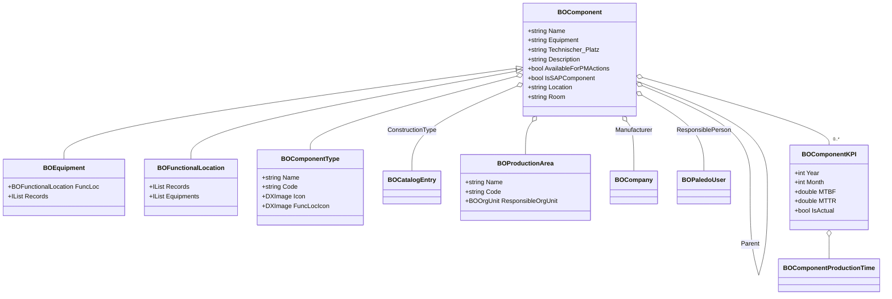
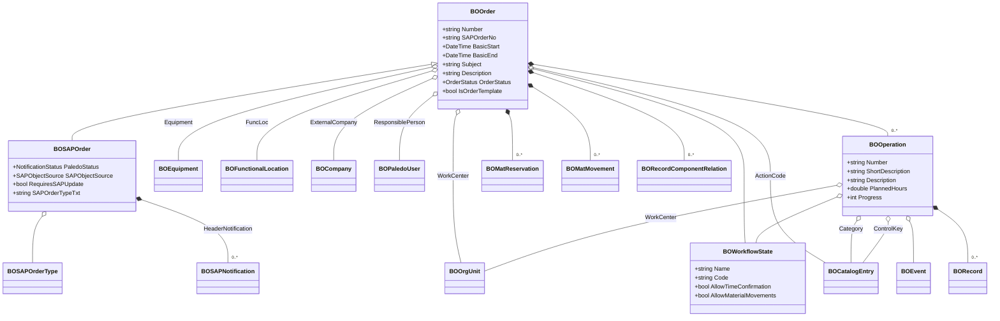
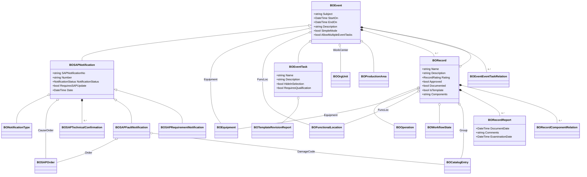
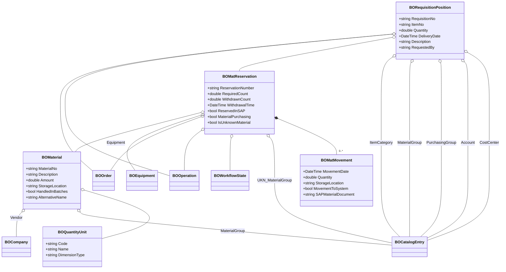
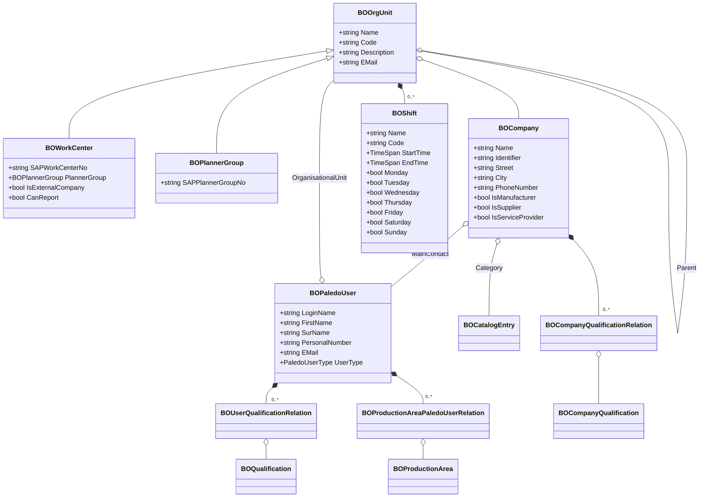
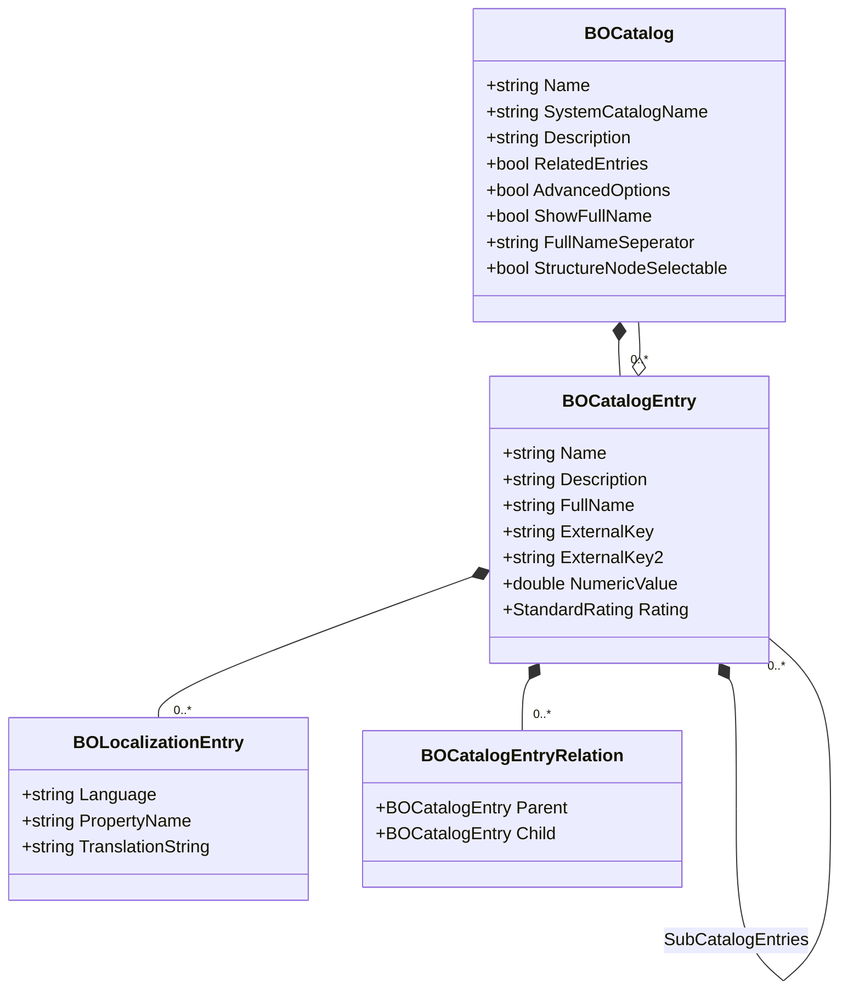
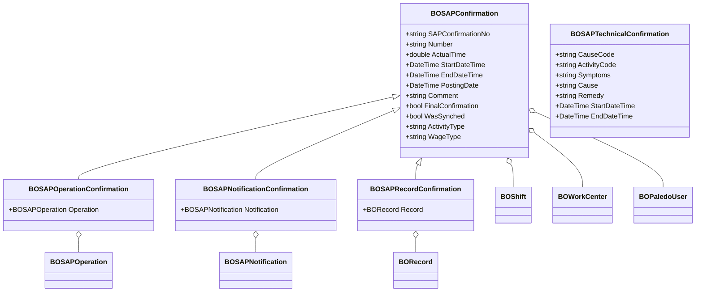
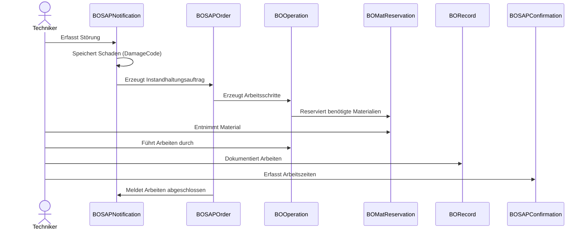

# Objektstruktur

## Einleitung

Willkommen bei Paledo! Sie nutzen Paledo wahrscheinlich, um die Prozesse Ihres Unternehmens in Bereichen wie Instandhaltung, Qualitätssicherung oder Anlagenmanagement zu optimieren. Paledo zeichnet sich dadurch aus, nahtlose digitale Arbeitsabläufe zu schaffen und Papierkram sowie isolierte Dateninseln zu eliminieren.

Ein Schlüsselaspekt, um die Leistungsfähigkeit von Paledo voll auszuschöpfen – insbesondere bei der Nutzung seiner Konfigurationsmöglichkeiten (wie dem Erstellen von Formularen oder dem Einrichten von Workflows) – ist das Verständnis der grundlegenden Bausteine des Systems. Dies sind die **Geschäftsobjekte**, ihre **Beziehungen** und wie sie in **Geschäftsprozessen** zusammenspielen.

Dieses Kapitel führt Sie durch diese fundamentalen Konzepte. Sie zu verstehen, wird die Konfiguration von Paledo zur perfekten Abbildung Ihrer spezifischen Anforderungen wesentlich einfacher und effektiver machen, auch wenn Sie keinen tiefen technischen Hintergrund haben.


**Ziel:** Dieses Kapitel hilft Ihnen, die wesentlichen Datenstrukturen und Prozessabläufe in Paledo zu verstehen, die die Grundlage für eine effektive Low-Code-Konfiguration bilden.


## Was sind Geschäftsobjekte in Paledo?

Stellen Sie sich Geschäftsobjekte (oft als "BO" abgekürzt) als digitale Repräsentationen von Dingen, Konzepten oder Dokumenten aus der realen Welt vor, die für Ihre Geschäftsprozesse in Paledo wichtig sind. Sie enthalten spezifische Informationen und interagieren miteinander.


**Definition: Geschäftsobjekt (BO)**\
Ein Geschäftsobjekt in Paledo repräsentiert eine eindeutige Entität wie einen Auftrag, eine Anlage, einen Bericht, eine Materialreservierung oder einen Benutzer. Jeder BO-Typ hat spezifische Eigenschaften (Datenfelder) und Funktionen.


Basierend auf gängigen Arbeitsabläufen sind hier einige der wichtigsten Geschäftsobjekte, denen Sie in Paledo begegnen werden:

* **Aufträge (BOOrder / BOSAPOrder):** Zentrale Objekte für die Planung und Durchführung von Instandhaltungsarbeiten. Sie können mit SAP-Aufträgen synchronisiert werden.
* **Vorgänge (BOOperation):** Repräsentieren einzelne Arbeitsschritte innerhalb eines Auftrags.
* **Berichte (BORecord):** Dienen zur Dokumentation durchgeführter Arbeiten, oft verknüpft mit spezifischen Anlagen oder Orten über Formulare (`BORecordReport`).
* **Meldungen (BOSAPNotification):** Erfassen Störungen, Probleme oder Anforderungen, oft im Zusammenhang mit Anlagen. Sie können zu Aufträgen führen und mit SAP-Meldungen synchronisiert werden.
* **Anlagen (BOEquipment):** Repräsentieren physische Anlagenteile.
* **Funktionsorte (BOFunctionalLocation):** Repräsentieren funktionale Standorte, an denen Anlagen installiert sein können (Technische Plätze).
* **Materialreservierungen (BOMatReservation):** Werden verwendet, um Materialien zu reservieren, die für Instandhaltungsaufgaben benötigt werden.
* **Firmen (BOCompany):** Repräsentieren externe Firmen wie Lieferanten oder Dienstleister.
* **Katalogeinträge (BOCatalogEntry):** Stellen standardisierte Wertelisten (z.B. Schadenscodes, Maßnahmenarten, Klassifizierungen) bereit, die in vielen anderen Geschäftsobjekten verwendet werden.

## Wie Geschäftsobjekte miteinander in Beziehung stehen

Geschäftsobjekte existieren selten isoliert. Sie sind miteinander verbunden und bilden die Struktur Ihrer Daten und Prozesse. Das Verständnis dieser Beziehungen ist entscheidend.

Zum Beispiel:

* Ein `Auftrag` (BOOrder) **enthält** typischerweise einen oder mehrere `Vorgänge` (BOOperation).
* Ein `Vorgang` (BOOperation) kann zur Dokumentation zu einem `Bericht` (BORecord) **führen**.
* Ein `Bericht` (BORecord) ist oft mit einer `Anlage` (BOEquipment) oder einem `Funktionsort` (BOFunctionalLocation) **verknüpft**.
* Eine `Meldung` (BOSAPNotification) kann die Erstellung eines `Auftrags` (BOOrder) **auslösen**.
* Eine `Materialreservierung` (BOMatReservation) **gehört zu** einem `Auftrag` (BOOrder) oder `Vorgang` (BOOperation) und **bezieht sich auf** ein `Material` (BOMaterial).

Diese Beziehungen definieren, wie Informationen durch Paledo fließen und wie verschiedene Teile Ihres Arbeitsablaufs miteinander verbunden sind.

## Beziehungen visualisieren: Wichtige Diagramme

Mermaid-Diagramme helfen, diese Strukturen und Beziehungen zu visualisieren. Die folgenden Diagramme illustrieren Schlüsselbereiche innerhalb von Paledo:

### 1. Anlagenhierarchie und Strukturierung

Dieses Diagramm zeigt, wie technische Objekte wie Anlagen (`BOEquipment`) und Technische Plätze (`BOFunctionalLocation`) organisiert sind, potenziell hierarchisch, und wie sie mit anderen Informationen wie Herstellern (`BOCompany`) oder verantwortlichen Personen (`BOPaledoUser`) verknüpft sind.

### 2. Auftrags- und Instandhaltungsprozesse

Dieses Diagramm konzentriert sich auf den zentralen `BOOrder` (und seine SAP-spezifische Variante `BOSAPOrder`) und zeigt, wie er mit `BOOperation` (Arbeitsschritten), Anlagen (`BOEquipment`, `BOFunctionalLocation`), Organisationseinheiten (`BOOrgUnit`) sowie potenziell Materialreservierungen und Workflow-Status verknüpft ist.

### 3. Ereignisse, Berichte und Meldungen

Dieses Diagramm illustriert, wie Ereignisse (`BOEvent`), einschließlich SAP-Meldungen (`BOSAPNotification`), mit Anlagen, Arbeitsplätzen und insbesondere wie sie mit der Dokumentation (`BORecord`) und spezifischen Formularen (`BORecordReport`) zusammenhängen.

### 4. Materialwirtschaft und Beschaffung

Dieses Diagramm detailliert die Objekte der Materialwirtschaft, mit Fokus auf Materialreservierungen (`BOMatReservation`), Materialien (`BOMaterial`), Materialbewegungen (`BOMatMovement`) und Bestellanforderungen (`BORequisitionPosition`).

### 5. Organisationsstruktur und Verantwortlichkeiten

Dieses Diagramm zeigt, wie Organisationseinheiten (`BOOrgUnit`, `BOWorkCenter`, `BOPlannerGroup`), Benutzer (`BOPaledoUser`) und externe Firmen (`BOCompany`) strukturiert und verknüpft sind, einschließlich Aspekten wie Qualifikationen und Schichten (`BOShift`).

### 6. Kataloge und Konfigurationen

Kataloge (`BOCatalog`) und ihre Einträge (`BOCatalogEntry`) sind fundamental für Standardisierung und Konfiguration. Dieses Diagramm zeigt ihre hierarchische Struktur und wie sie mehrsprachige Einträge (`BOLocalizationEntry`) unterstützen.

### 7. Zeit- und Statusbestätigungen

Dieses Diagramm zeigt, wie Zeit- und Arbeitsbestätigungen (`BOSAPConfirmation` und Varianten) erfasst werden, die auf Vorgänge, Meldungen oder Berichte zurückverweisen und Benutzer, Arbeitsplätze und Schichten involvieren. Es beinhaltet auch oft erfasste technische Details (`BOSAPTechnicalConfirmation`).

## Geschäftsobjekte in Aktion: Kernprozesse

Diese Geschäftsobjekte und ihre Beziehungen ermöglichen zentrale Geschäftsprozesse in Paledo. Hier sind einige typische Beispiele:

### 1. Instandhaltungszyklus (Ende-zu-Ende)

Ein gängiger Instandhaltungsworkflow beinhaltet die Interaktion mehrerer Geschäftsobjekte:

1. Ein Problem wird über eine **Meldung** (BOSAPNotification) gemeldet.
2. Dies löst die Erstellung eines **Auftrags** (BOOrder) mit geplanten **Vorgängen** (BOOperation) aus.
3. Benötigte **Materialien** werden mittels `BOMatReservation` reserviert.
4. Die Arbeit wird ausgeführt, potenziell unter Erfassung von **Zeitbestätigungen** (BOSAPConfirmation).
5. Die abgeschlossene Arbeit wird in **Berichten** (BORecord) dokumentiert.


Dieser Zyklus repräsentiert einen typischen Ablauf von der Problemidentifikation bis zur Lösung und Dokumentation, der oft in Paledo konfigurierbar ist.


### 2. Materialversorgungszyklus

Die Sicherstellung der Materialverfügbarkeit umfasst:

1. Erstellung von **Materialreservierungen** (BOMatReservation), oft verknüpft mit Aufträgen oder Vorgängen.
2. Bei Bedarf Generierung von **Bestellanforderungen** (BORequisitionPosition).
3. Dokumentation der tatsächlichen Entnahme oder des Zugangs von Materialien mittels **Materialbewegungen** (BOMatMovement).

### 3. Anlagenlebenszyklusmanagement

Die Verwaltung von Anlagen über ihren gesamten Lebenszyklus beinhaltet:

1. Erfassung von **Anlagen** (BOEquipment) und **Funktionsorten** (BOFunctionalLocation / Technischen Plätzen).
2. Dokumentation der Historie, Inspektionen und Ereignisse mittels **Berichten** (BORecord).
3. Planung und Ausführung der Instandhaltung über **Aufträge** (BOOrder).
4. Erfassung von Problemen und Störungen mittels **Meldungen** (BOSAPNotification).

### 4. Visualisierung eines Störungsbehebungs-Workflows

Dieses Sequenzdiagramm zeigt einen typischen Interaktionsfluss bei der Bearbeitung einer gemeldeten Störung:

## Warum dies für die Paledo-Konfiguration wichtig ist

Das Verständnis dieser Kernkonzepte – Geschäftsobjekte, ihre Eigenschaften, ihre Beziehungen und wie sie an Prozessen teilnehmen – ist **essenziell**, wenn Sie Paledo mit seinen Low-Code-Werkzeugen konfigurieren. Hier sind die Gründe:

* **Workflow-Design:** Zu wissen, dass ein `Auftrag` `Vorgänge` enthält, ermöglicht es Ihnen, mehrstufige Instandhaltungsaufgaben korrekt in Ihren Workflows zu strukturieren.
* **Formularerstellung:** Beim Erstellen digitaler Formulare (oft verknüpft mit `BORecord`), stellt das Verständnis, auf welches BO sich das Formular bezieht (z.B. `BOEquipment`, `BOFunctionalLocation`, `BOOperation`), sicher, dass Sie die richtigen Daten im korrekten Kontext erfassen und angemessen verknüpfen können.
* **Datenauswahl & Anzeige:** Die Konfiguration von Dropdown-Listen, Suchfeldern oder Berichtspalten basiert auf dem Wissen, welche `BOCatalogEntry`-Listen zu verwenden sind oder welche Felder auf einem verknüpften BO existieren (z.B. Anzeigen des `Name` der zugehörigen `BOEquipment` auf einem `BORecord`).
* **Integrations-Setup:** Wenn Sie mit SAP integrieren, ist das Wissen um das Mapping zwischen `BOSAPOrder` und SAP-Aufträgen oder `BOSAPNotification` und SAP-Meldungen entscheidend für die korrekte Konfiguration der Datensynchronisation.
* **Prozesslogik:** Das Definieren von Regeln oder Automatisierungen (z.B. das automatische Erstellen eines `Auftrags` aus einem bestimmten Typ von `Meldung`) erfordert das Verständnis der Beziehung und des typischen Flusses zwischen diesen BOs.


**Konfigurationsfallen vermeiden:** Ein Missverständnis dieser Beziehungen kann zu Konfigurationen führen, die nicht wie erwartet funktionieren, zu falscher Datenerfassung oder zu fehlerhaften Workflows. Der Versuch beispielsweise, einen `BORecord` direkt mit einem `BOMaterial` zu verknüpfen, ist möglicherweise keine Standardbeziehung und führt zu Fehlern, wenn Sie ein Formular konfigurieren, das diese Verknüpfung ohne die korrekten Zwischenobjekte (wie `BOMatReservation`, verknüpft mit einem `Auftrag`/`Vorgang`, der dann mit dem `BORecord` verknüpft ist) erwartet.


Indem Sie Zeit investieren, um diese Kernstrukturen zu verstehen, befähigen Sie sich selbst, robustere, effizientere und genauere digitale Prozesse in Paledo zu erstellen.

## Zusammenfassung: Wichtige Erkenntnisse

* **Geschäftsobjekte (BOs)** sind die fundamentalen Bausteine in Paledo und repräsentieren reale Entitäten wie Aufträge, Anlagen, Berichte usw.
* **Beziehungen** definieren, wie diese BOs verbunden sind und interagieren, und bilden die Struktur Ihrer Daten und Prozesse.
* **Geschäftsprozesse** zeigen, wie BOs in typischen Arbeitsabläufen wie Instandhaltungszyklen oder Materialmanagement zusammenarbeiten.
* **Visuelle Diagramme** (wie die Mermaid-Diagramme) helfen, diese komplexen Strukturen zu verstehen.
* **Konfigurationsmächtigkeit:** Das Verständnis dieser Konzepte ist entscheidend für die effektive Konfiguration von Paledos Formularen, Workflows, Berichten und Integrationen mithilfe seiner Low-Code-Funktionen.
