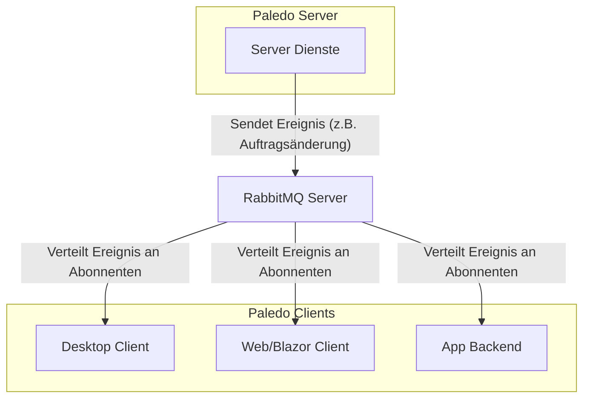
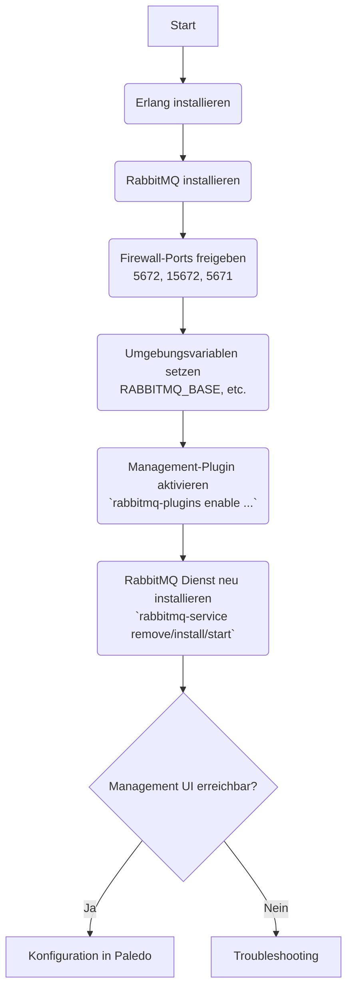

# **RabbitMQ: Installation und Konfiguration für Paledo**

RabbitMQ ist ein hochperformanter Message Broker, der in der Paledo-Architektur eine zentrale Rolle für die Echtzeit-Kommunikation zwischen den verschiedenen Systemkomponenten spielt. Er ermöglicht sofortige Benachrichtigungen und Datenaktualisierungen über Clients, Server-Dienste und die Weboberfläche hinweg.

Dieses Handbuch führt Sie durch die Installation, Konfiguration und Integration von RabbitMQ in Ihre Paledo-Umgebung.

## **1. Einleitung: Die Rolle von RabbitMQ in Paledo**

Innerhalb des Paledo-Ökosystems fungiert RabbitMQ als zentrale Nachrichten-Warteschlange. Anstatt dass Clients den Server aktiv nach Änderungen fragen (Polling), sendet der Server Ereignisse an RabbitMQ, und alle verbundenen Clients erhalten diese Informationen in Echtzeit.

**Vorteile:**

*   **Sofortige UI-Aktualisierungen:** Änderungen, die ein Benutzer vornimmt, sind sofort für andere sichtbar.
*   **Effiziente Ressourcennutzung:** Reduziert die Netzwerklast im Vergleich zu ständigem Polling.
*   **Entkoppelte Architektur:** Clients und Server müssen nicht direkt miteinander kommunizieren, was die Stabilität erhöht.



## **2. Voraussetzungen**

*   **Administratorrechte** auf dem Server, auf dem RabbitMQ installiert werden soll.
*   Die **Installationsdateien** für die halbautomatische Installation. Diese befinden sich unter `\\nas02\software\Syntactix\RabbitMQv2`.

---

## **3. Installationsmethoden**

Es gibt verschiedene Wege, RabbitMQ zu installieren. Die halbautomatische Methode wird für die meisten Anwendungsfälle empfohlen.

### **3.1 Halbautomatische Installation (Empfohlen)**

Diese Methode verwendet bereitgestellte Skripte, um die Installation von Erlang (dem Framework für RabbitMQ) und RabbitMQ selbst zu automatisieren.

1.  **Dateien kopieren:** Kopieren Sie den gesamten Inhalt des Ordners `\\nas02\software\Syntactix\RabbitMQv2` in ein temporäres Verzeichnis auf Ihrem Zielserver (z.B. `C:\temp\RabbitMQ-Install`).

2.  **Installer Teil 1 ausführen:** Führen Sie die Datei `01_PaledoRabbit_Installer.cmd` als Administrator aus. Dieses Skript installiert die Basiskomponenten wie Erlang und Visual C++ Redistributable. Folgen Sie den Anweisungen auf dem Bildschirm.

3.  **Installer Teil 2 ausführen:** Führen Sie direkt im Anschluss die Datei `02_PaledoRabbit_Installer.cmd` als Administrator aus. Dieses Skript installiert den RabbitMQ-Dienst, aktiviert die Management-Konsole und startet die Dienste.

4.  **Abschluss:** Nach erfolgreicher Installation öffnet sich automatisch ein Browserfenster mit der RabbitMQ Management UI (`http://localhost:15672`).


Die Skripte kümmern sich um die Installation der Abhängigkeiten, das Einrichten der Dienste, das Aktivieren der Management-Plugins und die notwendigen Firewall-Freigaben.


### **3.2 Manuelle Installation (Für Fortgeschrittene)**

Diese Methode gibt Ihnen die volle Kontrolle, erfordert aber mehr manuelle Schritte.



1.  **Abhängigkeiten installieren:**
    *   Installieren Sie die neueste kompatible Version von [Erlang/OTP](https://www.erlang.org/downloads).
    *   Installieren Sie den [RabbitMQ Server](https://www.rabbitmq.com/install-windows.html) von der offiziellen Website.

2.  **Firewall-Ports freigeben (TCP, eingehend):**
    *   `15672`: Für die Management-UI.
    *   `5672`: Für unverschlüsselte Nachrichten (AMQP).
    *   `5671`: Für SSL/TLS-verschlüsselte Nachrichten (AMQPS).

3.  **Management-Plugin aktivieren:** Öffnen Sie die `RabbitMQ Command Prompt (sbin dir)` als Administrator und führen Sie folgenden Befehl aus:
    ```batch
    rabbitmq-plugins enable rabbitmq_management
    ```

4.  **Dienst neu starten:** Um sicherzustellen, dass alle Änderungen übernommen werden, installieren Sie den Dienst neu:
    ```batch
    rabbitmq-service stop
    rabbitmq-service remove
    rabbitmq-service install
    rabbitmq-service start
    ```

### **3.3 Docker-Installation (Alternative)**


Die Installation via Docker wird für Produktionsumgebungen **nicht empfohlen**, da Docker Desktop nicht für den Multi-User-Betrieb auf Servern ausgelegt ist. Diese Methode eignet sich primär für lokale Entwicklungsumgebungen.


Erstellen Sie eine `docker-compose.yml`-Datei mit folgendem Inhalt:

```yaml
version: '3.8'
services:
  rabbitmq:
    image: rabbitmq:3-management
    hostname: my-rabbit
    container_name: paledo-rabbit
    volumes:
      - ./rabbitmq.conf:/etc/rabbitmq/rabbitmq.conf # Optional für SSL
    ports:
      - "15672:15672"
      - "5672:5672"
      - "5671:5671" # Optional für SSL
    restart: always
```

Starten Sie den Container mit `docker-compose up -d`.

---

## **4. Grundkonfiguration der Management UI**

Unabhängig von der Installationsmethode müssen Sie nach der Installation einen dedizierten Paledo-Benutzer in der RabbitMQ Management UI anlegen.

1.  Öffnen Sie die Management UI in Ihrem Browser: `http://hostname:15672`.
2.  Melden Sie sich mit dem Standardbenutzer an:
    *   **Username:** `guest`
    *   **Password:** `guest`
3.  Navigieren Sie zum Tab **Admin**.
4.  Unter **"Add a user"** erstellen Sie einen neuen Benutzer:
    *   **Username:** `paledouser` (Kleinschreibung beachten!)
    *   **Password:** Vergeben Sie ein sicheres Passwort (interner Standard: `!Paledo2011`).
    *   **Tags:** `administrator` (Dies gibt dem Benutzer volle Rechte).
    *   Klicken Sie auf **"Add user"**.
5.  Klicken Sie auf den neu erstellten `paledouser`.
6.  Unter **"Permissions"** klicken Sie auf **"Set permission"**, um dem Benutzer Zugriff auf den Standard Virtual Host (`/`) zu geben.


Der `guest`-Benutzer ist ein bekanntes Sicherheitsrisiko, da er standardmäßig nur Verbindungen von `localhost` erlaubt, aber oft unsicher konfiguriert wird. **Löschen Sie den `guest`-Benutzer nach der Erstellung Ihres `paledouser`-Kontos unbedingt!**


---

## **5. Integration in Paledo**

Nachdem RabbitMQ läuft und konfiguriert ist, muss Paledo darüber informiert werden.

1.  Starten Sie den **Paledo Client**.
2.  Navigieren Sie zu **Administration → Einstellungen → Anwendungseinstellungen**.
3.  Suchen Sie den Abschnitt **MessageBroker** und konfigurieren Sie die folgenden Felder:

| Einstellung | Beschreibung | Beispielwert |
| :--- | :--- | :--- |
| **MessageBrokerEnabled** | Aktiviert oder deaktiviert die RabbitMQ-Integration. | `True` |
| **MessageBrokerHostName** | Der Hostname des Servers, auf dem RabbitMQ läuft. | `mein-paledo-server` |
| **MessageBrokerExchange** | Der Name des "Kanals", über den kommuniziert wird. Sollte pro Umgebung eindeutig sein. | `paledo.prod` |
| **MessageBrokerUser** | Der in der RabbitMQ UI erstellte Benutzername. | `paledouser` |
| **MessageBrokerUserPassword** | Das Passwort für den RabbitMQ-Benutzer. | `!Paledo2011` |
| **MessageBrokerUseSSL** | Gibt an, ob die Verbindung verschlüsselt (Port 5671) werden soll. | `False` (oder `True` bei SSL-Setup) |
| **MessageBrokerReconnectInterval**| Intervall in Minuten, in dem Paledo versucht, eine verlorene Verbindung wiederherzustellen. | `5` |


Das Feld **MessageBrokerUser** ist **case-sensitive** (Groß-/Kleinschreibung wird beachtet). Achten Sie auf eine exakte Übereinstimmung mit dem in RabbitMQ erstellten Benutzernamen.


4.  **Speichern** Sie die Einstellungen.
5.  **Starten Sie alle Paledo-Komponenten neu** (alle Server-Dienste, App Backend, IIS-Anwendungspool für Blazor und alle laufenden Client-Instanzen), damit die neuen Einstellungen übernommen werden.

---

## **6. Überprüfung der Verbindung**

Um zu verifizieren, dass die Integration erfolgreich war:

1.  Öffnen Sie die RabbitMQ Management UI (`http://hostname:15672`).
2.  Navigieren Sie zum Tab **Connections**.
3.  Nachdem die Paledo-Dienste und -Clients gestartet wurden, sollten hier mehrere Verbindungen erscheinen, eine für jede aktive Komponente (Server P1, Server P2, Client, Blazor etc.).


Wenn Sie in der Liste der Verbindungen Ihre Paledo-Anwendungen sehen, war die Einrichtung erfolgreich. Die Echtzeit-Kommunikation ist nun aktiv.


---

## **7. Troubleshooting**

| Problem | Mögliche Ursache & Lösung |
| :--- | :--- |
| **Fehler bei halbautomatischer Installation: `RabbitMQ install exited with code: 1`** | **Ursache:** Das Installationsskript konnte die `HOMEDRIVE`-Umgebungsvariable nicht korrekt setzen. <br><br> **Lösung:** <br> 1. Öffnen Sie die Datei `.../RabbitMQ Server/rabbitmq_server-X.X.X/sbin/rabbitmq-env.cmd`. <br> 2. Fügen Sie am Ende die Zeile `set HOMEDRIVE=C:` hinzu. <br> 3. Installieren Sie den Dienst manuell neu (siehe Schritte in der manuellen Installation). |
| **Management-Konsole ist nicht erreichbar** | **Ursache:** Das Plugin wurde nicht korrekt aktiviert oder der Dienst läuft nicht. <br><br> **Lösung:** Führen Sie `rabbitmq-plugins enable rabbitmq_management` erneut aus und starten Sie den Dienst neu. |
| **Paledo-Clients verbinden sich nicht (Liste in UI bleibt leer)** | **Ursache:** Falsche Konfiguration in den Paledo-Einstellungen (Hostname, User, Passwort) oder ein Firewall-Problem. <br><br> **Lösung:** <br> 1. Überprüfen Sie alle MessageBroker-Einstellungen in Paledo auf Tippfehler (insb. Hostname und User). <br> 2. Stellen Sie sicher, dass die Ports 5672/5671 in der Firewall freigegeben sind. |