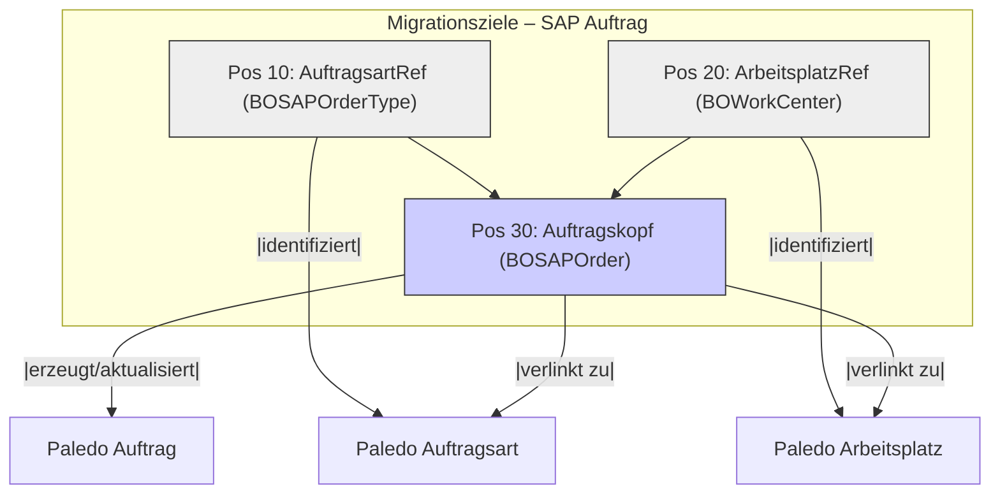

# Step-by-Step SAP Order

Okay, hier ist eine detaillierte Schritt-für-Schritt-Anleitung zur Erstellung einer Migrationsdefinition am Beispiel eines SAP-Auftragsimports. Dieses Beispiel geht davon aus, dass die Auftragsdaten (inkl. einiger Vorgangsdaten) über einen SAP RFC-Baustein abgerufen und als XML-Datei oder direkt als Datenstrom bereitgestellt werden.

**Szenario:** Importieren von SAP Instandhaltungsaufträgen (`BOOrder` bzw. spezialisiert `BOSAPOrder` in Paledo) inklusive zugehöriger Auftragsarten (`BOSAPOrderType`) und Arbeitsplätze (`BOWorkCenter`). Die Identifikation erfolgt über die SAP Auftragsnummer.

***

**Schritt-für-Schritt: SAP Auftragsimport konfigurieren**

**Voraussetzungen:**

* Zugriff auf das Paledo-Modul "Migrationsdefinitionen".
* Kenntnis des Paledo-Ziel-Datenmodells (`BOSAPOrder`, `BOSAPOrderType`, `BOWorkCenter` und deren relevante Felder).
* Eine **Beispieldatei (XML oder JSON)** mit der Datenstruktur, wie sie vom SAP RFC-Baustein geliefert wird (z.B. mit Tabellen/Segmenten wie `ET_ORDER_HEADER`, `ET_OPERATIONS`).

**Ziel:** Anlegen oder Aktualisieren von Aufträgen in Paledo basierend auf den SAP-Daten.

***

**Schritt 1: Neue Migrationsdefinition anlegen**

1. Navigiere zu: **Administration -> Import/Export & Datenmigration -> Importdefinitionen**.
2. Klicke im Ribbon auf **"Neu"**.
3. Gib einen **Namen** ein, z.B.: `SAP_IH_Auftragsimport_RFC`.
4. Wähle als **Standard-Datenprovider** den Typ, in dem die SAP-Daten vorliegen (häufig `Xml-File` oder `JSON-File`, wenn der RFC über Middleware läuft, oder ggf. ein spezifischer SAP-Provider, falls vorhanden). Nehmen wir hier `Xml-File` an.
5. **Speichere** die leere Definition.

***

**Schritt 2: Datenquelle konfigurieren und Struktur auflösen**

1. Öffne die gerade erstellte Definition `SAP_IH_Auftragsimport_RFC`.
2. Klicke im Ribbon auf **"Datenstruktur auflösen"**.
3. Im Dialog "Quelle" ist `Xml-File` (oder dein gewählter Typ) vorausgewählt. Bestätige.
4. Ein Datei-Öffnen-Dialog erscheint. **Wähle die Beispieldatei** aus, die die Struktur der SAP-Daten enthält.
5. Paledo analysiert die Datei.
6. Wechsle zum Reiter **"Datenquelle"**, um die erkannte Struktur zu prüfen. Du solltest hier die Segmente/Tabellen aus dem SAP-Export sehen (z.B. `ET_ORDER_HEADER`, `ET_OPERATIONS`) und deren Felder (z.B. `ORDERID`, `ORDER_TYPE`, `WORK_CNTR`, `SHORT_TEXT`, `ACTIVITY`).
7. **Speichere** die Definition erneut.

***

**Schritt 3: Migrationsziele definieren**

Wechsle zum Reiter **"Migrationsdetails"**. Definiere die Zielobjekte in der korrekten Abhängigkeitsreihenfolge:

1. **Ziel 1: Auftragsart (Referenz)**
   * Klicke oben auf "Neu".
   * **Position:** `10`
   * **Zielobjekt:** `BOSAPOrderType`
   * **Importverhalten:** `Voreinstellung nicht leer` (Wir wollen keine leeren Typen anlegen).
   * **Name:** `AuftragsartRef` (Wichtig für spätere Referenz).
   * **Bemerkungen:** "Sucht/Erstellt die SAP Auftragsart zur Referenzierung im Auftrag."
2. **Ziel 2: Arbeitsplatz (Referenz)**
   * Klicke oben auf "Neu".
   * **Position:** `20`
   * **Zielobjekt:** `BOWorkCenter`
   * **Importverhalten:** `Voreinstellung nicht leer`
   * **Name:** `ArbeitsplatzRef`
   * **Bemerkungen:** "Sucht/Erstellt den SAP Arbeitsplatz zur Referenzierung."
3. **Ziel 3: Auftragskopf (Hauptobjekt)**
   * Klicke oben auf "Neu".
   * **Position:** `30`
   * **Zielobjekt:** `BOSAPOrder` (oder `BOOrder`, je nach Paledo-Konfiguration)
   * **Importverhalten:** `Standard` (Aufträge sollen angelegt oder aktualisiert werden).
   * **Name:** `Auftragskopf`
   * **Bemerkungen:** "Importiert den SAP Auftragskopf."

_(Optional könnten hier noch Ziele für Vorgänge, Komponenten etc. folgen, basierend auf den Daten in `ET_OPERATIONS` etc.)_

4. **Speichere** die Definition.

***

**Schritt 4: Zielfelder konfigurieren**

Konfiguriere nun die Feldzuweisungen für jedes Migrationsziel im unteren Bereich des Reiters "Migrationsdetails":

1. **Für Ziel "AuftragsartRef":**
   * Wähle oben "AuftragsartRef" aus.
   * Klicke unten auf "Neu".
     * **Priorität:** `10`
     * **Zielfeld:** `Code` (Das Feld für den Typ-Code in `BOSAPOrderType`)
     * **Wertausdruck:** `[ET_ORDER_HEADER.ORDER_TYPE]` (Nimmt den Wert aus der Quelldatei)
     * **Filterausdruck:** `[ET_ORDER_HEADER.ORDER_TYPE]` (Sucht nach diesem Code in Paledo)
   * _(Optional: Weitere Felder wie `Name` hinzufügen, falls im SAP-Export vorhanden)_
2. **Für Ziel "ArbeitsplatzRef":**
   * Wähle oben "ArbeitsplatzRef" aus.
   * Klicke unten auf "Neu".
     * **Priorität:** `10`
     * **Zielfeld:** `Code` (Das Feld für den Arbeitsplatz-Code in `BOWorkCenter`)
     * **Wertausdruck:** `[ET_ORDER_HEADER.WORK_CNTR]`
     * **Filterausdruck:** `[ET_ORDER_HEADER.WORK_CNTR]`
3. **Für Ziel "Auftragskopf":**
   * Wähle oben "Auftragskopf" aus.
   * Klicke unten auf "Neu" für jedes zu mappende Feld:
     * **Identifikation (Schlüsselfeld):**
       * **Priorität:** `10`
       * **Zielfeld:** `SAPOrderID` (Das Feld für die SAP-Nummer in `BOSAPOrder`)
       * **Wertausdruck:** `SAPNumber([ET_ORDER_HEADER.ORDERID])` (Verwendet `SAPNumber`, um führende Nullen zu entfernen!)
       * **Filterausdruck:** `SAPNumber([ET_ORDER_HEADER.ORDERID])` (Muss identisch sein für die Suche!)
     * **Betreff/Kurztext:**
       * **Priorität:** `20`
       * **Zielfeld:** `Subject`
       * **Wertausdruck:** `[ET_ORDER_HEADER.SHORT_TEXT]`
       * **Filterausdruck:** _(leer lassen)_
     * **Auftragsart-Verknüpfung:**
       * **Priorität:** `30`
       * **Zielfeld:** `SAPOrderType` (Das Referenzfeld in `BOSAPOrder`)
       * **Wertausdruck:** `[<AuftragsartRef>]` (Referenziert das Objekt aus Ziel 1!)
       * **Filterausdruck:** _(leer lassen)_
     * **Arbeitsplatz-Verknüpfung:**
       * **Priorität:** `40`
       * **Zielfeld:** `WorkCenter` (Das Referenzfeld in `BOSAPOrder`)
       * **Wertausdruck:** `[<ArbeitsplatzRef>]` (Referenziert das Objekt aus Ziel 2!)
       * **Filterausdruck:** _(leer lassen)_
     * **Startdatum:**
       * **Priorität:** `50`
       * **Zielfeld:** `BasicStart`
       * **Wertausdruck:** `COMBINEDATETIME([ET_ORDER_HEADER.BASIC_START_DATE], [ET_ORDER_HEADER.BASIC_START_TIME])` (Kombiniert Datum und Zeit)
       * **Filterausdruck:** _(leer lassen)_
     * **Enddatum:**
       * **Priorität:** `60`
       * **Zielfeld:** `BasicEnd`
       * **Wertausdruck:** `COMBINEDATETIME([ET_ORDER_HEADER.BASIC_FIN_DATE], [ET_ORDER_HEADER.BASIC_FIN_TIME])`
       * **Filterausdruck:** _(leer lassen)_
     * _(Füge weitere benötigte Felder wie Priorität, Werk, Kostenstelle etc. analog hinzu)_
4. **Speichere** die Definition.

***

**Schritt 5: Globale Optionen konfigurieren (Optional)**

1. Wechsle zum Reiter **"Optionen"**.
2. Trage im Feld **"Kommentar"** eine Beschreibung ein: z.B. "Importiert SAP IH Aufträge (Kopfdaten) aus RFC-Export. Verwendet ORDERID als Schlüssel. Legt fehlende Auftragsarten/Arbeitsplätze an."
3. Überlege, ob Optionen wie **"Abbruch bei Fehler"** (empfohlen für Tests) oder **"Fehlende Spalten ignorieren"** sinnvoll sind.
4. **Speichere** die Definition.

***

**Schritt 6: Testen und Ausführen**

1. **Manueller Test:**
   * Klicke im Ribbon der Definition auf **"Migration durchführen"**.
   * Wähle die (Test-)XML-Datei aus.
   * Bestätige mit "OK".
   * Überprüfe die Meldungen nach dem Lauf und die erzeugten/aktualisierten Aufträge in Paledo.
   * Nutze **Haltepunkte** (Rechtsklick auf Zielfeld -> Haltepunkt setzen) bei Problemen, um die Werte während des Imports zu prüfen.
2. **Automatisierung (Produktivbetrieb):**
   * Erstelle einen **Server Job** vom Typ **"SAP Migration Task"** (oder generisch "Migrations-Service-Task", wenn kein direkter RFC-Call erfolgt).
   * Wähle im Job die erstellte Migrationsdefinition `SAP_IH_Auftragsimport_RFC` aus.
   * Konfiguriere die Parameter des Jobs (SAP-Verbindung, RFC-Baustein-Name, Abrufparameter, Intervall).
   * Aktiviere den Server Job.

***

Diese Anleitung deckt den grundlegenden Import von Auftragsköpfen mit Referenzen ab. Für komplexere Szenarien (Vorgänge, Komponenten, Statuslogik, Klassifizierungen) müssten weitere Migrationsziele und Zielfelder mit entsprechender Logik (ggf. unter Nutzung von `AddComponent`, `SetClassificationValue`, komplexen `iif`-Bedingungen etc.) hinzugefügt werden.
