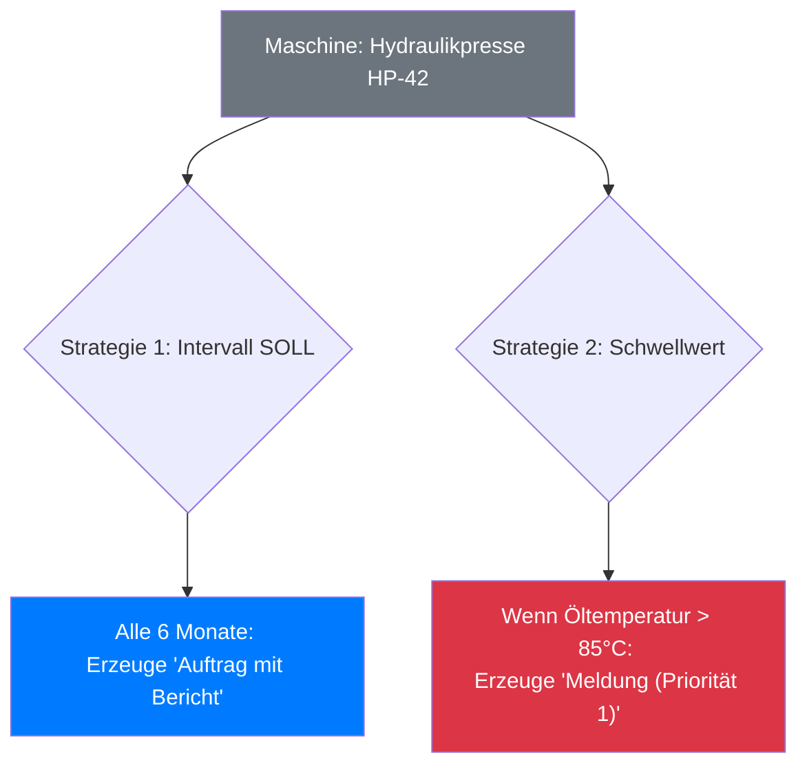

## Step-by-Step: Kombinierte Wartung mit Intervall und Schwellwert

Dieses Praxisbeispiel führt Sie durch die Erstellung einer umfassenden Wartungsstrategie für eine einzelne Maschine. Wir kombinieren dabei zwei unterschiedliche Strategiearten, um sowohl die reguläre, präventive Wartung als auch die reaktive, zustandsbasierte Überwachung abzudecken.

**Das Szenario:**
Wir richten die Wartung für eine **Hydraulikpresse (HP-42)** ein. Diese soll:
1.  Eine **regelmäßige Wartung alle 6 Monate** erhalten (z.B. Filterwechsel, Sichtprüfung), ausgelöst durch ein festes Zeitintervall.
2.  Eine **sofortige Störmeldung** generieren, sobald die Öltemperatur einen kritischen Grenzwert überschreitet.


**Voraussetzungen prüfen**
Bevor Sie beginnen, stellen Sie sicher, dass:
*   Die **Hydraulikpresse HP-42** als Equipment in der Anlagenstruktur existiert.
*   Für die Schwellwert-Strategie ein **Messpunkttyp** (z.B. "Öltemperatur Hydraulik") angelegt ist und für die Maschine regelmäßig Messbelege erfasst werden.


### Schritt 1: Die Strategiegruppe anlegen

Zuerst erstellen wir den Container, der beide Strategien für unsere Hydraulikpresse bündeln wird.

1.  Navigieren Sie zu `Administration → Berichts- & Auftragswesen → Strategiemanager`.
2.  Klicken Sie in der Ribbon-Leiste auf **Neu**.
3.  **Name der Strategiegruppe:** Vergeben Sie einen eindeutigen Namen, z.B. `Wartung Hydraulikpresse HP-42`.
4.  **Verantwortlichkeit:** Weisen Sie die zuständige Gruppe zu, z.B. den Arbeitsplatz `T-ME01 – Mechatronik Team 1`.
5.  **Komponente hinzufügen:** Klicken Sie im Reiter "Komponentenübersicht" auf das Hinzufügen-Symbol, suchen und wählen Sie die `Hydraulikpresse HP-42` aus der Anlagenstruktur aus und bestätigen Sie mit **OK**.
6.  Klicken Sie auf **Speichern**.

### Schritt 2: Strategie 1 – Die reguläre Wartung (Intervall SOLL)

Nun definieren wir die erste Regel: die turnusmäßige Wartung alle sechs Monate.

1.  Wechseln Sie in der soeben erstellten Strategiegruppe auf den Reiter **Strategien**.
2.  Klicken Sie auf **Neu**, um die erste Strategie anzulegen.

#### 2.1. Berechnung definieren
*   **Name:** Geben Sie der Strategie einen klaren Namen, z.B. `6-monatige Wartung`.
*   **Berechnungstyp:** Wählen Sie `Intervall SOLL`. Dies stellt sicher, dass der Termin fix ist und nicht durch eine verspätete Ausführung beeinflusst wird.
*   **Basisdatum:** Wählen Sie das Datum der letzten durchgeführten Wartung oder das Datum der Inbetriebnahme.
*   **Intervall:** Legen Sie den Zyklus fest, z.B. `6 Monate`.

#### 2.2. Erstellung konfigurieren
1.  Wechseln Sie zum Reiter **Erstellung**.
2.  **Erstellungstyp:** Wählen Sie `Auftrag mit Bericht`, da eine dokumentierte Tätigkeit ausgeführt werden soll.
3.  **Konfiguration "Auftrag":**
    *   **Auftragsart:** `Instandhaltungsauftrag`
    *   **Auftragstitel:** `[Strategy.Name] an [Component.Name]` (wird zu "6-monatige Wartung an Hydraulikpresse HP-42")
4.  **Konfiguration "Bericht":**
    *   **Tätigkeit:** Wählen Sie die passende Tätigkeit aus, z.B. `Wartung Hydraulikpresse (6M)`.

### Schritt 3: Strategie 2 – Die zustandsbasierte Überwachung (Schwellwert)

Jetzt fügen wir die zweite, ereignisbasierte Regel für die Temperaturüberwachung hinzu.

1.  Klicken Sie im Reiter **Strategien** erneut auf **Neu**.

#### 3.1. Berechnung definieren
*   **Name:** `Überwachung Öltemperatur`.
*   **Berechnungstyp:** Wählen Sie `Schwellwert`.
*   **Messpunkttyp:** Wählen Sie den entsprechenden Messpunkttyp aus, z.B. `Öltemperatur Hydraulik`.
*   **Maximalwert:** Legen Sie den kritischen Grenzwert fest, bei dessen Überschreitung die Strategie auslösen soll, z.B. `85` (für 85 °C).


**Was ist der Eröffnungshorizont?**
Dieses Feld gibt an, ab welcher Messwert-Änderung (in %) eine Neuberechnung stattfinden soll. Bei Schwellwerten ist dies meist weniger relevant als bei Verbrauchsstrategien und kann oft auf dem Standardwert belassen werden.


#### 3.2. Erstellung konfigurieren
Da dies ein potenziell kritischer Zustand ist, wollen wir eine hochpriorisierte Meldung erzeugen, die sofortige Aufmerksamkeit erfordert.

1.  Wechseln Sie zum Reiter **Erstellung**.
2.  **Erstellungstyp:** Wählen Sie `Meldung`.
3.  **Konfiguration "Meldung":**
    *   **Meldungsart:** `Störmeldung`
    *   **Priorität:** `1 - Sehr hoch`
    *   **Meldungstitel:** `KRITISCH: Öltemperatur an [Component.Name] überschritten!`
    *   **Beschreibung:** `Bitte sofort prüfen! Messwert hat den Grenzwert von 85°C überschritten.`

### Schritt 4: Überprüfen und Aktivieren

Ihre Strategiegruppe ist nun fertig konfiguriert und enthält zwei unterschiedliche Wartungsregeln.

1.  **Gesamtübersicht:** Wechseln Sie zurück in die Kopfdaten der Strategiegruppe und betrachten Sie die **Komponentenübersicht**. Sie sehen nun den Status beider Strategien für Ihre Hydraulikpresse.
2.  **Simulation (Optional):** Klicken Sie auf **Sofort erzeugen**, um eine Vorschau der Ereignisse zu sehen, die aktuell fällig wären. Dies ist ein sicherer Test, da erst mit **Speichern** die Ereignisse tatsächlich angelegt werden.
3.  **Aktivierung:** Wenn alles korrekt konfiguriert ist, klicken Sie in der Ribbon-Leiste auf **Aktiv**. Die Strategiegruppe ist nun scharf geschaltet.


**Server Job nicht vergessen!**
Damit Ihre aktivierte Strategiegruppe auch automatisch im Hintergrund läuft, muss ein **"Strategy Manager"-Serverjob** konfiguriert und aktiv sein. Ohne diesen Job findet keine automatische Erzeugung von Aufträgen oder Meldungen statt!



**Ergebnis**
Herzlichen Glückwunsch! Ihre Hydraulikpresse HP-42 ist nun durch ein duales System überwacht. Paledo wird automatisch alle 6 Monate einen regulären Wartungsauftrag erstellen und gleichzeitig das System in Echtzeit überwachen, um bei kritischen Temperaturüberschreitungen sofort eine Störmeldung zu generieren.
